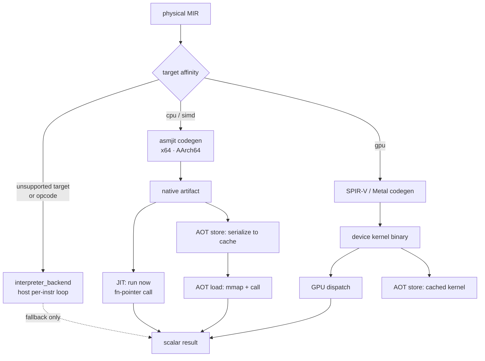
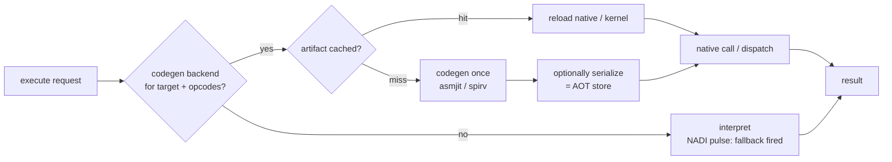

# Lithe Framework

## Bedrock Migration Status

Lithe now lives at `bedrock/include/lithe/` and is a local C++23 compiler,
interpreter, and execution engine over Pebble's Vākya, container, memory, and
diagnostic substrate. Its stable entry point is `lithe/lithe.hpp`.

The migrated Lithe and Crank Catch2 suites live in `bedrock/src/tests/` and
are enabled by `-DBUILD_TESTS=ON`; CMake exposes them through `bedrock_tests`.

AsmJit is available through the opt-in `bedrock::lithe_asmjit` target. It
provides the native x64/AArch64 JIT backend without adding a JIT dependency to
portable `bedrock::lithe` consumers.

The native Metal backend is registered as `metal`. It shares a non-owning
HL-MIR legality and binding plan with Vulkan: verified rank-1 contiguous f32
elementwise regions (loads, stores, arithmetic, comparisons, select, and f32
constants) lower to MSL, compile through `dependencies/metal-cpp`, and
dispatch through Pravaha. The earlier physical-MIR integer path remains a
compatibility route. Loop-carried reductions are recognized by the shared
device plan and deliberately rejected by the current elementwise emitters:
they require an explicit workgroup reduction ABI. Non-contiguous or dynamic
layouts, mixed types, calls, and control flow are likewise rejected until their
ABI and lowering are explicit.
Consumers that call this native path link `bedrock::lithe_metal`; the stable
API remains `lithe::codegen::backends::metal_backend` and does not expose
Metal-C++ types.

The Crank GPU example constructs the shared HL-MIR plan, selects Metal first
on macOS, and verifies the dispatched f32 add result. Its SPIR-V check remains
a portability probe; it is not used to decide native Metal availability.

Native Metal pipeline compilation is bounded and cached by semantic source
identity through Pebble's Kosha cache. Repeated host/device workloads can use
Pravaha's opt-in `metal_buffer_set<T, K>` to retain shared buffers and
`metal_submission` to submit without immediately waiting. Neither facility is
part of portable Lithe artifacts or required by a non-Metal consumer.

For device-only chains, `metal_f32_tensor` owns ephemeral Metal storage and
`metal_backend::dispatch_f32_device_async` consumes and produces those tensors
without an intermediate host copy. `upload()` and `download()` are explicit;
the move-only completion token retains the pipeline until `wait()` completes.
Crank exposes these as `gpu_f32_tensor` and `dispatch_metal_device_async`.

`lithe::exec::auto_execution_policy` controls this automatically. Its default
retains only an internal, compatible device chain above 64 KiB and downloads at
the next host-observation boundary. Users may select `prefer_device`,
`require_device`, or `host_only`, and tune the device-chain length, minimum
bytes, memory budget, fusion, and asynchronous submission independently of
portable execution.

Crank represents such chains with `gpu_execution_graph`, backed directly by
Pebble's `litegraph::Graph`. It topologically schedules device dependencies,
marks internal outputs as device-consumed, and derives residency, transfer, and
fusion-candidate decisions without duplicating a graph container in Lithe.
`execute` accepts a statically-bound resolver returning
`std::expected<void, std::string>`; the resolver owns the typed kernel/buffer
bindings and any asynchronous submission tokens. `fuse_parallel_hl_regions`
applies Lithe's existing structural fusion pass before device-plan extraction,
subject to the same policy.

For Metal, `gpu_metal_executor` is the typed opt-in data-plane adapter. It
accepts `gpu_metal_graph_binding` records, uploads each distinct graph input
once, keeps producer tensors device-resident for declared dependencies, retains
all completion tokens until the graph completes, and copies only explicitly
host-observed outputs. Its graph shape still uses Pebble LiteGraph; its tensor
and submission storage is intentionally local and ephemeral.

No GPU-specific facility is added to Pebble's common language layer. The
executor instead uses its existing `lang::telemetry::phase_observer` seam via
`execute_observed`; the default observer is empty, while a language can opt
into NADI metrics and feedback through Pebble's policy types.

Crank's opt-in `gpu_pipeline.hpp` is the frontend bridge: it borrows typed f32
host tensor views, records region dependencies in the Pebble graph, runs
HL-MIR fusion before Lithe device-plan extraction, and invokes the Metal
executor. Crank retains host-buffer ownership; Lithe retains only non-owning
plans; Metal tensors and submissions are temporary execution state.
Before a Crank pipeline dispatches, it conservatively admits the complete
resident tensor set against `auto_execution_policy::max_device_cache_bytes`.
An over-budget chain fails before any device write with
`gpu_dispatch_status::resource_exhausted`, so the frontend can safely choose
its scalar or SIMD fallback.

`languages/crank/tensor_runtime.hpp` provides the typed Crank entry point for
such lowered binary f32 regions. `execute_f32_binary` attempts the pipeline
first and invokes a statically-bound scalar/SIMD fallback only before GPU
submission when the configured policy permits it. Scalar-only Crank users do
not include this header or pay for the Metal path.

When the prebuilt MoltenVK package is present, `bedrock::lithe_vulkan` exposes
the same Crank graph bindings through the existing Pravaha Vulkan staging data
plane and Lithe SPIR-V resource/fence path. Metal remains preferred on macOS.
For compatible f32 elementwise chains, both providers retain graph
intermediates on device and download only terminal outputs. Pravaha owns the
move-only Vulkan tensor storage; Lithe retains pipeline, descriptor, and fence
ownership. Metal remains the preferred macOS provider.

`BEDROCK_ENABLE_LITHE_VULKAN` controls the optional target and defaults on when
the checked-in MoltenVK package is available. Highway SIMD and the interpreter
remain portable fallbacks.

The Crank example runner offers `--benchmark-gpu` for an explicit comparison.
It measures the same cached f32-add HL-MIR plan through direct Metal and
Vulkan/MoltenVK dispatch, including host transfer and completion, without
changing automatic provider selection.

`crank_gpu_pipeline::execute_observed()` remains automatic. Its optional final
provider argument is an explicit tuning/test override for a caller that needs
to evaluate a particular available provider.

Durable artifacts use the opt-in Petika catalog adapter. RocksDB is not a
Bedrock Lithe dependency. Persistent records contain portable IR, MSL, or
SPIR-V bytes and compatibility metadata only; live JIT, Metal, and Vulkan
handles are never persisted. Petika owns the durable catalog boundary.

Scheduling, networking, retries, and distributed execution are Pravaha
responsibilities. Lithe reuses Pravaha only behind its optional native Metal
provider for device ownership and dispatch.

The remainder is migrated reference material. RocksDB and an already-enabled
Vulkan backend remain legacy context until their corresponding Bedrock provider
is enabled.

## Executive Architecture Summary

Lithe is a universal optimization platform: a header-only C++23 compiler framework that takes an expression from user
code to native execution through a fully observable, cost-driven, adaptively-learned pipeline.

**Eight core pillars:**

| # | Pillar                                  | Primary header(s)                                                                     |
|---|-----------------------------------------|---------------------------------------------------------------------------------------|
| 1 | **Structural Representation** (Vākya)   | `lithe_core.hpp` / `vakya/vakya.hpp`                                                  |
| 2 | **Semantic Analysis**                   | `lithe_semantic.hpp`                                                                  |
| 3 | **Optimization**                        | `lithe_passes.hpp`, `lithe_egraph.hpp`, `lithe_profiles.hpp`                          |
| 4 | **Cost Modeling** (platform capability) | `lithe_cost_model.hpp`, `lithe_cost_registry.hpp`                                     |
| 5 | **Decision Framework**                  | `lithe_decision_engine.hpp`, `lithe_selector_strategy.hpp`, `lithe_ml_interfaces.hpp` |
| 6 | **Code Generation**                     | `lithe_codegen.hpp`, `lithe_codegen_pipeline.hpp`, backends/                          |
| 7 | **Execution**                           | `lithe_engine.hpp`, `lithe_execution/`, `lithe_exec/`, `lithe_rt/`                    |
| 8 | **Adaptive Feedback**                   | `lithe_adaptive.hpp`, `lithe_feedback.hpp`, `lithe_feature_store.hpp`                 |

The full pipeline:

```
Vakya
   ↓
Semantic Analysis
   ↓
Optimization
   ↓
MIR
   ↓
Backends
   ↓
Execution
   ↓
Runtime
   ↓
Feature Extraction  →  Cost Models  →  Decision Engine  →  Adaptive Feedback
```

Every decision point — backend selection, pass ordering, schedule policy — participates in the same
`decision_engine<Strategy>` pipeline and produces comparable `cost_vector`s. Heuristic, analytical, profile-guided, and
learned implementations plug into the same structural concepts without call-site changes.

---

## Table of Contents

- [Executive Architecture Summary](#executive-architecture-summary)
- [Introduction](#introduction)
- [Architecture Overview](#architecture-overview)
- [Algorithms Used](#algorithms-used)
- [Data Structures](#data-structures)
- [Compilation Pipeline](#compilation-pipeline)
- [Core Components](#core-components)
    - [lithe_core.hpp — Expression AST](#lithe_corehpp--expression-ast)
    - [lithe_extension.hpp — Plugin System](#lithe_extensionhpp--plugin-system)
    - [lithe_semantic.hpp — Type & Domain Inference](#lithe_semantichpp--type--domain-inference)
    - [lithe_semantic_passes.hpp — Semantic Canonicalization](#lithe_semantic_passeshpp--semantic-canonicalization)
    - [lithe_passes.hpp — Optimization Passes](#lithe_passeshpp--optimization-passes)
    - [lithe_lowering.hpp — Lowering to MIR](#lithe_loweringhpp--lowering-to-mir)
    - [lithe_codegen.hpp — MIR Structures](#lithe_codegenhpp--mir-structures)
    - [lithe_codegen_hl.hpp / lithe_codegen_hl_passes.hpp — High-Level MIR & Passes](#lithe_codegen_hlhpp--lithe_codegen_hl_passeshpp--high-level-mir--passes)
    - [lithe_codegen_pipeline.hpp — Pipeline Orchestration](#lithe_codegen_pipelinehpp--pipeline-orchestration)
    - [lithe_safepoint.hpp — Safepoint & Stack-Map Injection](#lithe_safepointhhpp--safepoint--stack-map-injection)
    - [lithe_runtime.hpp — Runtime Object Model](#lithe_runtimehpp--runtime-object-model)
    - [Abstract Runtime Value Layer](#abstract-runtime-value-layer-litheruntimevalues)
    - [Native Binding API](#native-binding-api-litheruntimeffibinding)
- [Backends](#backends)
- [Execution Model](#execution-model)
- [MIR v2 — Regional & Polyhedral IR](#mir-v2--regional--polyhedral-ir)
- [Language-Control Extension](#language-control-extension-litheitrhl-litheitrfrontend)
- [Program Dependence Graph](#program-dependence-graph-lithepdg)
- [Polyhedral Loop Analysis](#polyhedral-loop-analysis-lithepoly)
- [Runtime Foundation](#runtime-foundation-litheert)
- [Diagnostics](#diagnostics)
- [Algorithm Model & Pipeline](#algorithm-model--pipeline)
- [IR Interchange](#ir-interchange)
- [Frontend Import / Export](#frontend-import--export)
- [Unified Cost Model Framework](#unified-cost-model-framework)
- [Validation Framework](#validation-framework)
- [Feature Extraction Framework](#feature-extraction-framework)
- [Feature Store](#feature-store)
- [Selector Strategy Abstraction](#selector-strategy-abstraction)
- [ML Readiness](#ml-readiness)
    - [ML Plug-in Interfaces](#ml-plug-in-interfaces)
- [Intelligence Layer](#intelligence-layer)
    - [Decision Engine](#decision-engine)
    - [Property Propagation](#property-propagation)
    - [Adaptive Cost Model](#adaptive-cost-model)
    - [Schedule Bridge](#schedule-bridge)
    - [Decision-Level Explanation](#decision-level-explanation)
- [Complete Flow Walkthrough](#complete-flow-walkthrough)
- [Examples](#examples)
- [Design Notes](#design-notes)
- [Automatic Execution Analysis & Planning (`lithe::exec`)](#automatic-execution-analysis--planning-litheexec)

---

## Introduction

**Lithe** is a header-only, C++23 embedded DSL framework for building, transforming, and compiling expression trees. It
targets high-performance computation scenarios where the expression graph is built at C++ compile time or runtime, then
lowered to a backend (interpreter, JIT, or text IR) for evaluation.

Lithe's expression-construction layer is the standalone **Vākya** library (`include/vakya/`, namespace `vakya`). Lithe
consumes it: `lithe_core.hpp` re-exports the `vakya::` construction surface (`node`, `make_node`, `interface`,
`IRBuilder`, `emit::tag_descriptor`, `tree::*`, `graph::*`, `structural_hash`/`structural_equal`, the pattern DSL) under
namespace `lithe` and adds the compiler-specific layers — phase wrappers, semantic analysis, passes, codegen, and
backends — on top. Code written against `lithe::` names is unaffected. See [vakya.md](../vakya/vakya.md) for the
standalone
substrate.

| Property       | Detail                                                         |
|----------------|----------------------------------------------------------------|
| Standard       | C++23 (`std::expected`, explicit object params, `std::ranges`) |
| Delivery       | Header-only (`include/lithe/`)                                  |
| Namespace      | `lithe`                                                        |
| Entry header   | `lithe/lithe.hpp` (aggregates all sub-headers)                  |
| No virtual fns | All dispatch via templates and concepts                        |
| No macros      | Plugin registration is macro-free via NTTP descriptors         |

---

## Architecture Overview

```
 ┌─────────────────────────────────────────────────────────────────────────────┐
 │  User expression layer                                                      │
 │  C++ operators / make_node<Tag> / IRBuilder / dsl_extension                │
 └──────────────────────────────┬──────────────────────────────────────────────┘
                                │
 ┌──────────────────────────────▼──────────────────────────────────────────────┐
 │  AST / Expression Core         lithe_core.hpp                               │
 │  node<Tag,Children...>, Expression/Terminal/Operand concepts                │
 │  evaluate / visit / transform / rewrite_once, tree::* utilities             │
 │  graph::dag_view, shared_expr (DAG / CSE layer)                             │
 │  emit::dump, structural_equal, structural_hash                              │
 │  lithe_extension.hpp — plugin_descriptor, extension_tag, symbolic vars      │
 └──────────────────────────────┬──────────────────────────────────────────────┘
                                │
 ┌──────────────────────────────▼──────────────────────────────────────────────┐
 │  Semantic / Type inference     lithe_semantic.hpp                           │
 │  domain_type bitmask, semantic_info, semantic_context, semantic_query       │
 │  backend_routing_policy                                                     │
 │  lithe_semantic_inference.hpp — inference rules (internal fragment)         │
 │  lithe_semantic_passes.hpp — semantic_canonicalization_pass, rewrite rules  │
 └──────────────────────────────┬──────────────────────────────────────────────┘
                                │
 ┌──────────────────────────────▼──────────────────────────────────────────────┐
 │  Optimization passes           lithe_passes.hpp                             │
 │  O0–O3 / OG1 / Debug presets, fixpoint, pass_local_cache                   │
 │  simplify/constant-fold/strength-reduce/CSE/live-subtree passes             │
 │  compiler::observability (trace_observer, pass_event)                       │
 └──────────────────────────────┬──────────────────────────────────────────────┘
                                │
 ┌──────────────────────────────▼──────────────────────────────────────────────┐
 │  AST → MIR lowering            lithe_lowering.hpp                          │
 │  ASTNodeData / ASTTree, dependency_kind, operation_category                 │
 │  CFG construction via NAryTree + LiteGraph                                  │
 └──────────────────────────────┬──────────────────────────────────────────────┘
                                │
 ┌──────────────────────────────▼──────────────────────────────────────────────┐
 │  High-level MIR (structured)   lithe_codegen.hpp  lithe_codegen_hl.hpp     │
 │  hl::hl_mir_function, hl_opcode, structured_for_attr, memref_type           │
 │  task_decomposition_plan, arena_checkpoint_guard                            │
 │  lithe_codegen_hl_passes.hpp — fusion/tiling/vectorization/polyhedral/      │
 │    coordinate_lowering_pass (HL → flat), task_plan_extraction_pass          │
 └──────────────────────────────┬──────────────────────────────────────────────┘
                                │  coordinate_lowering_pass
 ┌──────────────────────────────▼──────────────────────────────────────────────┐
 │  Physical (flat register) MIR  lithe_codegen.hpp                           │
 │  vreg / preg / ssa_value_id / spill_slot / memory_address_kind              │
 │  CFG analysis, def-use / use-def chains, value_flow_analysis_result         │
 │  edge_kind (sync_branch / async_fork / sync_join / rpc_boundary / …)        │
 │  lithe_codegen_pipeline.hpp — compilation_artifact, backend_capability_set  │
 │    function_signature, subgraph_partition, execution_domain                 │
 └──────┬──────────────────┬───────────────────────────────────────────────────┘
        │                  │
        │   ┌──────────────▼──────────────────────────────────────┐
        │   │  Safepoint injection     lithe_safepoint.hpp        │
        │   │  lithe::safepoint — traverses PDG/CFG for           │
        │   │  async_fork / yield ops, intersects live-out vregs, │
        │   │  emits stack_map_artifact for GC / coroutine runtime │
        │   └─────────────────────────────────────────────────────┘
        │
 ┌──────▼────────────────────────────────────────────────────────────────────┐
 │  Analysis passes               lithe_pdg.hpp  lithe_poly.hpp              │
 │  PDG: pdg_edge, program_dependence_graph, build_pdg_pass                  │
 │       distribute_mir_pass (splits MIR across execution domains)            │
 │  Poly: affine_matrix, polyhedral_loop, extract/fusion/interchange passes   │
 └──────────────────────────────┬────────────────────────────────────────────┘
                                │
 ┌──────────────────────────────▼──────────────────────────────────────────────┐
 │  Execution / Backend Layer     lithe_execution/                             │
 │  foundation.hpp — persisted_backend_id, ir_kind, artifact_class,           │
 │    stage errors, engine error variants, execution_mode, memory_domain       │
 │  facet.hpp — CPOs (compile/install/get_entry/invoke/release/serialize)      │
 │  artifact.hpp / resource.hpp / entry.hpp — lifecycle types                  │
 │  registry.hpp — backend_registry (generational_handle, slot_map,           │
 │    backend_ref, registration_token, shared-lock acquire protocol)           │
 │  aot.hpp — AOT serialize/deserialize (aot_header, aot_view, aot_error)     │
 └──────────────────────────────┬──────────────────────────────────────────────┘
                                │
 ┌──────────────────────────────▼──────────────────────────────────────────────┐
 │  Backends                      include/lithe/backends/                       │
 │  interpreter        (bytecode, no JIT — reference vertical)                 │
 │  asmjit             (native JIT: x64 + AArch64 auto-selected)              │
 │  debug_text         (human-readable pseudo-assembly)                        │
 │  text_assembly      (offline text-assembly target)                          │
 │  vulkan / MoltenVK  (SPIR-V → compute pipeline; lithe_codegen_vulkan.hpp)  │
 │  null_backend                                                               │
 │  plugin / out-of-proc  (C ABI thunk table, lithe_plugin_abi.hpp)           │
 │  backend_registry — variant + list_available_backends()                    │
 │  execute_with_fallback — capability-aware primary/fallback dispatch         │
 └──────────────────────────────┬──────────────────────────────────────────────┘
                                │
 ┌──────────────────────────────▼──────────────────────────────────────────────┐
 │  Algorithm model & pipeline    lithe_algorithms/                            │
 │  selection.hpp — algorithm_descriptor, algorithm_pack, algorithm_box,      │
 │    backend_selector, cost_based_backend_selector (10-step pipeline)         │
 │  pipeline.hpp — static_pipeline / dynamic_pipeline, analysis_manager,      │
 │    preserved_analysis_set, pass_result, analysis_id                         │
 │  lifecycle.hpp — tiering/eviction/retirement policies, retirement_driver    │
 └──────────────────────────────┬──────────────────────────────────────────────┘
                                │
 ┌──────────────────────────────▼──────────────────────────────────────────────┐
 │  Static engine                 lithe_engine.hpp                             │
 │  basic_lithe_engine — compile_with / compile_best / compile_and_invoke_best │
 │  selected_entry<B,IR,Sig>, selected_entry_t (variant), engine_interface    │
 │  resource_store (owns installed resources)                                  │
 └──────────────────────────────┬──────────────────────────────────────────────┘
                                │
 ┌──────────────────────────────▼──────────────────────────────────────────────┐
 │  IR Interchange                lithe_ir/                                    │
 │  format.hpp — format_descriptor, stable_ir_id, wire_endian                 │
 │  provider.hpp — no_ir_provider, diagnostic_text_stub                        │
 │  hooks.hpp — pipeline_hooks, hook_point, hook_failure_policy                │
 │  adapters/ — graph / hl_mir / physical_mir stage adapters                  │
 │  providers/ — text_provider (canonical codec), binary_provider + envelope  │
 │  security_envelope.hpp — ordered structural/digest/signature checks         │
 │  registry.hpp — ir_provider_registry, provider_descriptor                  │
 │  upgrade.hpp — IR-local upgrade_registry (decode-time schema migration)    │
 │  integration.hpp — import→validate→compile_best pipeline                   │
 └──────────────────────────────┬──────────────────────────────────────────────┘
                                │  opt-in (#include "lithe/lithe_rt.hpp")
 ┌──────────────────────────────▼──────────────────────────────────────────────┐
 │  Managed Runtime               lithe_rt/   (opt-in overlay, lithe_rt.hpp)  │
 │  foundation.hpp — typed_value, trap model, may_trap_kinds                  │
 │  heap.hpp — generational_gc (aliased heap_manager): GC object model,       │
 │    gc_header, copying young + mark-sweep old + large-object space,          │
 │    object-level remembered set, weak refs, pinning, finalizers              │
 │  execution.hpp — rooted_ref, root_slot_table, thread_context,              │
 │    thread_attachment, safepoint_coordinator, machine_root_location,         │
 │    machine_stack_map  (M2: roots + threads + safepoints)                    │
 │  code_metadata.hpp — code_version_metadata (unified GC/deopt/reloc/        │
 │    patchpoint/stack-map bundle), executable_memory (W^X), code_resource,   │
 │    code_manager                                                              │
 │  instance.hpp — runtime_instance (shared factory create()), execution_     │
 │    profile, trap_manager, security_policy                                   │
 │  engine.hpp — compile() MIR pipeline (annotate→verify→lower→install),     │
 │    managed_function, out-of-line rooted_ref / thread_attachment members     │
 │  engine_integration.hpp — managed_entry_adapter, managed_integration_context│
 └─────────────────────────────────────────────────────────────────────────────┘
```

**Lazy by design.** No compilation context is required to build an expression. Compilation is explicit and on-demand.

**Layer inclusion model:**

- `lithe/lithe.hpp` aggregates all core layers (AST through backends + algorithm model + static engine + IR interchange).
  Does NOT include `lithe_rt.hpp`.
- `lithe/lithe_rt.hpp` is a separate opt-in aggregate for the managed runtime overlay. Core users pay nothing for it.
- All dispatch is static: templates, concepts, `if constexpr`. No virtual functions, no macros.

---

## Algorithms Used

Concrete named algorithms across the compiler, with the header they live in. (Detailed prose per
subsystem follows in the sections below; this is the consolidated index.)

| Concern | Algorithm | Where |
|---|---|---|
| Semantic canonicalization | Rewrite-rule normalization pass (`semantic_canonicalization_pass`) + structural-hash dedup | `lithe_semantic_passes.hpp` |
| Optimization passes | simplify · constant-folding · strength-reduction · common-subexpression elimination (CSE) · dead/live-subtree elimination · algebraic canonicalization | `lithe_passes.hpp` |
| Equality saturation | E-graph optimization: intern → saturate (rule set + `saturation_limits`) → `extract_best<CostModel>` → `rebuild_expr` (union-find + hash-cons, egg-style rebuild) | `lithe_egraph.hpp`, `containers/graph/egraph.hpp` |
| Lowering | AST → MIR lowering; CFG construction via NAryTree + LiteGraph | `lithe_lowering.hpp`, `lithe_codegen.hpp` |
| HL codegen passes | loop fusion · tiling · vectorization · polyhedral transforms | `lithe_codegen_hl_passes.hpp` |
| Dependence analysis | Program Dependence Graph (data + control dependence edges) | `lithe_pdg.hpp` |
| Loop analysis | Polyhedral model: affine-matrix domains, loop extract / fusion / interchange | `lithe_poly.hpp` |
| Backend selection | Cost-based selector (10-step gate) + selector strategies: cost_based / profile_guided / rule_based / learned | `lithe_selector_strategy.hpp`, `lithe_decision_engine.hpp` |
| Cost modeling | Unified cost-model framework; adaptive/profile-guided cost refinement | `lithe_algorithms.hpp`, `lithe_pgo.hpp` |
| Backends | 8 codegen backends: debug_text · interpreter · text assembler · asmjit JIT · SIMD (Highway) · native Metal · Vulkan (SPIR-V) · null | `include/lithe/backends/` |
| Backend registry | Generational-handle + slot_map registry with shared-lock acquire protocol | `lithe_execution/registry.hpp` |
| Feature extraction | Static feature extraction + feature store for ML-guided selection | `lithe_feature_extractor.hpp`, `lithe_feedback.hpp` |
| Safepoints | Safepoint + stack-map injection for managed runtime | `lithe_safepoint.hpp` |

---

## Data Structures

### `lithe::node<Tag, Children...>`

The core AST node. Statically typed: tag and child types are compile-time parameters.

```cpp
template <class Tag, class... Children>
struct node : interface<node<Tag, Children...>> {
    using is_lithe_node = void;   // satisfies Expression concept
    using tag_type = Tag;
    std::tuple<Children...> children;
};
```

**Capture policy** (`capture_t<T>`): lvalue references stored as references; rvalues decayed by value — no unnecessary
copies, no dangling.

### `lithe::graph::dag_view<Expr>` / `shared_expr<Expr>`

DAG representation for common-subexpression analysis. Nodes are interned by structural hash.

```cpp
struct dag_node {
    node_id id;
    std::size_t hash;
    std::any expr;           // type-erased
    std::type_index type_tag;
    std::vector<node_id> children;
    std::size_t use_count;
};
```

`build_dag(expr)` returns `shared_expr<Expr>` with all sharing metadata filled in. `shared_expr::sharing_count()`
returns the number of nodes referenced more than once. `use_count` equals the number of incoming edges; root has no
incoming edge (use_count == 0). `sharing_count()` counts nodes with `use_count > 1`.

### Phase wrappers

Four thin value wrappers mark the compilation phase of an expression without changing its structure:

| Wrapper             | Phase                  |
|---------------------|------------------------|
| `surface_expr<T>`   | As-built               |
| `canonical_expr<T>` | After canonicalization |
| `optimized_expr<T>` | After optimization     |
| `lowered_expr<T>`   | After lowering         |

`unwrap_expr(e)` strips the wrapper; `as_surface_expr(e)` / `as_canonical_expr(e)` etc. wrap idempotently.

### MIR structures (`lithe::codegen::mir`)

| Type                  | Role                                                  |
|-----------------------|-------------------------------------------------------|
| `vreg`                | Virtual register (SSA value, `uint32_t id`)           |
| `preg`                | Physical register (`uint16_t id`, name)               |
| `ssa_value_id`        | SSA value identity (`uint64_t`)                       |
| `spill_slot`          | Stack frame slot (size, alignment, frame_offset)      |
| `memory_address_kind` | Addressing mode enum (stack_frame, direct, offset, …) |

---

## Compilation Pipeline

**Pass presets** (defined in `lithe_passes.hpp`):

| Preset  | Passes run                                                                 |
|---------|----------------------------------------------------------------------------|
| `O0`    | None — identity transform                                                  |
| `O1`    | `simplify_add_zero_pass`, `simplify_mul_identity_pass` (fixpoint, 4 iters) |
| `O2`    | O1 + canonicalize + `constant_fold_arith_pass` (6 iters)                   |
| `O3`    | O2 + `strength_reduction_pass` (8 iters)                                   |
| `OG1`   | Alias for O2 (debug-info-friendly variant)                                 |
| `Debug` | O2 with full trace enabled via `compiler::context`                         |

Tree profiles contain only passes that transform trees. Pure CSE and effect-aware
DCE run in the portable HL-MIR optimizer, where shared values and liveness are
representable; `true_cse_pass` remains available only as a compatibility marker.

Apply a preset:

```cpp
auto optimized = lithe::preset::O2{}(expr);        // returns an optimized_expr<...>
auto result    = lithe::optimize_preset(expr, lithe::compiler::opt_level::O2);
```

---

## Core Components

### `lithe_core.hpp` — Expression AST

> **Provenance.** Every symbol in this section is defined in the standalone **Vākya** library
> (`include/vakya/vakya.hpp`, namespace `vakya`). `lithe_core.hpp` is a thin shim that re-exports them under namespace
> `lithe` (`using vakya::…`) and adds the phase-wrapper decorators. `lithe::add_tag` *is* `vakya::add_tag`, etc. — the
> names below are all aliases. See [vakya.md](../vakya/vakya.md) for the authoritative reference.

**Tags** (operation identifiers — all empty structs):

*Arithmetic:* `add_tag`, `sub_tag`, `mul_tag`, `div_tag`, `mod_tag`, `neg_tag`
*Comparison:* `eq_tag`, `ne_tag`, `lt_tag`, `le_tag`, `gt_tag`, `ge_tag`
*Logical:* `and_tag`, `or_tag`, `not_tag`
*Bitwise:* `bit_and_tag`, `bit_or_tag`, `bit_xor_tag`, `bit_not_tag`, `shl_tag`, `shr_tag`
*Control flow:* `if_tag`, `while_tag`, `for_tag`, `let_tag`, `seq_tag`, `call_tag`
*Memory:* `cast_tag`, `sizeof_tag`, `deref_tag`, `addr_tag`, `subscript_tag`, `get_element_ptr_tag`,
`extract_value_tag`, `insert_value_tag`
*Advanced:* `lambda_tag`, `return_tag`, `box_tag`, `unbox_tag`, `indirect_call_tag`

**Concepts:**

```cpp
template <class T> concept Expression  // has is_lithe_node, tag_type, children
template <class T> concept Terminal    // arithmetic or is_terminal<T> specialization
template <class T> concept Operand     // Expression || Terminal
template <class T> concept VariantExpr // std::variant of alternatives
```

**Factory:**

```cpp
auto node = lithe::make_node<add_tag>(lhs, rhs);  // constexpr-friendly
```

**Traversal functions** (all constexpr, work on Expression/Terminal/Variant):

| Function       | Signature pattern                    | Behaviour                                                   |
|----------------|--------------------------------------|-------------------------------------------------------------|
| `evaluate`     | `evaluate(expr, transform)` → result | Bottom-up: `on_terminal` / `on_node(tag, children...)`      |
| `visit`        | `visit(expr, visitor)` → result      | Same shape; visitor sees original children                  |
| `transform`    | `transform(expr, t)` → result        | Passes both original and transformed children               |
| `rewrite_once` | `rewrite_once(expr, rule)` → result  | Single-pass rewrite via `on_node(tag, orig..., xformed...)` |

**Tree utilities** (`lithe::tree` namespace):

```cpp
tree::arity(e)              // number of direct children
tree::size(e)               // total nodes (recursive)
tree::depth(e)              // max depth
tree::is_leaf(e)            // arity == 0
tree::for_each_child(e, fn) // call fn on each direct child
tree::map_children(e, fn)   // rebuild with fn applied to each child
tree::replace_child<I>(e, child)  // rebuild with child I replaced
tree::rebuild_with(e, ch...)      // rebuild with all children replaced
tree::internal_nodes(e)     // count non-terminal nodes
tree::leaf_nodes(e)         // count terminal nodes
// compile-time type-tree folds (consteval; operate on node type, not value)
tree::all_tags_satisfy<E, Pred>()          // true iff Pred<Node>::value for every Expression node
tree::any_tag_satisfies<E, Pred>()         // true iff Pred<Node>::value for at least one node
tree::fold<E>(contrib, combine, init)      // reduce: acc=combine(acc, contrib.operator()<Node>())
                                           //   per Expression node; terminals return init unchanged
```

**Debug utilities** (`lithe::emit` namespace):

```cpp
emit::dump(expr)                     // prefix-form string: "(+ 3 5)"
emit::dump(shared_expr)              // SSA-style listing: "%1 = +(2,3) [uses=1]"
emit::structural_equal(a, b)         // structural equality (handles phases/variants)
emit::structural_hash(e)             // stable hash for side-car keying; topology-only by default.
                                     // Opt in to value-aware hashing by defining an ADL overload:
                                     //   std::size_t structural_payload_hash(const MyNode&) noexcept;
                                     // Zero cost for tags without the hook.
```

**Tag Metadata & Extensibility** (`lithe::emit` namespace):

Per-tag metadata lives in one openly-extensible trait — the single source of truth:

```cpp
template <class Tag>
struct tag_descriptor {
    static constexpr std::string_view symbol    = "<tag>";        // debug/operator text
    static constexpr std::size_t      stable_id = 0x9u;           // structural_hash seed
    static constexpr std::uint8_t     arity     = kVariadicArity; // 0 leaf,1 unary,2 binary
};
```

- **Reserved id band:** built-in tags use `stable_id < kExtensionIdBase` (`= 1000`); downstream
  EDSLs MUST return `stable_id >= kExtensionIdBase` so ids never collide.
- **`kVariadicArity`** (`= 0xFF`) marks variadic/unknown arity.
- **Register a custom tag** by specialising `tag_descriptor` in your *own* header — zero edits to
  `lithe_core.hpp`. `structural_hash` folds `stable_id` automatically, so custom tags hash into
  distinct buckets with no further work.
- `tag_name<Tag>::value` (→ `const char*`, used by `dump`) and `tag_id<Tag>::value` are now thin
  aliases over `tag_descriptor::symbol` / `::stable_id`.
- **Value-aware hashing** — `structural_hash` is topology-only by default. If a leaf node carries a
  payload that must distinguish otherwise-identical trees (e.g. a typed constant `lit(1.0f)` vs
  `lit(2.0f)`), define an ADL hook in your own header:
  ```cpp
  std::size_t structural_payload_hash(const MyLitNode&) noexcept;
  ```
  `structural_hash` detects the hook via concept and mixes it in. Tags without the hook have zero
  overhead — the detection is compile-time only.

**Wrappers for plain terminals:**

```cpp
auto x = lithe::as_expr(my_double);       // expr_ref<double> (reference)
auto c = lithe::as_expr(3.14);            // expr<double> (by value)
// Both satisfy Terminal and have all member operators
```

**`IRBuilder`** (zero-overhead facade):

```cpp
lithe::IRBuilder{}.CreateAdd(lhs, rhs)
lithe::IRBuilder{}.CreateIf(cond, then_, else_)
// ... CreateSub, CreateMul, CreateDiv, CreateSubscript, CreateSeq, CreateCall
```

**`lithe::builder::IRBuilder`** (namespace `builder`, richer API):

```cpp
using namespace lithe::builder;
IR.add(a, b)           IR.sub(a, b)         IR.mul(a, b)
IR.eq(a, b)            IR.lt(a, b)          IR.logical_not(x)
IR.if_then_else(c,t,e) IR.while_loop(c,b)   IR.for_loop(i,c,u,b)
IR.lambda(body, params...) IR.call(fn, args...)
IR.constant(v)         IR.variable(v)        IR.symbol<T>("name")
IR.cast_to<T>(e)       IR.deref(e)           IR.address_of(e)
IR.custom_node(tag, args...)
```

---

### `lithe_extension.hpp` — Plugin System

**`fixed_string<N>`** — structural NTTP string; usable as template parameter.

**`version_triple`** — structural semver (major.minor.patch).

**`plugin_descriptor<IdN, AuthorN>`** — static identity block for any plugin:

```cpp
struct my_pass {
    static constexpr lithe::plugin_descriptor<
        sizeof("acme.passes.my"),
        sizeof("Acme Corp")
    > descriptor{
        .id      = "acme.passes.my",
        .version = {1, 0, 0},
        .author  = "Acme Corp",
        .domain  = lithe::semantic::domain_type::arithmetic,
    };
};
static_assert(lithe::LitheExtension<my_pass>);
```

**`dsl_extension::extension_tag<Name>`** — macro-free custom tag from a fixed string:

```cpp
using pow_tag = lithe::dsl_extension::extension_tag<"pow">;
auto expr = lithe::make_node<pow_tag>(base, exp);
```

Override metadata via `extension_tag_traits<"pow">`:

```cpp
template<> struct lithe::dsl_extension::extension_tag_traits<"pow"> {
    static constexpr int  precedence     = 8;
    static constexpr bool is_commutative = false;
    static constexpr std::size_t arity   = 2;
};
```

**`extension_registry`** — compile-time registry of named descriptors:

```cpp
inline constexpr auto my_reg = lithe::dsl_extension::make_extension_registry(
    lithe::dsl_extension::extension_descriptor<"pow">{8, false, false, 2},
    lithe::dsl_extension::extension_descriptor<"min">{0, false, true,  2}
);
constexpr auto& d = my_reg.get<"pow">();  // compile-time lookup
```

**Symbolic variables** (`dsl_extension::symbolic`):

```cpp
auto x = lithe::dsl_extension::symbolic::symbol.create<double>("x");
// x is symbolic_var<double>; usable as a Terminal in any expression
```

**Functional DSL** (`dsl_extension::functional`):

```cpp
auto lam = lithe::dsl_extension::functional::make_lambda(
    lithe::dsl_extension::functional::params(x, y),
    x + y   // body
);
```

---

### `lithe_semantic.hpp` — Type & Domain Inference

**`semantic::domain_type`** (bitmask enum, `uint16_t`):

```
unknown, arithmetic (1<<0), symbolic (1<<1), query (1<<2),
task (1<<3), layout (1<<4), tensor (1<<5), custom (1<<6)
```

Use `domain_type::tensor` to tag tensor DSL nodes in `semantic_info`. Register it in `plugin_descriptor.domain` for
tensor passes.

Domains compose: `domain_type::arithmetic | domain_type::symbolic`. Query: `has_domain(d, probe)`.

**`semantic::semantic_info`** — per-node annotation:

```cpp
struct semantic_info {
    domain_type domain = domain_type::unknown;
    // sign, shape, type tags, overlay support
};
```

Merge semantics: `merge_domain(lhs, rhs)` — `unknown` yields to concrete; conflicting concrete domains are OR-combined.

**`semantic::semantic_context`** — thread-safe annotation store; maps structural hash → `semantic_info`.

**`semantic::semantic_query`** — fluent read-side:

```cpp
lithe::semantic::semantic_query q(ctx);
auto dom = q.domain_of(expr);    // returns domain_type
```

**Backend routing** (`semantic::backend_routing_policy`): maps domain → backend names; enforces allowed/denied domain
lists per backend.

### `lithe_semantic_passes.hpp` — Semantic Canonicalization

**`semantic_rewrite_rule`** — predicate + transformation pair on `semantic_info`. Ops are pure; never mutate MIR.

**`semantic_canonicalization_pass`** — vector of rules, applied sequentially to semantic registry entries.

**`semantic_optimization_report`** — aggregates rewrites with traces:

- `semantic_rewrite_trace` — rule_name, node_id, source_span, type_before/after, changed flag.
- `rewritten_nodes` / `visited_nodes` counters.

**`semantic_optimization_pipeline`** — orchestrates pass composition and report collection.

---

### `lithe_passes.hpp` — Optimization Passes

**Pass concept** (duck-typed): any callable `(E&&) -> result` where result is a phase-wrapped expression.

**Built-in passes:**

| Pass                            | Effect                                                                                             |
|---------------------------------|----------------------------------------------------------------------------------------------------|
| `simplify_add_zero_pass`        | Eliminates `x + 0` → `x`                                                                           |
| `simplify_mul_identity_pass`    | Eliminates `x * 1` → `x` only; `0*literal` folding handled by `constant_fold_arith_pass`           |
| `constant_fold_arith_pass`      | Folds arithmetic on literal terminals                                                              |
| `true_cse_pass`                 | Structural; currently a fixpoint no-op (planned)                                                   |
| `strength_reduction_pass`       | Power-of-two division reduced to shift for **unsigned** operands only; signed division left intact |
| `live_subtree_analysis_pass`    | Traverses expression and records live-subtree hashes for analysis (no elimination)                 |
| `dead_subtree_elimination_pass` | Deprecated alias for `live_subtree_analysis_pass`; real DCE needs DAG/MIR lowering                 |
| `canonicalize`                  | Normalizes expression form                                                                         |

**Composition helpers:**

```cpp
// Run a pass to fixpoint (at most max_iters times)
auto p = lithe::passes::fixpoint(lithe::passes::simplify_add_zero_pass{}, 4);

// Chain passes sequentially
auto result = lithe::compiler::compile(expr, pass1, pass2, pass3);

// Preset use
auto opt = lithe::preset::O2{}(expr);
```

**Observability** (`compiler::observability`): opt-in tracing; each pass emits `pass_event` with before/after dumps,
timestamps, structural hashes, and (§3.3) egraph/rewrite telemetry fields.

**§3.3 Extended `pass_event` fields** — zero-default; never allocated unless the observer reads them:

| Field             | Type          | Populated by                                              |
|-------------------|---------------|-----------------------------------------------------------|
| `rule_fired`      | `std::string` | rewrite/egraph passes (last rule name)                    |
| `iterations`      | `size_t`      | fixpoint loop count (1 for classic passes, ≥1 for egraph) |
| `nodes_before`    | `size_t`      | IR/enode count before the pass                            |
| `nodes_after`     | `size_t`      | IR/enode count after the pass                             |
| `pass_cost_ns`    | `uint64_t`    | `end_ns - start_ns` (convenience alias)                   |
| `egraph_enodes`   | `size_t`      | `saturation_report.enodes` — egraph passes only           |
| `egraph_eclasses` | `size_t`      | `saturation_report.eclasses` — egraph passes only         |

`egraph_optimize` (§imp-5) populates all egraph fields after saturation.

```cpp
// Attach a trace_observer to any pass or preset via with_trace:
lithe::compiler::observability::trace_observer tracer;
auto opt = lithe::passes::with_trace(lithe::preset::O2{}, tracer)(expr);
// tracer.trace.pass_events → vector<pass_event> (name, ns, ir_before/after, hashes, changed,
//   + iterations, nodes_before/after, pass_cost_ns, egraph_enodes/eclasses)
// tracer.trace.compilation_events / rewrite_events / structural_hash_events also populated
```

`semantic_canonicalization_pass`: specialized pass that rewrites `semantic_info` annotations;
emits `semantic_canonicalization_event` (visited/rewritten node counts, fired rules).

**`pass_local_cache`** — per-pipeline memoization keyed by structural hash; backed by `std::any` for type-erasure.

---

### Pass Registry & Metadata (`lithe_passes.hpp`)

**`ir_stage`** — monotone IR transformation stage for compile-time pass ordering checks.

| Value       | Meaning                        |
|-------------|--------------------------------|
| `surface`   | Raw / un-normalized expression |
| `canonical` | Canonicalized form             |
| `optimized` | Fully optimized intermediate   |
| `lowered`   | MIR / backend-ready form       |

Values are ordered `surface < canonical < optimized < lowered`. Used exclusively in `pass_type_traits` for the
`in_stage`/`out_stage` fields; distinct from the runtime `pass_stage` enum used by the dynamic pass planner.

**`pass_type_traits<Pass>`** — compile-time metadata trait keyed on the pass type (mirrors `tag_descriptor<Tag>`).

```cpp
struct pass_type_traits_base {
    static constexpr auto id              = lithe::fixed_string{"unknown"};
    static constexpr lithe::version_triple version{0, 0, 0};
    static constexpr pass_category category = pass_category::optimization;
    static constexpr pass_effect_kind effect = pass_effect_kind::transforms;
    static constexpr ir_stage in_stage      = ir_stage::surface;
    static constexpr ir_stage out_stage     = ir_stage::surface;
    static constexpr std::size_t stable_id  = 0;
    static constexpr preserved_analysis_set preserved() noexcept;
    static constexpr std::array<std::size_t, 0> conflicts{};
};

template <class Pass> struct pass_type_traits : pass_type_traits_base {};

// Specialize for your own passes — inherit from pass_type_traits_base,
// override only the fields you care about:
template <> struct pass_type_traits<my_pass> : pass_type_traits_base {
    static constexpr auto id       = lithe::fixed_string{"my_domain.my_pass"};
    static constexpr ir_stage in_stage  = ir_stage::canonical;
    static constexpr ir_stage out_stage = ir_stage::optimized;
    static constexpr std::size_t stable_id = 2000; // >= 1000 (extension band)
};
```

`pass_effect_kind` states the currently observable role of a pass independently
of its pipeline category: `transforms`, `analyzes`, `annotates`, or
`placeholder`. This lets profiles and diagnostics distinguish a named
optimization that changes IR from an analysis-only or intentionally scaffolded
pass. Built-ins mark `dead_subtree_elimination_pass` as `analyzes` and
`true_cse_pass` as `placeholder`; extension pass traits default to
`transforms` for source compatibility. `export_profile()` includes this effect
for every pass, and the standard profiles exclude non-transforming effects.

`stable_id` bands:

- `[0, 1000)` — built-in passes (use `kExtensionIdBase = 1000u` as the boundary)
- `[1000, ∞)` — extension / plugin passes

Built-in passes with specializations: `simplify_add_zero_pass` (id=10), `simplify_mul_identity_pass` (11),
`constant_fold_arith_pass` (12), `strength_reduction_pass` (13), `dead_subtree_elimination_pass` (14), `true_cse_pass` (
15), `constant_propagation_pass` (16), `canonicalize_commutative_pass` (17), `live_subtree_analysis_pass` (18),
`enhanced_algebraic_canonicalization_pass` (19).

**Consteval bundle introspection** — zero-overhead, `consteval` queries over a `pass_bundle`:

```cpp
// Number of pass descriptors in a bundle.
template <class Bundle> consteval std::size_t bundle_size();

// True iff any pass in Bundle has the given category.
template <class Bundle, pass_category C> consteval bool bundle_has_category();

// True iff topo-sorted passes have non-regressing ir_stage (in/out monotone).
template <class Bundle> consteval bool stages_monotone();

// True iff no pass in Bundle declares another as a conflict.
template <class Bundle> consteval bool no_conflicts();
```

All helpers operate on `order_pass_bundle_t<Bundle>` (topo-sorted); they read `pass_type_traits<D::pass_type>` for each
descriptor.

**`pass_registry<IR>`** (optional, `lithe_execution/registry.hpp`) — runtime registry for dynamic / plugin passes. Zero
cost for pure static `pass_bundle` users; only instantiated when used.

```cpp
// Register a pass with runtime metadata + erased any_pass<IR>.
// Returns expected<pass_registration_token, pass_registry_error>.
auto tok = registry.register_pass(meta, any_pass<IR>{my_runtime_pass{}});

// Find by string id; returns optional<pass_lease>.
auto lease = registry.find("my_domain.my_pass");

// All passes in a category (uint8_t maps to pass_category).
auto vec = registry.passes_in_category(uint8_t(pass_category::optimization));
```

`pass_descriptor_runtime` — fixed-width POD wire-safe descriptor (char id[64], version[3], category_id, in/out stage,
stable_id, conflicts[8]). Thread-safety: `shared_mutex`, same shared-lock acquire protocol as `backend_registry`.
Unregister deferred until `pass_registration_token` is destroyed. `register_pass` rejects: empty id, stable_id in
builtin band, duplicate id, conflict with an already-registered pass.

---

### Optimization Profiles (`lithe_profiles.hpp`)

Internal fragment included at the end of `lithe_passes.hpp`; available via `#include "lithe/lithe_passes.hpp"`.
All types live in `namespace lithe::profile`.

**`profile_descriptor`** — structural (NTTP-usable) metadata record:

```cpp
struct profile_descriptor {
    char             id[32]{};          // "domain.level", e.g. "std.o3", "tensor.o3"
    version_triple   version{1, 0, 0};
    int              max_iters    = 8;
    passes::ir_stage target_stage = passes::ir_stage::optimized;
    bool             trace        = false;
    bool             deterministic = true;

    // Construct from string literal (zero-pads id to 32 chars):
    consteval profile_descriptor("std.o3", {1,0,0}, 8, ir_stage::optimized, false, true);

    std::string_view id_view() const noexcept;
};
```

Id convention: `"domain.level"` — downstream EDSLs prefix their profiles with a domain name (e.g. `"tensor.o3"`) to
avoid collisions with `"std.*"` built-ins.

**`profile<Bundle, Desc>`** — type-level profile; zero-overhead:

```cpp
template <class Bundle, profile_descriptor Desc>
struct profile {
    static constexpr profile_descriptor descriptor = Desc;
    using bundle  = Bundle;                              // pass_bundle<Descriptors...>
    using ordered = passes::order_pass_bundle_t<Bundle>; // topo-sorted

    template <class Expr>
    constexpr auto operator()(Expr&& e) const;           // lowers to compiler::compile
};
```

`operator()` runs each descriptor's `pass_type` wrapped in `fixpoint(pass, max_iters)` through `compiler::compile`,
left-to-right in topo-sorted order. Built-in `std_o1/o2/o3/debug/semantic_safe` delegate directly to
`preset::O1/O2/O3/Debug/SemanticSafe` for exact hash parity; use `profile<Bundle, Desc>` for user-defined or inherited
profiles.

**Inheritance and composition:**

```cpp
// Extend a profile — dedup-concat bundles, optionally override descriptor.
template <class BaseProfile, class ExtraBundle,
          profile_descriptor NewDesc = BaseProfile::descriptor>
using profile_inherit = ...;

// Override descriptor only (keep bundle).
template <class BaseProfile, profile_descriptor NewDesc>
using with_descriptor = ...;

// Functor-level composition for passes that aren't pass_descriptor types.
auto p = lithe::profile::compose_profile(std_o2{}, my_extra_pass{});
```

**Validation:**

```cpp
template <class P>
consteval bool profile_valid() noexcept;
// Returns true iff:
//   1. All pass descriptor dependencies present in bundle.
//   2. Topo-sort succeeds (no cycles / unresolvable deps).
//   3. No conflicting pass pair in the bundle.
static_assert(lithe::profile::profile_valid<std_o3>());
```

Note: `stages_monotone` is intentionally excluded — expression-level optimization passes share canonical input stages;
stage monotonicity applies to IR-lowering pipelines.

**Built-in profiles** (in `lithe::profile`):

| Type                | Equivalent preset      | `max_iters` | id                    |
|---------------------|------------------------|-------------|-----------------------|
| `std_o0`            | `preset::O0`           | 0           | `"std.o0"`            |
| `std_o1`            | `preset::O1`           | 4           | `"std.o1"`            |
| `std_o2`            | `preset::O2`           | 6           | `"std.o2"`            |
| `std_o3`            | `preset::O3`           | 8           | `"std.o3"`            |
| `std_debug`         | `preset::Debug`        | 6           | `"std.debug"`         |
| `std_semantic_safe` | `preset::SemanticSafe` | 6           | `"std.semantic_safe"` |

`preset::O0..O3/Debug/SemanticSafe` remain unchanged — back-compat surface. All built-in profile types are empty (
sizeof == 1).

**Descriptor constants:** `k_std_o0_desc`, `k_std_o1_desc`, `k_std_o2_desc`, `k_std_o3_desc`, `k_std_debug_desc`,
`k_std_semantic_safe_desc`.

**Export / import:**

```cpp
// Export static profile to a POD record.
profile_record rec = lithe::profile::export_profile<std_o3>();
// rec.profile_id == "std.o3", rec.passes = ordered stable_ids

// Import: reconstruct dynamic_profile from record + pass resolver.
// Resolver maps (stable_id, max_iters) → erased_pass functor.
using pass_resolver = std::function<dynamic_profile::erased_pass(std::size_t, int)>;
auto dp = lithe::profile::import_profile(rec, resolver);
// dp.id() / dp.pass_count() / dp.run(std::any& expr)

// Import without resolver — descriptor-only (no pass functors).
auto dp2 = lithe::profile::import_profile(rec);
```

`dynamic_profile` is erased (holds `std::function` per pass) — for tooling / serialisation only. The static path (
`profile<>`) is always preferred for hot-path execution.

**Domain-specific profile packs** (downstream EDSL pattern):

```cpp
// In tensor.hpp — register a "tensor.o3" profile without modifying std headers:
inline constexpr lithe::profile::profile_descriptor k_tensor_o3_desc{
    "tensor.o3", {1,0,0}, 8, lithe::passes::ir_stage::optimized};

using tensor_o3 = lithe::profile::profile_inherit<
    lithe::profile::std_o3,
    lithe::passes::pass_bundle<desc_my_tensor_pass>,
    k_tensor_o3_desc
>;
static_assert(lithe::profile::profile_valid<tensor_o3>());
```

---

### Analysis Registry (`lithe_algorithms/pipeline.hpp`)

**Dual-index design** — built-in analyses and extension analyses live in separate caches:

| Index     | Key type                          | Storage                                | Cost                |
|-----------|-----------------------------------|----------------------------------------|---------------------|
| Built-in  | `analysis_id` enum (8-bit)        | `std::array<std::any, 8>`              | O(1), no allocation |
| Extension | `analysis_key.stable_id` (≥ 1000) | `std::unordered_map<size_t, std::any>` | O(1) avg            |

**`analysis_key`** — structural aggregate (usable as NTTP):

```cpp
struct analysis_key {
    char        domain[32]{};
    char        name[32]{};
    std::size_t stable_id = kAnalysisExtIdBase;   // >= 1000
    constexpr bool operator==(const analysis_key&) const noexcept = default;
};
```

**`analysis_descriptor<A>`** — trait that registers an analysis. Specialize in your own header; never edit
`pipeline.hpp`.

```cpp
// Built-in analysis (fast path via array):
template <> struct analysis_descriptor<CfgAnalysis> {
    using result_t = CfgAnalysis;
    static constexpr analysis_id id = analysis_id::cfg;   // picks built-in path
    static CfgAnalysis compute(const IR& ir, analysis_manager& am);
};

// Extension analysis (side map path):
template <> struct analysis_descriptor<TensorShape> {
    using result_t = TensorShape;
    static constexpr analysis_key key = {/* domain, name, stable_id=1000 */};
    static TensorShape compute(const IR& ir, analysis_manager& am);
};
```

**`analysis_manager::require<A>(ir)`** — compute-once / serve-cached:

```cpp
// Returns a const ref to the cached result; computes on first call.
const auto& shape = am.require<TensorShape>(ir);
```

Dispatches by whether `analysis_descriptor<A>` has `::id` (built-in) or `::key` (extension). Result lifetime: until the
next invalidation.

**Invalidation semantics:**

- `pass_result::preserved` (bitset) — built-in analyses the pass preserves; all others are dropped.
- `pass_result::invalidated` (vector of `stable_id`) — extension analyses the pass explicitly dirtied. Default empty →
  zero cost for passes that don't touch extensions.
- `analysis_manager::invalidate_except(preserved, invalidated)` — the pipeline calls this after every pass
  automatically.

```cpp
// In a pass that rewrites tensor shapes:
al::pass_result<MyIR> operator()(analysis_manager& am, MyIR ir) const {
    // ... transform ...
    al::pass_result<MyIR> r{std::move(ir), true, al::preserved_analysis_set::all()};
    r.invalidated.push_back(1000);  // explicitly drop TensorShape cache
    return r;
}
```

**Registering `TensorShape` — complete example:**

```cpp
// my_tensor_analysis.hpp
inline constexpr lithe::algorithms::analysis_key kTensorShapeKey = []() consteval {
    lithe::algorithms::analysis_key k;
    const char dom[] = "tensor"; for (std::size_t i=0;i<sizeof(dom);++i) k.domain[i]=dom[i];
    const char nm[]  = "shape";  for (std::size_t i=0;i<sizeof(nm); ++i) k.name[i]  =nm[i];
    k.stable_id = 1000;
    return k;
}();

template <> struct lithe::algorithms::analysis_descriptor<TensorShape> {
    using result_t = TensorShape;
    static constexpr lithe::algorithms::analysis_key key = kTensorShapeKey;
    static TensorShape compute(const MyIR& ir, lithe::algorithms::analysis_manager& am) {
        return TensorShape{ /* ... */ };
    }
};
```

**`ASTNodeData` / `ASTTree`**: intermediate AST representation (`NAryTree<ASTNodeData>`).

**`dependency_kind`**: fine-grained dependence classification:

| Kind             | Meaning                        |
|------------------|--------------------------------|
| `data_raw`       | Read-after-write (true dep)    |
| `data_war`       | Write-after-read (anti dep)    |
| `data_waw`       | Write-after-write (output dep) |
| `control_direct` | Branch → dominated successor   |
| `rpc_boundary`   | Crosses distributed boundary   |

**`operation_category`**: `terminal`, `arithmetic`, `logical`, `comparison`, `control_flow`, `dataflow`, `custom`.

Uses `NAryTree` and `LiteGraph` from the containers library for CFG and PDG representation.

---

### `lithe_codegen.hpp` — MIR Structures

**Namespace:** `lithe::codegen`

| Type                  | Description                                               |
|-----------------------|-----------------------------------------------------------|
| `vreg` / `preg`       | Virtual / physical registers (inline namespace `mir::v1`) |
| `ssa_value_id`        | SSA value identity                                        |
| `spill_slot`          | Stack slot (id, size, alignment, frame_offset)            |
| `memory_address_kind` | Addressing modes: `stack_frame`, `direct`, `offset`, …    |

**CFG analysis** (`cfg_analysis_result`): reachable/unreachable blocks, typed edges, subgraph partitions.

**Edge kinds** (`edge_kind`):

| Kind           | Meaning                                   |
|----------------|-------------------------------------------|
| `sync_branch`  | Ordinary conditional/unconditional branch |
| `fallthrough`  | Implicit sequential fall-through          |
| `async_fork`   | Spawns new concurrent context             |
| `sync_join`    | Re-convergence of concurrent contexts     |
| `rpc_boundary` | Crosses distributed-execution boundary    |
| `entanglement` | Non-causal informational link             |

**Def-use / use-def chains** (`def_use_chain`, `use_def_chain`, `value_flow_analysis_result`).

---

### `lithe_codegen_hl.hpp` / `lithe_codegen_hl_passes.hpp` — High-Level MIR & Passes

Internal fragments included via `lithe_codegen.hpp` umbrella. Provide `lithe::codegen::hl` namespace types (
`hl_mir_function`, `hl_opcode`, `structured_for_attr`, `memref_type`, `task_decomposition_plan`) and all HL MIR passes (
`extract_polyhedral_from_hl`, `pre_header_isolation`, `region_fusion_pass`, `loop_tiling_pass`, `vectorization_pass`,
`coordinate_lowering_pass`, `task_plan_extraction_pass`).
See [MIR v2 — Regional & Polyhedral IR](#mir-v2--regional--polyhedral-ir) for full reference.

---

### `lithe_codegen_pipeline.hpp` — Pipeline Orchestration

End-to-end compilation from expression to artifact.

**`compilation_artifact`**: wraps the output of any backend.

**`backend_feature`** / **`backend_capability_set`**: per-feature capability advertising.

**`function_signature`**: argument list, calling convention, variadic flag.

**CFG edge classification** and subgraph partitioning (`execution_domain`, `subgraph_partition`).

**`backend_variant`**: `std::variant` of all registered backends.

---

### `lithe_safepoint.hpp` — Safepoint & Stack-Map Injection

**Namespace:** `lithe::safepoint`

Traverses the PDG/CFG for `async_fork` edges and `yield` abstract operations, intersects live-out vreg sets at each
asynchronous boundary, and emits a `stack_map_artifact` attached to the `physical_mir_function`. The artifact tells an
external GC or coroutine runtime exactly which virtual registers hold live pointers at every potential context-switch
point.

**`safepoint_result`**:

```cpp
struct safepoint_result {
    codegen::mir::physical_mir_function function;
    std::size_t safepoints_injected = 0;
    std::vector<std::string> diagnostics;
    [[nodiscard]] bool ok() const noexcept;
};
```

**`safepoint_injection_pass`** — analysis + annotation pass (struct with `run()`).

**`inject_safepoints(fn)`** — convenience free function; runs the pass and returns `safepoint_result`.

---

### `lithe_runtime.hpp` — Runtime Object Model

**Namespace:** `lithe::runtime::mop`

**MOP (Method/Object Protocol)** — structural contract for dynamic dispatch without vtables:

```cpp
struct field_descriptor  { std::string name; size_t byte_offset, size_bytes; uint32_t type_tag; };
struct method_descriptor { ... };
struct object_layout     { std::vector<field_descriptor> fields; ... };
struct object_ptr        { void* ptr; const object_layout* layout; };
```

**`ObjectManager` concept**: structural contract requiring `allocate`, `deallocate`, `get_field`, `set_field`,
`invoke_method`. `deallocate_instance` returns `std::expected<void, mop_error>` — a null pointer or
layout-mismatched deallocation is reported as `mop_error` (e.g. `bad_layout`) rather than silently leaking.

**Provided managers:**

| Manager                    | Description                        |
|----------------------------|------------------------------------|
| `default_object_manager`   | `new`/`delete`-backed              |
| `injecting_object_manager` | Caller-supplied allocator (arenas) |
| `oom_test_object_manager`  | Exhaustible budget for OOM testing |

**`mop_context`**: type-erased callback bundle for backend dispatch; constructed via
`make_mop_context(manager, registry)`.

**Error type** (`mop_error` / `mop_error_code`): `ok`, `out_of_memory`, `invalid_layout`, `field_not_found`,
`method_not_found`, `invalid_object_ptr`, `type_mismatch`.

---

### Abstract Runtime Value Layer (`lithe::runtime::values`)

**Namespace:** `lithe::runtime::values`

High-performance, JIT-register-aligned value abstractions sitting above the raw MOP memory protocol. All types are
trivially copyable and map directly onto 64-bit ABI registers.

#### Type taxonomy

| Type                  | Description                                                                              |
|-----------------------|------------------------------------------------------------------------------------------|
| `object_ref`          | Non-owning MOP object pointer enriched with `layout_id` + `plugin_tag`.                  |
| `native_function_ref` | Raw `void* fn_ptr`, `arity`, `ret_hint`, `param_hints[8]` — unified JIT/interpreter ABI. |
| `dynamic_value`       | `std::variant<int64_t, double, bool, void*, object_ref, native_function_ref>`.           |
| `boxed_value`         | `{dynamic_value, uint32_t type_hint}` — carries the ffi type tag alongside the value.    |

#### `dynamic_value` variant index map (stable — do not reorder)

| Index | Type                  | Accessor       | Check          | Factory          |
|-------|-----------------------|----------------|----------------|------------------|
| 0     | `std::int64_t`        | `as_i64(v)`    | `is_i64(v)`    | `make_i64(x)`    |
| 1     | `double`              | `as_f64(v)`    | `is_f64(v)`    | `make_f64(x)`    |
| 2     | `bool`                | `as_bool(v)`   | `is_bool(v)`   | `make_bool(x)`   |
| 3     | `void*`               | `as_ptr(v)`    | `is_ptr(v)`    | `make_ptr(x)`    |
| 4     | `object_ref`          | `as_object(v)` | `is_object(v)` | `make_object(r)` |
| 5     | `native_function_ref` | `as_func(v)`   | `is_func(v)`   | `make_func(f)`   |

#### Marshalling

```cpp
// Flatten dynamic_value to a 64-bit ABI register word (branchless).
[[nodiscard]] std::int64_t marshal_to_native(const dynamic_value& v) noexcept;

// Reconstruct from a raw word using the caller-supplied ffi type hint.
[[nodiscard]] dynamic_value unmarshal_from_native(std::int64_t raw, std::uint32_t type_hint) noexcept;
```

`double` uses `std::memcpy` bit-reinterpretation — no narrowing or strict-aliasing UB.
`object_ref` encodes the raw pointer only; `layout_id`/`plugin_tag` must be restored from the registry after unmarshal.

#### Terminal conformance

`is_terminal` is specialised for `dynamic_value`, `boxed_value`, and `object_ref`, making them valid leaf nodes in any
Lithe lazy expression AST without a wrapper:

```cpp
auto expr = lithe::lit(vals::make_i64(42)) + lithe::var<int>("x");
```

---

### Native Binding API (`lithe::runtime::ffi::binding`)

**Namespace:** `lithe::runtime::ffi::binding`  
**File:** `lithe/lithe_runtime.hpp`

Zero-overhead compile-time bridge from typed C++ callables to the JIT register ABI. Accepts stateless lambdas and plain
function pointers as NTTPs; produces a `native_proxy` with a type-erased C-compatible trampoline and full ABI metadata.

#### `bind_native_function<auto Fn>()`

```cpp
template <auto Fn>
[[nodiscard]] constexpr
std::expected<native_proxy, mop_error> bind_native_function() noexcept;
```

- Inspects `Fn`'s signature at compile time via `detail::callable_traits`.
- Maps each C++ parameter/return type to a `type_hint_*` constant.
- Generates a `trampoline_holder::invoke` that unmarshals `int64_t` registers → typed args, calls `Fn`, and marshals the
  result back.
- Returns `std::unexpected(mop_error{type_mismatch, ...})` for arity > 8 or any unsupported type. Both checks are
  `if constexpr` — the error path produces zero runtime code on valid inputs.

**Supported types and their `type_hint_*` mapping:**

| C++ type(s)                           | `type_hint_*`                                    |
|---------------------------------------|--------------------------------------------------|
| `int8/16/32/64_t`, `uint8/16/32/64_t` | `type_hint_i64`                                  |
| `float`, `double`                     | `type_hint_f64`                                  |
| `bool`                                | `type_hint_bool`                                 |
| `T*` (any pointer)                    | `type_hint_ptr`                                  |
| `void` (return only)                  | `type_hint_i64` (0); callable must be `noexcept` |

`float` is bit-widened to 32-bit int, then zero-extended to `int64_t`.  
`double` uses `std::memcpy` for strict-aliasing-safe bit reinterpretation.

#### `invoke_bound(proxy, regs, ctx)`

```cpp
[[nodiscard]] std::expected<std::int64_t, mop_error>
invoke_bound(const native_proxy& proxy,
             std::span<std::int64_t const> regs,
             void* ctx = nullptr) noexcept;
```

Hot-path dispatch. Validates `proxy.valid()` and `regs.size() >= proxy.arity`, then calls the trampoline. Returns
`std::unexpected` on null proxy or insufficient registers.

#### Example

```cpp
static constexpr std::int64_t add(std::int64_t a, std::int64_t b) noexcept {
    return a + b;
}

// At initialisation time (constexpr-safe):
auto proxy = lithe::runtime::ffi::binding::bind_native_function<add>();
assert(proxy.has_value());
assert(proxy->arity == 2);

// At call time (hot path, no allocation):
std::array<std::int64_t, 2> regs{10, 32};
auto result = lithe::runtime::ffi::binding::invoke_bound(*proxy, regs);
assert(*result == 42);
```

#### Constraints

- `Fn` must be a non-capturing, trivially copyable callable (function pointer or stateless lambda).
- Arity is limited to 8 — matches `native_proxy::arg_types` capacity.
- No heap allocation, no RTTI, no virtual dispatch.
- Trampoline address is stable for the process lifetime (`static` member function of a template instantiation).

---

## Backends

> See [Execution Model](#execution-model) for how these backends compose into the JIT / AOT / GPU / interpret modes.

### `lithe_codegen_interpreter.hpp`

Bytecode interpreter over allocated MIR. No JIT or external deps. It is a
defined subset executor: `call`, `load_symbol`, aggregate operations, and
`indirect_call` must be lowered before interpretation. The backend preflights
the whole physical MIR and rejects those opcodes before it mutates runtime
state.

```cpp
struct interpreter_backend {
    static constexpr auto descriptor = ...;  // LitheExtension
    static constexpr backend_capability_set capabilities();
    [[nodiscard]] backend_result begin_function(const mir::physical_mir_function&, backend_state);
    // execute dispatches per-instruction; returns via return_value
};
```

State: `integer_registers`, `fp_registers`, `spill_values`, `memory_values`, call frame.

### `lithe_codegen_asmjit.hpp`

Native JIT via AsmJIT (x64 or AArch64 auto-selected at compile time).

```cpp
struct jit_function_handle {
    using fn_i64_t = int64_t(*)(int64_t, int64_t);
    using fn_f64_t = double (*)(int64_t, int64_t);
    int64_t call(int64_t a, int64_t b) const;
    double  call_f64(int64_t a, int64_t b) const;
    bool    valid() const noexcept;
};
```

Owns `asmjit::JitRuntime`; move-only.

### `lithe_codegen_debug_text_backend.hpp`

Emits human-readable pseudo-assembly from allocated MIR. Useful for IR inspection and testing.

### `lithe_codegen_assembler.hpp`

Text-assembly target (`text_assembly_target`) for offline assembly output.

### `lithe_codegen_backend_registry.hpp`

`backend_variant` —
`std::variant<debug_text_backend, null_backend, interpreter_backend, text_assembly_target, asmjit_or_stub, simd_backend>`.

AsmJIT stub used when not compiled with AsmJIT (`asmjit_backend_stub`).

```cpp
std::vector<std::string_view> backends = lithe::codegen::backends::list_available_backends();
// {"debug_text", "null_backend", "interpreter", "text_assembly", "asmjit", "simd"}
// when compiled without AsmJIT the list omits "asmjit" entirely — the stub is
// not a genuinely constructible backend, so it is never advertised.
// "simd" remains available through the portable Highway-backed simd_backend.
```

#### Backend Fallback Execution Policy

Two functions orchestrate capability-aware dispatch within the `backends` namespace:

```cpp
// Returns true iff every instruction in fn is covered by caps.
// Wraps validate_backend_requirements(); no RTTI, no allocation on success.
[[nodiscard]] bool verify_backend_legality(
    const mir::physical_mir_function& fn,
    const backend_capability_set& caps) noexcept;

// Attempt emission via primary_backend.  If verify_backend_legality fails,
// route to fallback_backend and append a codegen_diagnostic_event to the
// returned artifact's diagnostics list.  fallback_policy controls what happens
// when the fallback is ALSO incapable: attempt_anyway (default) emits regardless
// and records the fallback trace; reject refuses to emit and returns a
// diagnostic artifact (kind == none).
enum class fallback_policy { attempt_anyway, reject };

[[nodiscard]] compilation_artifact execute_with_fallback(
    mir::physical_mir_function const& fn,
    backend_variant& primary_backend,
    backend_variant& fallback_backend,
    fallback_policy policy = fallback_policy::attempt_anyway);
```

**Routing rules:**

1. Query `primary_backend.capabilities()` via `std::visit` + `if constexpr` (graceful for backends that omit
   `capabilities()`).
2. Pass → `emit_with_physical_mir_backend(primary_backend, fn)`.
3. Fail → preflight the fallback with `verify_backend_legality`. With the default `attempt_anyway`, emit via
   `fallback_backend` and prepend `"execute_with_fallback: Primary backend invalid; falling back to …"` plus all
   `"fallback-reason: …"` lines (and, if the fallback is also incapable, an `"also incapable"` note) to
   `artifact.diagnostics`. With `reject`, if the fallback is incapable, return a diagnostic artifact (`kind == none`)
   *without emitting* — a hard preflight gate against invalid emission.

Typical usage — AsmJIT as primary, interpreter as software fallback:

```cpp
auto primary  = lithe::codegen::backends::make_backend("asmjit");
auto fallback = lithe::codegen::backends::make_backend("interpreter");
auto art = lithe::codegen::backends::execute_with_fallback(fn, *primary, *fallback);
// art.diagnostics is empty on JIT success; contains fallback trace on mismatch.
```

### `execution_engine<Policy>` — unified policy-dispatched engine

`execution_engine<Policy>` (defined in `lithe_codegen_interpreter.hpp`) unifies
constexpr partial evaluation, interpreter execution, and JIT emission behind a single
`execute(fn) → compilation_artifact` call.

| Policy                       | Alias              | Behaviour                                     |
|------------------------------|--------------------|-----------------------------------------------|
| `constexpr_execution_policy` | `constexpr_engine` | Partial evaluation via `partial_evaluate()`   |
| `runtime_execution_policy`   | `runtime_engine`   | Interpreter via `interpreter_backend::emit()` |
| `jit_execution_policy`       | `jit_engine`       | Delegates to a bound `CodeEmissionTarget`     |

**`jit_engine` usage:**

```cpp
lithe::codegen::backends::asmjit_backend jit;
lithe::codegen::jit_engine eng;
eng.with_target(jit);                    // bind any CodeEmissionTarget (non-owning)
auto art = eng.execute(fn);              // delegates to jit.emit(fn)
```

`with_target<T>(T& t)` stores a type-erased function pointer — no include-graph
coupling to AsmJit or any specific backend. If no target is bound, `execute()` returns
a diagnostic artifact (`kind == jit_function`, one diagnostics entry) instead of crashing.

Fluent setters `with_arguments(args)` and `with_signature(sig)` apply on all policies
(only the runtime path inspects them).

---

## Execution Model

Lithe has one execution *pipeline*, not four. **JIT, AOT, and GPU are entry
points into the same codegen path** — physical MIR → a per-target codegen
backend → a native artifact. AOT is JIT plus persistence (serialize the native
output, reload next run). GPU is JIT for the device (MIR → SPIR-V/Metal, the
driver finishes to device ISA). **Interpretation is the only mode with no
codegen and the only one that runs a host-side per-instruction loop** — it is
the portable fallback, not a peer execution strategy.

| mode      | codegen?           | when               | artifact kept                            | executes                                      |
|-----------|--------------------|--------------------|------------------------------------------|-----------------------------------------------|
| interpret | no                 | —                  | none                                     | host walks MIR, `switch` per instr, every run |
| JIT       | yes (asmjit)       | runtime            | native in memory (`jit_function_handle`) | fn-pointer `call()`                           |
| AOT       | yes (asmjit)       | ahead / first-miss | native serialized to cache               | reload bytes → `call()`                       |
| GPU       | yes (SPIR-V/Metal) | runtime or AOT     | device kernel binary                     | dispatch kernel                               |





Backend → mode mapping:

- `interpreter_backend` (`lithe_codegen_interpreter.hpp`) = portable fallback. Only mode with a host per-instruction
  dispatch loop.
- `asmjit_backend` (`lithe_codegen_asmjit.hpp`) = CPU codegen emitter (x64/AArch64) → `jit_function_handle`. Serves BOTH
  JIT (run now) and AOT (serialize + reload).
- Vulkan (`lithe_codegen_vulkan.hpp`) and native Metal (`lithe_codegen_metal.hpp`) = GPU codegen. Their own JIT (runtime kernel build) + AOT (cached kernel
  binary).
- `execution_engine<Policy>` (`lithe_codegen_interpreter.hpp`) = policy dispatcher that selects a backend and applies
  the fallback rule.
- Selection: **device affinity (cpu/simd/gpu) picks WHICH codegen backend; JIT vs AOT picks run-now vs
  persist-and-reload.** Same emitter either way.

Cost model — "pay for what you use":

- Interpreter: ~40 ns/instr fixed dispatch (heap operand vectors + `variant`/`optional` unwrap). Cost = O(iters ×
  instrs × dispatch). A 100 k counted loop is 100 % dispatch → **322×/238×** slowdown on sum/harmonic benchmarks.
- Codegen (JIT/AOT/GPU): whole function → native; the loop is native branches; runtime = one fn-pointer `call()` (or one
  kernel dispatch). → C++ parity.
- Guidance: cold / one-shot / unsupported code → interpreter (cheap, portable); hot / repeated / device code → codegen.
  This is the framework's "charged only for what you use" principle applied to execution.

Fallback rule:

> Codegen is attempted first for the selected target. If no backend supports the
> target or an opcode, execution falls back to the interpreter and emits a NADI
> pulse (`fallback_fired`). Hot code that a backend *does* support must never be
> silently interpreted — that is the defect this section exists to prevent.

Entry points (`include/lithe/lithe_execution/compile.hpp`, namespace `lithe::execution`):

- `plan(phys, hint, policy)` → `execution_kind` — cost-model planner; reuses `lithe::exec::execution_hint`.
- `compile(phys, req)` → `compile_result` — converged single entry: plan → emit → cache.
- `invoke(result, args)` → `optional<int64>` — calls native handle or reads interpreter metadata.
- `artifact_store` — in-process fingerprint → `compile_result` cache.
- `prepare(phys, req, store)` → `prepared_execution` — retains the selected artifact after one planning/cache step.
  `prepared_execution::native_entry()` exposes a non-owning typed i64 entry for a hot loop; the prepared object retains
  artifact ownership for the entry's lifetime.
- `compile_observed<Observer>` / `prepare_observed<Observer>` and
  `prepared_execution::invoke_observed<Observer>` instrument backend compilation and execution. `Observer` is a
  static policy from `languages/generic/observability/phase.hpp`: it may route fixed-size phase metrics to Nadi and/or
  a feedback sink. The default observer is an empty no-op type, so normal Lithe calls do not read clocks, allocate,
  mutate trace state, or branch for telemetry.
- **crank frontend entry:** `execute_planned` (`languages/crank/plan.hpp` + `execute.hpp`); crank's planner (
  `construct_plan`) supplies intent (`execution_hint`) and force policy; lithe emits/caches (L-1 §4.5). Callers that
  want the explicit interpreter path set `execute_options::path = interpreter_only` on `execute_via_interpreter` or
  `execute_physical`.

Crank execution-path note (`include/languages/crank/execute.hpp`):

- `execute_physical` now honors `execute_options::path` (`auto_select`, `jit_preferred`, `interpreter_only`,
  `native_only`).
- Default `auto_select` prefers native codegen for CFG-heavy or larger physical MIR and keeps interpreter for small
  straight-line MIR.
- `jit_preferred` requests native first while preserving a safe interpreter fallback when native is unavailable.
- `execute_via_interpreter` is the intelligent local-execution front door: with the default `auto_select` it follows
  the same native-versus-interpreter policy as `execute_physical`; callers that require the interpreter set
  `interpreter_only` explicitly.
- `execute_physical_native` uses a digest-keyed in-process artifact cache so repeated calls of equivalent physical MIR
  reuse the compiled native artifact.
- `prepare_physical_native` returns Crank's owning `prepared_native_execution`; its `native_entry()` is the zero-extra-
  work hot path after preparation, while `invoke()` retains a safe fallback-aware interface.
- `prepare_physical_native<Observer>` and `prepared_native_execution::invoke_observed<Observer>` preserve the same
  ownership and fallback semantics while emitting the shared `backend_compile` and `execute` phase records.
- Crank additionally provides `lower_to_hl_observed<Observer>` and `lower_to_physical_observed<Observer>` for the
  generic-IR and physical-lowering boundaries. The migrated benchmark demonstrates all four phases with a bounded,
  overwrite-oldest Nadi ring sink and a separate feedback route.
- The AArch64 AsmJit backend emits common physical-MIR integer definitions directly into their assigned virtual
  register. This avoids an otherwise redundant temporary-to-destination move for argument loads, immediates, scalar
  arithmetic, comparisons, and simple loads; spill definitions retain their explicit store path.

**Status.** crank's `execute`/`aot` layer previously lowered + verified then ran the
interpreter, caching only a fingerprint (not native code). As of this implementation,
`compile_and_cache` calls `lithe::execution::compile` so the native JIT path is active
when asmjit is available. See design `scratch/lithe/perf-l1-interpreter-vs-aot.md` §4–5.

---

## MIR v2 — Regional & Polyhedral IR

`namespace lithe::codegen::hl` — header `lithe/lithe_codegen.hpp` + `lithe/lithe_codegen_pipeline.hpp`

### Overview

MIR v2 adds a **structured high-level MIR** layer above the existing flat register MIR.
Two distinct types enforce progressive lowering at compile time:

| Type                         | Phase                     |
|------------------------------|---------------------------|
| `hl::hl_mir_function`        | Structured (pre-lowering) |
| `mir::physical_mir_function` | Flat register MIR         |

Lowering is one-way: `hl::coordinate_lowering_pass` converts `hl_mir_function → physical_mir_function`.
After lowering all existing passes and backends work unchanged.

### Key Types

#### `hl_opcode` — structured dialect opcodes

`structured_for` (affine loop), `structured_reduce`, `region_yield`, `loop_index`,
`memref_load`, `memref_store`, scalar arithmetic (`fadd`, `fmul`, …), math builtins (`exp`, `log`, `sqrt`).

Effect predicates: `is_pure(op)`, `is_terminator(op)`, `has_effect(effects_of(op), hl_effect_flags::write)`.

#### `structured_for_attr`

```cpp
struct structured_for_attr {
    uint8_t rank = 1;
    bool    is_parallel = false;
    std::array<iv_bounds, 8> bounds{};  // lower/upper/step — separate from tile sizes
    std::array<uint32_t,  8> tile{};    // 0 = untiled
};
```

#### `memref_type`

Multi-dimensional strided tensor view. Inline, trivially copyable, rank ≤ 8.

```cpp
auto m = memref_type::row_major(abstract_value_kind::floating, 64, 2, {1024, 1024});
// m.strides = {1024, 1}  (row-major auto-computed)
```

#### `loop_legality_summary`

`summarize_loop_legality(loop)` derives reusable facts for optimizers and
backends without enlarging persisted HL-MIR. It reports canonical counted-loop
and trip-count facts, memory read/write counts, contiguity, static shape,
minimum alignment, uniform element type, reductions, control flow, and a
conservative possible in-place dependency. `device::kernel_plan` retains this
summary so device emitters consume the same legality result as HL passes.

#### `task_decomposition_plan`

Trivially copyable C-ABI POD. Zero dependency on any task runtime (no Pravaha/Sutra headers required).

```cpp
struct task_decomposition_plan {
    std::array<loop_range, 8> bounds{};
    uint8_t  rank      = 0;
    size_t   chunk     = 1;
    void (*kernel)(void*, size_t, size_t) = nullptr;
    void* user_data = nullptr;  // opaque context pointer for kernel
};
static_assert(std::is_trivially_copyable_v<task_decomposition_plan>);
```

### HL MIR Passes

All passes are structs with `run()` — no `std::function`, no virtuals.

| Pass                         | Description                                                                                                                                                                                                                   |
|------------------------------|-------------------------------------------------------------------------------------------------------------------------------------------------------------------------------------------------------------------------------|
| `extract_polyhedral_from_hl` | Top-down: `structured_for_attr` → `polyhedral_loop` (exact, no recovery heuristics)                                                                                                                                           |
| `pre_header_isolation`       | Split blocks so every `structured_for` is the sole op in its enclosing block; prerequisite for safe `region_fusion_pass`                                                                                                      |
| `region_fusion_pass`         | Fuse two equal-bound `structured_for` ops (O(1) intrusive-list splice)                                                                                                                                                        |
| `loop_tiling_pass`           | Tile a `structured_for` into outer+inner nest                                                                                                                                                                                 |
| `vectorization_pass`         | Conservatively identifies canonical rank-1 parallel loops with compatible layout/alignment; never upgrades a memref's declared alignment                                                                                         |
| `coordinate_lowering_pass`   | HL → flat: expand loops + memref address arithmetic; sub-byte (`elem_bits < 8`) elements use bit-offset arithmetic + read-modify-write masking; MLIR-style `block_args` lowered to fresh physical registers via `ssa_to_preg` |
| `task_plan_extraction_pass`  | Extract `task_decomposition_plan` from `is_parallel` ops                                                                                                                                                                      |

At physical MIR `mir_opt_level::O2` runs the verified scalar cleanup sequence:
unreachable-block elimination, jump threading, strict loop-preheader
normalization, conservative loop-invariant motion, affine induction strength
reduction, constant propagation, copy propagation, common-subexpression
elimination, dead-definition elimination, and peephole cleanup. The default remains `O0`; users opt in through
`codegen_options::with_mir_opt_level(mir_opt_level::O2)` or supply their own
pipeline.

Preheaders are formed only by redirecting proven external CFG edges, and never
when header arguments or phi placeholders would require repair. LICM hoists
single-definition integer `load_imm`, move, arithmetic, and bitwise operations
only when every register operand is loop-invariant. Division, remainder,
shifts, floating-point operations, calls, and stores remain in place. A
physical load moves only when a lowering supplies an `invariant_load_motion_proof`
for that exact instruction: invariant base/index, non-trapping access, and
either no loop writes or writes proven disjoint. The default proof is `unknown`,
which leaves the load in place at zero extra cost.

Structured lowering also records optional canonical-loop and affine-address
descriptors. O2 uses them for pointer-induction strength reduction for an
invariant base and exact `base + (iv * stride)` address form, including signed
non-zero starts, steps, strides, and lowering-supplied invariant byte offsets
when derived byte offsets are representable.
Multiple independent addresses receive independent pointer inductions; every
unproven, malformed, or overflowing descriptor retains its original MIR.

`vector_polyhedral_planning_pass` is an opt-in HL-MIR analysis pass. It emits
target-neutral `vector_plan` records containing lanes, element width, alignment,
tail strategy, reduction shape, legality, the extracted affine schedule, and an
explicit scalar fallback. A schedule is materialized only for a proven affine,
contiguous, non-dependent, sufficiently large loop. Unknown dynamic bounds and
unsupported reductions retain the structured scalar path; no vector opcode or
target dependency is introduced into HL-MIR.

`select_execution_plan` is the opt-in, deterministic Phase-D selector. Callers
provide provider availability and setup/per-work-item costs for interpreter,
JIT, SIMD, Metal, and Vulkan; Lithe applies legality gates, explicit overrides,
overflow-safe cost arithmetic, and a scalar fallback. The event path is a
compile-time template switch: `Observe=false` emits nothing and stores nothing;
`Observe=true` forwards a POD `execution_selection_event` to an existing Nadi-
compatible observer. Provider discovery, device handles, and benchmark storage
remain outside the portable core.

`lithe_execution_benchmark.hpp` is an opt-in fixture for equivalent provider
workloads. `measure_provider` records cold compilation separately from warmed
execution samples and stops on the first failed equivalence predicate. It does
not select a provider, retain artifacts, or run as part of normal execution.
`record_measurement` is a separate opt-in adapter that converts only equivalent
warm samples into the existing feedback store, making them available to an
adaptive cost model without making benchmark collection part of compilation.
`calibrate_candidate_cost` is the complementary pure adapter: it returns an
explicit warm-cache candidate cost from an equivalent benchmark measurement,
leaving feedback storage and automatic selection under the caller's control.

`execution_cost_input` keeps selection deterministic while representing the
actual workload: work items, data bytes, device-transfer bytes, cache state,
and access locality. Per-provider costs may distinguish cold from warm setup,
streaming from reusable data-byte work, and accelerator transfer. Provider
availability remains a caller-supplied fact, so portable Lithe does not include or probe Metal,
Vulkan, or JIT facilities merely to rank candidates.

Optional backend adapters convert SIMD, Metal, and Vulkan plan bindings into
pure `execution_backend_admission` values. The selector remains backend-free;
admission updates only the matching candidate. `make_execution_fallback_chain`
exposes the macOS order Metal, Vulkan, SIMD, JIT, interpreter for a selected
provider. A caller may set `force_requires_success` when a forced provider must
report failure rather than use a fallback.

The Highway SIMD backend consumes a proven `vector_plan` through
`bind_vector_plan`. It accepts only materialized f32 elementwise plans with a
whole-vector or scalar-epilogue tail, then maps the target-neutral plan to the
native Highway lane count. Every other plan returns an explicit scalar-fallback
binding; no physical MIR is silently reinterpreted as vector code.

`lower_vector_plan_for_simd` and `execute_simd_binary` provide the typed f32
add/multiply execution path for admitted plans. They require equal input/output
extents and honor the proven tail mode. Rejected plans, extent mismatch, or an
invalid whole-vector tail invoke a statically-bound scalar fallback.

The native Metal path consumes the same `vector_plan` through
`bind_vector_plan_for_metal`. It first rejects plans that are not proven,
materialized f32 elementwise work, then checks native Metal availability. Its
binding supports whole-vector, scalar-epilogue, and masked tails; all other
plans retain an explicit fallback decision. Binding does not emit a kernel or
retain a device handle, so it remains an optional backend-only operation.
`lower_vector_plan_for_metal` carries that admitted plan and a non-owning
`device::kernel_plan` into the existing MSL emitter. It refuses emission unless
both contracts agree, so vector admission cannot bypass the device ABI.

Vulkan and MoltenVK consume the same plan through
`bind_vector_plan_for_vulkan(vector_plan, kernel_plan)`. The binding is portable
and does not create a Vulkan device: it accepts only proven, materialized f32
elementwise work which also satisfies the existing SPIR-V ABI (two readable,
one writable, rank-1 contiguous bindings). A compatible binding may proceed to
optional provider installation; an unavailable device or failed installation
retains the explicit fallback path.

**Pass composition helper:**

```cpp
// apply_passes(fn, pass_a{}, pass_b{}) — runs passes left-to-right on fn.
// Each pass's run() is invoked; return value is discarded.
// For passes that transform fn, chain them manually.
template <class Fn, class... Passes>
void apply_passes(Fn& fn, Passes&&... passes);
```

### Arena and Rollback

```cpp
hl_mir_function fn{1 << 20};  // 1 MiB arena
auto* op = fn.make_op(hl_opcode::structured_for);
{
    arena_checkpoint_guard guard{fn};  // RAII rollback on failure
    // ... speculative fusion/tiling ...
    guard.commit();
}
```

### Architecture

```
hl::hl_mir_function     ← structured_for / memref / region-nested
        │
 hl passes (fusion, tiling, vectorization, polyhedral)
        │
hl::coordinate_lowering_pass
        │
mir::physical_mir_function  ← flat register MIR
        │
 ┌──────┴──────┐
 │             │
interpreter  asmjit
```

---

## Language-Control Extension (`lithe::ir::hl`, `lithe::ir::frontend`)

The **Language-Control Extension** evolves the HL MIR from a compute-oriented
kernel IR into a full **portable language-level control/effect IR**. It is
introduced across five additive schema minor versions (1.1.0–1.5.0) and is
documented normatively in `docs/lithe/lithe-ir-spec.md §8.2 / §14.6`.

### Four-Layer Model

```
Source language (Crank / Sutra)
        │  lowering_contract.hpp  (stable string tables, type mapping)
        ▼
HL MIR live form  (hl_mir_function / hl_opcode enum)
        │  freeze.hpp
        ▼
HL MIR wire form  (lithe_hl_mir_ir / hl_wire_op)
        │  verify.hpp / verify_portable()
        ▼
Portable module   (portable_module / canonical_encode / semantic_digest)
        │  codec.hpp / encode_portable / decode_portable
        ▼
Durable bytes     (filesystem_blob_store + memory_catalog/petika_catalog)
```

The live form uses C++ enums and structs (arena-backed, in-process only).
The wire form uses string-keyed `(domain, name)` opcode identity and
`std::optional<…>` attr payloads (serialisable, schema-stable).

`codec.hpp` is the lossless persistence boundary. It encodes every module,
function, region, block, operation, value, and optional attribute field with
explicit little-endian lengths and limits. `decode_portable()` checks the
format magic/version, enforces allocation limits, rejects trailing data, and
runs `verify_portable()` before returning by default. The resulting bytes are
the payload stored by the existing content-addressed artifact store; catalog
keys continue to include semantic, ABI, pipeline, target, policy, and symbol
fingerprints as appropriate.

### Schema Minors and the Ops They Add

| Schema | New ops                                                                                          |
|--------|--------------------------------------------------------------------------------------------------|
| 1.1.0  | `branch`, `branch_cond`, `return`, `icmp`, `fcmp`, `select`                                      |
| 1.2.0  | `sdiv`, `udiv`, `srem`, `urem`, `bit_and`, `bit_or`, `bit_xor`, `bit_not`, `shl`, `lshr`, `ashr` |
| 1.3.0  | `guard`, `trap`                                                                                  |
| 1.4.0  | `cleanup_region`, `cleanup_yield`                                                                |
| 1.5.0  | `tx.region`, `tx.read`, `tx.write`, `tx.abort`, `tx.yield`                                       |

### Lowering Examples

**Crank `if/else` → `icmp` + `branch_cond` + `return`:**

```
// source: if x < 0 { return -x } else { return x }
%cond = icmp slt %x, %zero      // i1 result
branch_cond %cond, then_bb, else_bb
then_bb:
  %neg = sub %zero, %x
  return %neg
else_bb:
  return %x
```

**Checked integer division → `icmp` + `guard` + `sdiv`:**

```
// source: let q = a / b  (checked)
%ok   = icmp ne %b, %zero     // guard condition
guard %ok  [guard_kind=div_by_zero, policy=trap]
%q    = sdiv %a, %b           // safe: guard ensures b != 0
```

**Crank `defer` block → `cleanup_region` + `cleanup_yield`:**

```
// source: defer { release(resource) }
cleanup_region [cleanup_ids=[cr0]]
cr0:
  call release(%resource)
  cleanup_yield
// The cleanup region is attached to the enclosing scope's region.
// Requires declared_capabilities & defer_scopes.
```

**Crank `transaction {}` → `tx.region` + `tx.read`/`tx.write` + `tx.yield`:**

```
// source: transaction { resource[key] += delta }
%tok = tx.region [iso=serializable, retry=3]
  %val = tx.read %resource, %key
  %new = add %val, %delta
  tx.write %resource, %key, %new
  tx.yield %tok
// Requires declared_capabilities & transactions.
```

### Guard Obligation Model

A `guard` op asserts a boolean precondition at runtime under a named `failure_policy`:

| Policy          | On guard failure                                 |
|-----------------|--------------------------------------------------|
| `return_result` | Return error/null value from enclosing function  |
| `trap`          | Lower to a `trap` terminator (abort immediately) |
| `terminate`     | Process-level abort / unreachable                |
| `host_handler`  | Delegate to a registered host failure handler    |

The `guard` → `trap` lowering is:

```
guard %cond [kind=bounds, policy=trap]
// lowers to:
%not_cond = icmp eq %cond, %false
branch_cond %not_cond, trap_bb, ok_bb
trap_bb:
  trap [kind=bounds_violation]
ok_bb:
  ...
```

### Stable String Tables

All predicate, guard-kind, trap-kind, policy, and isolation index fields in
wire attr payloads MUST use the canonical string tables from
`include/lithe/lithe_ir/frontend/lowering_contract.hpp §9`:

- `k_icmp_predicates` (10 strings)
- `k_fcmp_predicates` (6 strings)
- `k_guard_kinds` (7 strings)
- `k_trap_kinds` (8 strings)
- `k_failure_policies` (4 strings)
- `k_tx_isolation_levels` (3 strings)

Index positions are stable within a major schema version (spec §17.7).

---

## Runtime Foundation (`lithe::rt`)

The runtime foundation is an **opt-in overlay** that layers a managed execution
substrate on top of `lithe::codegen` and `lithe::runtime` without modifying
either. It lives in the new namespace `lithe::rt`, ships as header-only C++23,
and is aggregated by a single opt-in header:

```cpp
#include "lithe/lithe_rt.hpp"   // NOT pulled in by lithe/lithe.hpp
```

Core Lithe users pay nothing for it — `lithe/lithe.hpp` does not include it. The
foundation implements the shared execution foundation, the managed-heap / GC
layer (M1), roots + safepoints (M2), the compile/invoke engine (M3), and
language exceptions (M4). Deoptimization, JIT tiering, AOT containers, and the
out-of-process sandbox build on this substrate in later passes (M5+).

### Execution Layer — foundations

The execution layer is structured as a **frozen one-way DAG**:

```
lithe_execution/foundation.hpp      ← identity, capability, errors, mode
         │
lithe_execution/capability.hpp      ← compile_requirements struct
lithe_execution/identity.hpp        ← four identity notions + typed<T>()
         │
lithe_rt/* (M1–M4)                  ← managed runtime (GC, roots, engine, exceptions)
```

> **Two execution sub-layers**: `lithe_execution/` (backend infra — HOW to compile and install)
> and `lithe_exec/` (analysis & planning — WHAT mode to use). See
> [Automatic Execution Analysis & Planning](#automatic-execution-analysis--planning-litheexec)
> for the analysis layer. `lithe_exec/exec_bridge.hpp` converts between the two.

`lithe_execution/foundation.hpp` is the **single source of truth** for:

- `persisted_backend_id`, `backend_display_name`, `in_process_type_token`
- `backend_capability_set` / `backend_feature` (canonical; `lithe::codegen` aliases them)
- `ir_kind`, `artifact_class` — IR phase and artifact role classification
- Stage errors: `compile_error`, `install_error`, `compile_install_error` (fused-backend, distinct from the pair),
  `selection_error`, `execution_error`, `ir_error`, `native_install_unavailable`
- Engine error variants:
  `engine_compile_error = variant<selection_error, compile_error, install_error, compile_install_error>`,
  `engine_compile_invoke_error` (same + `execution_error`) — defined here so `lithe_ir/integration.hpp` can reference
  them without a circular include
- Backend lifetime control: `backend_slot_state` enum, `backend_lifetime` struct (atomic refcount + state) — defined
  here so `resource.hpp` can hold `shared_ptr<backend_lifetime>` without including the full registry
- `execution_mode` enum + `execution_mode_set` bitset
- Target seams: `memory_domain`, `buffer`, `kernel_launch`, `execution_event`
- Neutral defaults: `no_ir_integration`, `no_pipeline_hooks`, `no_observer` (empty structs, zero cost)

**Status:**

- Foundation, capability, and identity headers: **complete**.
- P0A managed-runtime invariants: root-relocation, finalizer ownership, safepoint stop/resume, `managed_frame_guard`
  active-frame accounting, exception/unwind ownership, and retirement invariants are **asserted and documented** in
  `lithe_rt/*`.
- P0B: native executable-code installation remains quarantined behind typed
  backend resources; `compile()` never treats heap bytes as executable memory.
  `managed_function::invoke()` executes only a bound erased managed invoker,
  establishes a `managed_frame_guard`, accounts active frames, validates arity
  and dynamic argument types, and converts host exceptions to structured traps.
  Raw entry cells remain non-callable. `engine_integration.hpp` owns the typed
  `execution::typed_entry` lease for interpreter and AsmJIT resources.

### Execution Layer — Facet Vocabulary

The execution layer now ships a typed facet vocabulary for backends (`lithe_execution/facet.hpp`).

#### Facet model

A backend is a **bag of structurally-detected facets**, not a subclass. Detection is purely via ADL `tag_invoke` — a
member `compile()` on a backend does NOT satisfy `compiler_for`.

```
lithe_execution/facet.hpp       ← CPOs, backend_traits, concepts
lithe_execution/artifact.hpp    ← typed payload artifacts, lifecycle metadata
lithe_execution/resource.hpp    ← owning lease, resource_store, async result
lithe_execution/entry.hpp       ← entry_lease, invocation_guard, typed_entry<Sig>
```

Adapter headers (additive — `emit()` / `execute_with_fallback` unchanged):

```
backends/lithe_codegen_interpreter_facet.hpp   ← interpreter adapt
backends/lithe_execution_backends.hpp           ← all 5 backends + static_backend_set
```

#### CPOs (namespace `lithe::execution::cpo`)

| CPO                   | Signature                                                                                   | Purpose                        |
|-----------------------|---------------------------------------------------------------------------------------------|--------------------------------|
| `compile`             | `(B&, IR&&) → expected<artifact_t<B,IR>, compile_error>`                                    | Separate compile step          |
| `install`             | `(B&, Artifact&&) → expected<resource_t<B,A>, install_error>`                               | Install artifact into resource |
| `compile_and_install` | `(B&, IR&&) → expected<resource_t<B,A>, compile_install_error>`                             | Fused (AsmJIT)                 |
| `get_entry`           | `(B&, Resource&, type_tag<Sig>{}) → expected<entry_t<B,R,Sig>, execution_error>`            | Typed callable                 |
| `invoke`              | `(B&, Resource&, invocation_request) → expected<dynamic_execution_result, execution_error>` | Erased dynamic path            |
| `release`             | `(B&, Resource&&) → void`                                                                   | Destroy resource               |
| `serialize`           | `(B const&, Artifact const&, buffer&) → bool`                                               | AOT/cache serialise            |

#### Typed static path vs erased dynamic boundary

```
Static path (no erasure):
  compile(B&, IR&&) → basic_compiled_artifact<Payload>
    └─ install(B&, artifact&&) → concrete resource_t<B,Artifact>
         └─ get_entry(B&, resource, type_tag<Sig>{}) → typed_entry<Sig>
              └─ entry(args...) → Ret   ← invocation_guard raised for call only

Dynamic boundary (erased, plugin/reflection path only):
  any_compiled_artifact::erase(artifact&&)
  any_installed_resource (owns erased resource via resource_ops*)
  invoke(B&, any_installed_resource&, invocation_request) → dynamic_execution_result
```

#### Artifact / resource / entry split

| Type                               | Stage             | Owns                                                      |
|------------------------------------|-------------------|-----------------------------------------------------------|
| `basic_compiled_artifact<Payload>` | After `compile`   | Typed payload (interpreter plan, JIT handle, bytes, text) |
| `resource_t<B,Artifact>`           | After `install`   | Installed code storage + frame counter                    |
| `entry_t<B,Resource,Sig>`          | After `get_entry` | Typed callable + entry lease                              |

Metadata is split by lifecycle: `compilation_metadata` (compile stage), `installation_metadata` (install stage),
`code_version_metadata` (assembled full bundle).

#### Entry lease vs invocation guard

- **`entry_lease`** — keeps code storage alive (holds `frame_counter_ref`), but does **not** increment the active-frame
  counter. Valid for the entry's lifetime, across many calls.
- **`invocation_guard`** — RAII; increments the counter on construction, decrements on destruction. Raised **only** for
  the duration of one call via `typed_entry<Sig>::operator()`.

```cpp
// Frame count is 0 here (lease alive but no call in flight)
auto e = cpo::get_entry(backend, resource, type_tag<int64_t(int64_t,int64_t)>{});
assert(e->active_frames() == 0);
auto r = (*e)(3, 4);          // guard raised inside call, dropped on return
assert(e->active_frames() == 0);  // back to 0
```

#### Interpreter as the reference vertical

The interpreter backend is the first full compile→install→invoke vertical (no external deps):

```cpp
#include "lithe/backends/lithe_codegen_interpreter_facet.hpp"
namespace ex = lithe::execution;

cg::backends::interpreter_backend backend;
auto art = ex::cpo::compile(backend, std::move(fn));   // produces interpreter_program
auto res = ex::cpo::install(backend, std::move(*art)); // produces interpreter_resource
auto e   = ex::cpo::get_entry(backend, *res,
               ex::type_tag<int64_t(int64_t,int64_t)>{});
int64_t result = (*e)(3, 4);  // 7
```

#### static_backend_set

Zero-erasure, fold-based compile-time backend set. No RTTI, no dispatch table.

```cpp
ex::static_backend_set set{interp_backend, debug_backend};
auto* selected = set.select_first(reqs, ex::execution_mode::interpret);
set.visit_all([](auto& b) { /* visit each backend */ });
```

**Status:** All five backends have facet adapters. Interpreter passes the full vertical.  `mode_gate` predicates wire
`compile_requirements` (mode≠capability gating). Old `emit()` / `execute_with_fallback` unchanged.

- Generic containers `generational_handle` and `slot_map`: **complete**.

### Vulkan / MoltenVK Device Backend

`execution_mode::device` (=5) tier. A single backend body covers both MoltenVK on macOS (SPIR-V → MSL → Metal) and
native Vulkan ICDs elsewhere — no Metal fork.

**Fused path:** `compile_and_install` calls `vkCreateShaderModule` then `vkCreateComputePipelines` in one step; split
`compile_t` / `install_t` tags are also supported for AOT / cache scenarios.

**Memory domain mapping:**

| `memory_domain`  | Vulkan memory type                                    |
|------------------|-------------------------------------------------------|
| `host_cpu`       | host-visible                                          |
| `device_gpu`     | device-local                                          |
| `shared_unified` | host-visible + device-local (Apple Silicon fast path) |
| `guest_sandbox`  | unsupported → `install_error`                         |

**Kernel dispatch:** `kernel_launch` → `vkCmdDispatch`; `block_x/y/z` must match the SPIR-V `LocalSize` decoration or
dispatch is rejected.

**Generic storage-buffer binding:** the descriptor-set layout holds `binding_count` (default `2`) storage-buffer
bindings — `vk_build_pipeline(backend, spirv_module&&, binding_count = 2)` builds them by loop and records the count in
`vulkan_pipeline_payload`; `vk_alloc_pools_and_wrap` sizes the descriptor pool to match. Callers own their own
`VkBuffer`s and attach them to the resource's own descriptor set through:

```cpp
struct storage_buffer_binding { VkBuffer buffer; VkDeviceSize offset = 0; VkDeviceSize range = VK_WHOLE_SIZE; };
std::expected<void, execution_error>
vulkan_resource::bind_storage_buffers(std::span<const storage_buffer_binding>) const;
```

It writes bindings `0..N-1` on the resource's pre-allocated `desc_set_` via `vkUpdateDescriptorSets` and validates
(resource `valid()`, non-empty, `size() <= binding_count`, no null buffer) so over-binding or a null handle is rejected
rather than passed to the driver. Lithe owns device / pipeline / descriptor-set / fence lifetime; the buffer data plane
(allocation, host staging, readback) is left to the caller.

**Async events:** `execution_event` backed by `VkFence`; the fence pins the `vulkan_resource` lease until signalled.
Retirement drain counts live fences like live frames.

**MoltenVK log level (macOS):** on first device bring-up (`VkContext::create`, before `vkCreateInstance`) the backend
sets `MVK_CONFIG_LOG_LEVEL=1` (errors only), suppressing MoltenVK's info/warning spam — the driver banner, the full
supported-extension list, and the per-device capability dump. `setenv` uses `overwrite=0`, so a user-exported
`MVK_CONFIG_LOG_LEVEL` always wins. Whichever Vulkan instance is created first (lithe device backend or the pravaha
GPU backend) applies the level; both apply the same guard so ordering is irrelevant.

**SPIR-V IR adapter** (`backends/lithe_codegen_vulkan_spirv_ir.hpp`): `spirv_module` + `spirv_ir_provider`. Structural
`validate_ir` checks: magic word `0x07230203`, presence of `OpEntryPoint`, `OpExecutionMode LocalSize`, and
`OpCapability`. Identity hash is deterministic (drives pipeline-cache key).

**Platform guard:** `#if __has_include(<vulkan/vulkan.h>) && (defined(HAS_MOLTENVK) || defined(HAS_VULKAN))` — the
engine core never names these macros; the guard is confined to the backend header.

See worked lifecycle: `src/examples/example_vulkan_moltenvk.hpp`.

### Plugin ABI & Isolated Backends

`execution_mode::out_of_proc` (=6) for backends that run in a separate process or untrusted sandbox.

**C ABI boundary** (`plugin/plugin_abi.h`): fixed-width types only (`uint8_t`, `uint32_t`, `uint64_t`), no C++ symbols
across the `.so` / `.dylib` boundary.  `lithe_plugin_thunk_table` carries stable function pointers;
`LITHE_PLUGIN_ABI_MAJOR=1` gates version compatibility.

**C++ host wrapper** (`plugin/lithe_plugin_abi.hpp`): `c_abi_plugin_backend` adapts a loaded thunk table to the
`backend_traits` CPO model.  `load_plugin<SigVerifier>` loads the shared library, verifies the AOT signature (distinct
from the IR security envelope), and registers the backend into `backend_registry`.

**Registry contract:** live-resource refcount defers `unregister` — a `registration_token` cannot be destroyed while any
`backend_ref` lease is pinned.  `find_first(pred)` is the only lookup; no raw handle escapes.

**Sandbox monotonicity:** `execution_profile::untrusted_sandbox` is a monotone floor — once set, `security_policy`
cannot be relaxed by any call path (enforced in `check_sandbox_monotonicity`).

**Signed-plugin verification:** the AOT signature provider concept (`sign` / `verify`) is wired at `load_plugin` time; a
plugin that fails signature verification never reaches `compile_and_install`.

### R5 layering note

Pipeline error types (`pass_error`, `backend_error`, …) are intentionally a lower-layer concern than execution errors —
not redundant; they carry MIR-pass-level diagnostics that the execution layer wraps but does not collapse.

### Design mandate: one shared metadata system

The central decision is that stack maps, deopt state, code versioning, artifact
metadata, and resource ownership are **one shared metadata system** rather than
independent per-feature side tables that drift apart. `code_version_metadata`
is that system — every later runtime service (GC relocation, deopt, hot
replacement, AOT serialization, JIT tiering) reads and writes THIS struct.

### Headers

The overlay is a set of cohesive headers under `lithe/lithe_rt/`, plus the single
`lithe/lithe_rt.hpp` entry (sibling of `lithe/lithe.hpp`) that aggregates them in
dependency order:

| Header                            | Provides                                                                                                                                                                                                                                                                                                                                                                                                                                                                                                                                                                                                                                                                        |
|-----------------------------------|---------------------------------------------------------------------------------------------------------------------------------------------------------------------------------------------------------------------------------------------------------------------------------------------------------------------------------------------------------------------------------------------------------------------------------------------------------------------------------------------------------------------------------------------------------------------------------------------------------------------------------------------------------------------------------|
| `lithe_rt/foundation.hpp`         | Typed-MIR value model (`int_sign`, `ptr_class`, `value_role`, `typed_value`, `classify()` / `to_abstract()` bridging to `codegen::abstract_value_type`) **and** the unified trap model (`trap_code`, `trap`, `trap_kind_set`, `may_trap_kinds(opcode)` reusing `codegen::may_trap`; adds `unknown_runtime_fault`).                                                                                                                                                                                                                                                                                                                                                              |
| `lithe_rt/heap.hpp`               | GC object model — `gc_header` (16-byte aligned, forwarding pointer, mark/age/pinned bits, cached `total_size`/`payload_offset`) with `header_of` / `payload_of` / `compute_object_size` — **and** the production `generational_gc` (aliased `heap_manager`): owning `heap_region` (move-only), object-level remembered set, checked object sizing with overflow detection.                                                                                                                                                                                                                                                                                                      |
| `lithe_rt/execution.hpp`          | RAII host roots (`rooted_ref`, `root_slot_table` over `std::deque` for stable slots), `thread_context` (phase, machine frame, host roots, `exception_state`, fuel), `thread_attachment`. Also: machine root locations (`machine_root_location`, `register_save_area`, `safepoint_context`), `machine_stack_map`, and the stop-the-world `safepoint_coordinator` (single-thread fast path). Covers M2: roots + threads + safepoints in one header.                                                                                                                                                                                                                               |
| `lithe_rt/code_metadata.hpp`      | The one shared `code_version_metadata` bundle (gc/deopt maps, relocations, patchpoints, source positions, dependencies, `machine_stack_map physical_roots`) **and** owning code lifecycle: `executable_memory` (W^X-aware reserve), `code_resource` (state + `active_frames`), `code_manager` (`install` / `find` / `retire`). Also contains the `operation_id{"lithe.rt", …}` extension mechanism + `managed_mir_annotations` side table, `annotate_managed_mir`, `verify_managed_mir`, `lower_managed_mir`, and stable runtime thunks (`rt_allocate`, `rt_write_barrier`, `rt_safepoint`, `rt_throw`, `rt_raise_trap`) via `runtime_thunk_table` + `backend_runtime_context`. |
| `lithe_rt/instance.hpp`           | `runtime_instance` (owning root, `enable_shared_from_this` shared factory `create()`), `execution_profile`, `profile_defaults`, `trap_manager`, `security_policy`. Language exceptions: immutable `handler_table` (finalize-then-frozen), stable `handler_id`, two-phase unwind (`search_phase` / `cleanup_phase`), the landing-pad ABI, and `guard_foreign_boundary`.                                                                                                                                                                                                                                                                                                          |
| `lithe_rt/engine.hpp`             | Out-of-line `rooted_ref` / `thread_attachment` members (runtime_instance now complete), the `compile()` MIR pipeline (annotate → verify → lower → install), and the `managed_function` executable handle.                                                                                                                                                                                                                                                                                                                                                                                                                                                                       |
| `lithe_rt/engine_integration.hpp` | `managed_entry_adapter<Sig>` and `managed_integration_context<Sig>` — bridges the static engine's `typed_entry<Sig>` to the managed runtime's `span<const runtime_value>` calling convention.                                                                                                                                                                                                                                                                                                                                                                                                                                                                                   |
| `lithe_rt.hpp`                    | Opt-in aggregate including the parts in dependency order (`foundation` → `heap` → `execution` → `code_metadata` → `instance` → `engine` → `engine_integration`). NOT included by `lithe/lithe.hpp`.                                                                                                                                                                                                                                                                                                                                                                                                                                                                              |

### Typed-MIR value model

`typed_value` classifies a MIR SSA value beyond the existing kinds — the
signed/unsigned distinction, raw vs managed pointers, base vs derived managed
pointers, host vs guest pointers, and value-role flags (exception / deopt /
safepoint). `classify()` and `to_abstract()` bridge to the existing
`codegen::abstract_value_type` so nothing downstream breaks.

```cpp
lithe::codegen::abstract_value_type t;
t.kind = lithe::codegen::abstract_value_kind::pointer;
t.semantic_type = "gc_ref.derived";
auto tv = lithe::rt::classify(t);   // pclass == managed_derived; is_derived()
```

### Unified traps

Every runtime fault is one structured `trap` carrying `trap_code`, function id,
code version, MIR instruction, machine offset, source location, and an optional
exception payload. `std::expected<T, trap>` is the runtime result convention.
`may_trap_kinds(opcode)` maps each trapping opcode to its trap set (e.g. `div`
→ `division_by_zero` + `integer_overflow`; `load` → `out_of_bounds` +
`null_reference`).

### `generational_gc`

The production collector (aliased `heap_manager`) drives root scanning through
the safepoint layer and satisfies the shared safepoint anchor.

- Copying young generation (semispaces, Cheney scan) + mark-sweep old generation.
- Large-object space (direct allocation, never copied).
- **Object-level remembered set** for old→young references, driven by
  `write_barrier(container, slot, value)` — not an absolute-address card table.
- Weak references (RAII `weak_handle`, stable u64 id, cleared on collect),
  two-cycle finalizers, object pinning (`pin` / `allocate_pinned`).
- Age-based promotion, allocation / heap-size limits, `stats()`.
- **Checked object sizing** with overflow detection; `gc_header` caches
  `total_size` + `payload_offset`. Owning `heap_region` is move-only; the
  collector itself is non-movable.
- `collect(collection_reason)` returns `std::expected<void, trap>` — a failed
  collection surfaces a structured trap rather than aborting.

Allocation returns a **rooted handle**, so a value is protected from collection
the instant it exists:

```cpp
auto rt = lithe::rt::runtime_instance::create(          // expected<shared_ptr, trap>
    {lithe::rt::execution_profile::managed_language});
(*rt)->layouts().register_layout(/* mop::object_layout */);
auto ref = (*rt)->allocate(layout_id);                  // expected<rooted_ref, trap>
auto rc  = (*rt)->heap().collect(
    lithe::rt::collection_reason::explicit_request);    // expected<void, trap>
```

### Roots, threads, and safepoints (M2)

`rooted_ref` is a move-only RAII handle backed by `root_slot_table` (a
`std::deque` of stable slots the collector rewrites on relocation). A host
attaches with `attach_current_thread()` → `thread_attachment`, giving a
`thread_context` (phase, machine frame, host roots, in-flight exception, fuel).
The `safepoint_coordinator` runs stop-the-world with a single-thread fast path;
`machine_root_location` / `register_save_area` describe where live references
sit in machine registers or stack slots at a safepoint. All of M2 lives in
`lithe_rt/execution.hpp`.

### Compile + invoke (M3)

`compile(rt, physical_mir_function)` runs the managed MIR pipeline —
`annotate_managed_mir` (type propagation) → `verify_managed_mir` →
`lower_managed_mir` (fast-path + thunk-call plans) — then installs an owning
`code_resource` and returns a `managed_function`. Managed extension operations
ride the existing MIR via `operation_id{"lithe.rt", …}` with a
`managed_mir_annotations` side table, so no new MIR opcodes are added. Generated
code calls back through stable thunks (`rt_allocate`, `rt_write_barrier`,
`rt_safepoint`, `rt_throw`, `rt_raise_trap`). MIR passes and runtime thunks live
in `lithe_rt/code_metadata.hpp`; the `compile()` entry point in `lithe_rt/engine.hpp`.

```cpp
auto fn = lithe::rt::compile(**rt, mir);                // expected<managed_function, trap>
auto thread = (*rt)->attach_current_thread();           // expected<thread_attachment, trap>
auto result = fn->invoke(*thread, args);                // expected<runtime_value, trap>
```

For the complete local path, explicitly include `lithe/lithe_local_engine.hpp`.
It stays out of the lighter runtime aggregate so storage and optimizer headers
remain pay-for-use. `local_lithe_engine` owns backend
selection and composes compile → install → typed-entry acquisition → managed
binding → invocation. Callers no longer need to invoke `bind_managed_entry`
manually. A signature-aware physical-MIR fingerprint keys a bounded LRU of
resident managed functions (512 entries by default). Compilation uses per-key
single-flight coordination: requests for the same function wait for and reuse
one result, while unrelated functions compile independently. Eviction first
marks code `retiring`; code with active frames enters the retirement queue, and
unwind/root metadata is unregistered only when reclamation is safe. Capacity,
hit, miss, eviction, pending-retirement, explicit eviction, and drain APIs are
available on the façade:

```cpp
lithe::local_lithe_engine engine{
    std::tuple{interpreter_backend{}, asmjit_backend{}}, runtime,
    catalog, blob_store};
auto value = engine.compile_and_invoke<std::int64_t(std::int64_t,
                                                     std::int64_t)>(
    std::move(physical_mir), thread, arguments);
engine.set_managed_cache_capacity(256);
auto hits = engine.managed_cache_hits();
auto misses = engine.managed_cache_misses();
auto evictions = engine.managed_cache_evictions();
```

The same `compile_managed<Sig>` and `compile_and_invoke<Sig>` overloads accept
live `hl_mir_function` values. They execute the complete portable path — freeze,
deterministic optimization/cache, verified decode, thaw, coordinate lowering,
managed compilation, backend selection, binding, and invocation. Top-level HL
`argument` and result-carrying `region_yield`/`ret` operations lower to physical
`load_arg` and `ret` instructions.

The façade also exposes `portable_cache()`. `load_or_optimize()` derives a key
from source semantic identity, schema, ABI, pipeline version, and semantic
policy; runs deterministic portable optimization only on a miss; atomically
publishes the encoded module; checks host compatibility; verifies the payload
semantic digest; and decodes it. `freeze_optimize_thaw()` supplies the complete
live-HL-MIR persistence round trip. A missing, corrupt, or digest-mismatched blob
evicts its catalog row and is rebuilt once.

`target_cache()` is the provider boundary for target-local artifacts. The caller
supplies compile, encode, and decode functions plus stable backend, target,
pipeline, specialization, symbol-resolution, and compatibility fingerprints.
Only owned encoded bytes are published, and every hit is reconstructed through
the decoder; live JIT handles and process-local pointers are never stored.

The managed-call ABI uses a versioned `managed_signature_descriptor`. Supported
types are `i64`, `f64`, `bool`, raw pointers, `object_ref`, relocation-safe
`managed_handle`, function references, and explicit `void_value`. Object
arguments are rooted at the managed boundary and exposed to the adapter through
root slots. Code that retains a reference across a safepoint should accept a
`managed_handle`, whose slot is rewritten by the collector. Invocation also
links a `machine_frame`, rejects threads from another runtime, and restores the
frame and managed-depth state on every exit.

### Exceptions (M4)

The exception layer is correctness-first: the in-flight payload is a **GC root**
for the whole throw→catch window (its type is derived from `payload.layout_id`,
never a separate field). Handler metadata is **finalized before install** —
`handler_table::finalize()` precomputes each handler's innermost→outermost
cleanup chain and freezes the table, so dispatch and unwinding never allocate.
Unwinding is two-phase: `search_phase` records the target catch + cleanups
without running code; `cleanup_phase` runs cleanups then transfers to the
landing pad via the explicit ABI `(runtime_instance*, thread_context*,
object_ref, handler_id)`. A new exception raised in a cleanup **replaces** the
original (policy D2). `guard_foreign_boundary` wraps host callbacks, converting
`std::exception` / `(...)` into a structured trap. Exception types live in
`lithe_rt/instance.hpp`.

### Execution profiles

`execution_profile` selects safe defaults via `profile_defaults`. The
`untrusted_sandbox` profile forces verification, bounds checks, fuel, W^X, import
restriction, guest memory model, and host-pointer forbidding on — and it
**cannot** be relaxed by a caller. `runtime_instance::create()` refuses to start
if a profile-required control cannot be enforced.

---

## Diagnostics

**Header:** `lithe/lithe_diagnostics.hpp`  
**Namespace:** `lithe::diag`

Unified diagnostic value type shared across all pipeline stages. Replaces the former two independent channels (
`compiler::diagnostic` in lithe_passes.hpp and `algorithms::pass_diagnostic` in pipeline.hpp) with one model and
pluggable sinks.

### `diag::diagnostic`

```cpp
enum class severity : uint8_t { note, info, warning, error, fatal };
enum class stage    : uint8_t { semantic, optimization, lowering, ir, backend, runtime };

struct source_span { size_t file_id, offset, length, line, column; };

struct diagnostic {
    severity                   level   = severity::info;
    diag::stage                stage   = diag::stage::optimization;
    std::string                code    = "unknown";   // stable string; use diag::codes::*
    std::string                message;
    std::optional<source_span> span;
    std::vector<diagnostic>    notes;    // attached note sub-diagnostics
    std::vector<diagnostic>    related;  // related locations / child diagnostics
};
```

Built-in code strings live in `lithe::diag::codes::*` (`pass_failed`, `lowering_failed`, etc.). Downstream stages extend
by supplying any `std::string` code without editing this header.

### `diagnostic_sink` concept

```cpp
template <class S>
concept diagnostic_sink = requires(S& s, const diagnostic& d) { s.on_diagnostic(d); };
```

### Built-in sinks

| Sink                       | Description                                                                                                            |
|----------------------------|------------------------------------------------------------------------------------------------------------------------|
| `null_sink`                | No-op, zero bytes, zero cost.                                                                                          |
| `collecting_sink`          | Accumulates into `entries` vector; `has_errors()` and `emit()` for back-compat with `diagnostic_engine`.               |
| `nadi_sink`                | Routes each diagnostic to the NADI event bus as a `Pulse<"lithe.diag", ...>`. Falls back to no-op when NADI is absent. |
| `multiplex_sink<Sinks...>` | Fan-out to all sinks. Each sink held in `std::tuple`.                                                                  |

`collecting_sink` is aliased as `diagnostic_engine` for back-compat with `lithe::compiler::diagnostic_engine`.

### Pipeline sink integration

`static_pipeline` and `dynamic_pipeline` expose `set_sink<S>(s)` to route diagnostics produced by each pass to any
`diagnostic_sink`. Default: no routing (diagnostics remain in `pass_result.diagnostics`).

```cpp
al::static_pipeline<no_pipeline_hooks, my_pass> pl{my_pass{}};
lithe::diag::collecting_sink col;
pl.set_sink(col);
auto result = pl.run(am, ir);  // pass diagnostics forwarded to col
```

### Back-compat aliases

`lithe::compiler::diagnostic`, `::diagnostic_engine`, `::diagnostic_level`, `::diagnostic_note`, `::source_span` are all
type aliases into `lithe::diag`. Existing code in `lithe::compiler` namespace compiles without change.

`algorithms::pass_diagnostic` retains the original field layout `{level, message, instr_id}` and adds `to_diagnostic()`
to convert to `diag::diagnostic` for sink routing. `pass_result::has_errors()` delegates to `d.level`.

---

## Algorithm Model & Pipeline

**Headers:** `lithe_algorithms/selection.hpp`, `lithe_algorithms/pipeline.hpp`, `lithe_algorithms/lifecycle.hpp`  
**Umbrella:** `lithe_algorithms.hpp`

### Selection & Backend Binding

Metadata record carried by every selectable algorithm:

```cpp
struct algorithm_descriptor {
    std::string_view id;
    uint32_t version_major, version_minor;
    bool deterministic, thread_safe, reentrant;
    bool supports_cancellation, safe_for_runtime_replacement;
    preserved_analysis_set required_analyses;  // typed bitset (not span<string_view>)
};
```

`required_analyses` uses the typed `preserved_analysis_set` bitset from `pipeline.hpp` — not a
`span<const string_view>`. Use `preserved_analysis_set::none_set()` (default) or `preserved_analysis_set::all()`.
Individual analyses are set via `set(analysis_id::dominator_tree)` etc.

### `algorithm_pack<Algorithms...>`

Zero-cost aggregate holding a compile-time-fixed list of algorithms via `[[no_unique_address]]` + `std::tuple`.
`get<I>()` returns the I-th algorithm by reference. Empty types cost nothing.

### `algorithm_box<Sig, InlineBytes>`

SBO callable — stores the algorithm inline when `sizeof(Algo) <= InlineBytes`; spills to heap otherwise. `InlineBytes`
is a **template parameter, not an ABI constant** — never assume a fixed value in library headers.

### Backend selector concept

```cpp
template <class A, class Context>
concept backend_selector =
    requires { A::descriptor(); } &&
    requires(A& a, Context& cx, compile_requirements& req) { a(cx, req); };
```

### `cost_based_backend_selector`

Default selector; implements a 10-step pipeline:

| Step | Action                         |
|------|--------------------------------|
| 1    | Drop unavailable backends      |
| 2    | Required capability gate       |
| 3    | Mode & security gate           |
| 4    | IR compatibility check         |
| 5    | Service-dependency check       |
| 6    | Artifact-class & security gate |
| 7    | Score preferred capabilities   |
| 8    | Estimate compile cost          |
| 9    | Pick highest-scoring candidate |
| 10   | Emit NADI negotiation report   |

NADI is the only event sink — no Lithe-internal logger.

`attempt_anyway_policy` is an **explicit debug-only flag** (`enabled = false` by default). The default selector rejects
mode-blocked backends. Do not set `enabled = true` in production code.

### `backend_capability_info`

Per-backend snapshot used by the selector:

```cpp
struct backend_capability_info {
    std::string_view       backend_id;
    backend_capability_set caps;
    execution_mode_set     supported_modes;
    double                 compile_cost = 1.0;
    bool                   available = true;
};
```

### `negotiation_report_buffer`

Fixed 512-char buffer written by the selector. `view()` returns a `std::string_view` into it. Contains the selected
backend id and the word `"selected"`.

### Backend Selection Policies (`selection_policy`) — §5.1

`selection_policy` biases the scoring steps (7-8) of `cost_based_backend_selector` without replacing the 10-step
pipeline. Default (`balanced`) preserves prior single-score behavior exactly.

```cpp
enum class selection_policy : uint8_t {
    balanced,             // default: equal weight on all dims (back-compat)
    lowest_latency,       // maximise exec_cost penalty weight
    highest_throughput,   // maximise preferred-caps score (×2000 bonus)
    lowest_memory,        // minimise transfer_cost
    lowest_power,         // minimise compile_cost + exec_cost sum
    highest_parallelism,  // boost backends with parallel exec caps
};

cost_based_backend_selector sel;
sel.policy = selection_policy::lowest_latency;
auto result = sel(backends, reqs, report_buf);
```

### `selection_explanation` — §5.1

Structured per-backend accept/reject list. Accompanies (does not replace) `negotiation_report_buffer`.
Reuses `diag::diagnostic` from imp-3.

```cpp
selection_explanation expl;
auto result = sel(backends, reqs, report_buf, &expl);
// expl.decisions: vector<backend_decision>
//   each entry: { backend_id, accepted, reason_code, diag::diagnostic }
// expl.winner_id: set on success
for (const auto& d : expl.decisions) {
    if (!d.accepted) std::cerr << d.diag.message << "\n";
}
```

`reason_code` values: `"unavailable"` | `"caps"` | `"mode"` | `"ir_compat"` | `"services"` | `"artifact_security"`.

### Typed Pass Pipeline

```cpp
enum class analysis_id : uint8_t {
    cfg=0, dominator=1, loop_info=2, liveness=3,
    alias=4, managed_ref=5, def_use=6, value_flow=7
};

struct preserved_analysis_set {
    static preserved_analysis_set all();        // all 8 bits set
    static preserved_analysis_set none_set();   // zero bits
    void set(analysis_id id);
    bool test(analysis_id id) const;
    bool any() const;
};
```

### `analysis_manager`

Thread-unsafe cache of analysis results, keyed by `analysis_id`. Stores arbitrary types via `std::any`.

```cpp
am.store(analysis_id::cfg, my_cfg_data);
const auto* v = am.get<MyCfgType>(analysis_id::cfg);  // nullptr on miss/type mismatch
am.has(analysis_id::cfg);
am.invalidate_except(preserved_set);  // removes non-preserved entries
am.clear();
```

### `pass_result<IR>`

```cpp
template <class IR>
struct pass_result {
    IR                       output;
    bool                     changed = false;
    preserved_analysis_set   preserved;
    std::vector<pass_diagnostic> diagnostics;
    bool has_errors() const;  // true if any diagnostic has level::error
};
```

### `static_pipeline<IrHooks, Passes...>`

Zero-erasure pipeline — passes stored in `std::tuple`, no `std::function`. `IrHooks` is `[[no_unique_address]]`; with
`no_pipeline_hooks` it disappears entirely.

```cpp
al::static_pipeline<no_pipeline_hooks, increment_pass, doubling_pass>
    pl{increment_pass{}, doubling_pass{}};
auto result = pl.run(am, std::move(ir));  // runs passes in order, aggregates changed/preserved
```

Template args must be spelled explicitly — no CTAD deduction guide.

### `dynamic_pipeline<IR>`

Erased pass list via `any_pass<IR>` (internally `std::function`). Add passes with `add()`. Useful for runtime-assembled
pipelines.

```cpp
al::dynamic_pipeline<MyIR> dyn;
dyn.add(my_pass{});
auto result = dyn.run(am, std::move(ir));
```

### Lifecycle policies (`lifecycle.hpp`)

Three policy concepts and no-op defaults:

| Concept             | Default                   | Responsibility                                               |
|---------------------|---------------------------|--------------------------------------------------------------|
| `tiering_policy`    | `no_op_tiering_policy`    | Should this code version be tiered up/down?                  |
| `eviction_policy`   | `no_op_eviction_policy`   | Should this resource be evicted from cache?                  |
| `retirement_policy` | `no_op_retirement_policy` | Can this version be retired? (default: yes when frames == 0) |

`default_lifecycle_policies = lifecycle_policies<>` — empty struct, zero bytes.

---

## IR Declarations

> **Normative contract**: The authoritative IR specification lives in [
`docs/lithe/lithe-ir-spec.md`](lithe-ir-spec.md) (impl-6). This guide is explanatory and defers to the spec on any
> conflict. Do not duplicate the spec tables here — link to them.

Headers: `lithe_ir_core.hpp` (lightweight aggregate), `lithe_ir/format.hpp`, `lithe_ir/provider.hpp`,
`lithe_ir/hooks.hpp`
Full umbrella: `lithe_ir.hpp` (all IR headers including providers, adapters, registry)

`lithe_ir_core.hpp` is declarations-only — no codegen dependency. Concrete codecs arrive in later phases.

### `format_descriptor`

```cpp
struct format_descriptor {
    encoding       wire_encoding;
    stage          ir_stage;
    schema_version version;
    uint8_t        target_address_width = 0;  // 0 = invalid
    ir_kind        ir_kind_tag;
    stable_ir_id   dialect;    // stable cross-process dialect id (wire-stable)
    wire_endian    endian;     // wire byte order (binary encodings; text ignores)

    // Rejects width == 0 AND binary_native (persistent artifacts only).
    static std::expected<format_descriptor, ir_error> make(...) noexcept;
    // Accepts binary_native; in-process use only.
    static constexpr format_descriptor make_in_process(...) noexcept;
    bool valid() const noexcept;  // true iff target_address_width != 0
};
```

**`stable_ir_id`** — fixed-size (64-byte array, trivially copyable) dialect identifier that survives serialization and
process boundaries. Well-known constants: `k_dialect_graph`, `k_dialect_hl_mir`, `k_dialect_physical_mir`,
`k_dialect_managed_mir`.  `dialect_from_kind()` maps `ir_kind` → canonical `stable_ir_id`.

**`wire_endian`** — authoritative definition lives in `format.hpp`.  `security_envelope.hpp` imports it from there; it
is NOT redefined in the envelope header.

### `no_ir_provider` / `diagnostic_text_stub`

`no_ir_provider` — sentinel with `available = false`, empty struct. Zero-cost default for all template parameters that
accept a provider.

`diagnostic_text_stub` — `available = true`. Debug-only: validates that IR text is non-empty, exports text views
unchanged. Not for production.

### `pipeline_hooks<Provider>`

```cpp
template <class Provider = no_ir_provider>
class pipeline_hooks {
    static constexpr bool active = Provider::available;
    std::optional<ir_error> fire(const ir_hook_request&, std::string_view ir_text) const;
    bool is_active() const noexcept;
};
```

When `Provider = no_ir_provider`, `active = false` and `fire()` is a no-op returning `std::nullopt`. The entire hook
infrastructure is `if constexpr`-eliminated.

**`hook_point`** — pass-pipeline stage boundaries:

| Value                        | Stage                       |
|------------------------------|-----------------------------|
| `after_capture`              | IR as built                 |
| `after_semantic_analysis`    | After semantic inference    |
| `after_canonicalization`     | After canonicalization      |
| `after_high_level_lowering`  | After HL MIR lowering       |
| `after_optimization`         | After optimization passes   |
| `after_physical_lowering`    | After physical MIR lowering |
| `before_backend_compilation` | Before backend emit         |
| `after_backend_compilation`  | After backend emit          |

Compatibility aliases: `pre_compile`, `post_compile`, `pre_install`, `post_install`, `on_error` map to the nearest
canonical value and are retained for backward compatibility.

**`hook_failure_policy`**:

| Value              | Behavior                              |
|--------------------|---------------------------------------|
| `ignore`           | Swallow failure, continue (default)   |
| `emit_diagnostic`  | Record non-fatal diagnostic, continue |
| `fail_compilation` | Surface as compilation error (fatal)  |

Compatibility alias: `propagate_error == fail_compilation`.

**`ir_hook_request`** — descriptor passed to each hook invocation:

```cpp
struct ir_hook_request {
    hook_point           point;               // which stage fired
    encoding             requested_encoding;  // encoding caller wants exported
    hook_failure_policy  failure_policy;      // per-hook override of global policy
    format_descriptor    format;              // legacy: if valid(), used directly
    std::string_view     context;             // optional caller label
};
```

Per-hook `failure_policy` overrides the global instance policy when non-`ignore`.

---

## Static Engine

Header: `lithe_engine.hpp`

### Ownership boundary

```
basic_lithe_engine
  ├── resource_store        (owns installed resources)    ← HERE
  ├── [[no_unique_address]] Algorithms
  ├── [[no_unique_address]] MemoryPolicies
  ├── [[no_unique_address]] Observer
  └── [[no_unique_address]] IrIntegration

rt::code_manager           (owned by runtime_instance)   ← SEPARATE
```

The engine does **not** include `lithe_rt/engine.hpp` — including it would reverse the include DAG. Managed integration
lives in `lithe_rt/engine_integration.hpp`.

### Three compile APIs

| API                                                | When to use                                 | Return type                                                           |
|----------------------------------------------------|---------------------------------------------|-----------------------------------------------------------------------|
| `compile_with<B,Sig,IR>(backend, ir)`              | Known backend at compile time               | `expected<selected_entry<B,IR,Sig>, engine_compile_error>`            |
| `compile_best<Sig,IR>(ir)`                         | Let engine pick best eligible backend       | `expected<selected_entry_t<BackendSet,IR,Sig>, engine_compile_error>` |
| `compile_and_invoke_best<Sig,IR,...>(ir, args...)` | One-shot compile + invoke, no entry escapes | `expected<native_result_t<Sig>, engine_compile_invoke_error>`         |

`engine_compile_error` and `engine_compile_invoke_error` are **variant types** defined in
`lithe_execution/foundation.hpp` (not in `lithe_engine.hpp`) and are **not** `ir_error`:

```cpp
using engine_compile_error = std::variant<
    selection_error, compile_error, install_error, compile_install_error>;
using engine_compile_invoke_error = std::variant<
    selection_error, compile_error, install_error, compile_install_error, execution_error>;
```

Use `std::visit` or `std::get_if` to discriminate the failing stage. `lithe_engine.hpp` imports them via
`using execution::engine_compile_error`.

Default template parameters:

- `Observer = execution::no_observer` — zero-cost observer slot (distinct from `no_pipeline_hooks`)
- `IrIntegration = execution::no_ir_integration` — no IR compile-time dependency when unused

### `selected_entry<B,IR,Sig>`

Backend-tagged typed entry wrapper. `operator()` forwards to the underlying `typed_entry<Sig>`.

```cpp
auto result = engine.compile_with<interpreter_backend, my_sig, my_ir>(backend, ir);
if (result) {
    auto r = (*result)(arg1, arg2);     // direct call
    bool ok = result->valid();
    std::string_view id = result->backend_id;
}
```

### `selected_entry_t<BackendSet,IR,Sig>`

Compile-time-generated `std::variant` containing one `selected_entry<B,IR,Sig>` per backend in `BackendSet` that
satisfies `selectable_backend<B,IR,Sig>`. All-ineligible → `static_assert` at `compile_best`.

```cpp
auto result = engine.compile_best<my_sig, my_ir>(ir);
if (result) {
    auto r = std::visit([](auto& se) { return se(a, b); }, *result);
}
```

### `engine_interface`

Struct of typed function pointers (NOT virtual). Provides a façade for dynamic/plugin paths. Unused in the static path.

---

## Dynamic Registry & Lifetime

Header: `lithe_execution/registry.hpp`

### Acquisition protocol

`backend_registry` stores runtime-registered backends in a `slot_map<backend_slot>` keyed by `generational_handle`. The
acquisition race is closed by the **shared-lock validate+increment** protocol:

- **Shared lock** (readers): validate slot generation + state, then atomically increment the
  `backend_lifetime::refcount`. No exclusive lock is held after the increment.
- **Exclusive lock** (writers): structural mutations only (`register_backend`, `unregister`).

A `backend_ref` (pinned lease) holds a `shared_ptr<backend_lifetime>`; dropping it decrements the refcount.

### Live-resource refcount

Unregister is **deferred** while `live_refs > 0`: the slot transitions to `retiring`, lookup visibility is removed, but
the backend remains alive until all `backend_ref` instances are released. This guarantees that a lease acquired before
unregister remains valid throughout its lifetime.

```cpp
lithe::execution::backend_registry reg;

// Register a backend — returns a move-only registration_token.
auto token = reg.register_backend(my_backend{});

// Acquire a pinned lease — returns nullopt if slot is stale or retiring.
auto ref = reg.acquire(token.handle());
if (ref) {
    // Use ref->get() to access the erased pointer.
    // Refcount is > 0; unregister is deferred until ref is released.
}

// Drop ref → unpin → unregister may now complete.
// Drop token → calls unregister(); slot erased if refcount == 0.
```

### `registration_token`

Move-only RAII handle. Destructor calls `unregister()` on the registry.

### `backend_ref`

Copy-constructible pinned lease. Copy increments the refcount; destructor decrements. Safe to pass across threads.

---

## IR Import→Compile

Header: `lithe_ir/integration.hpp`

### Contract: decode → validate → resolution gate → compile_best

```
import_text_ir / import_binary_ir
  │
  ├─ format_descriptor.target_address_width == 0 → ir_error (before any byte read)
  ├─ provider::import_text / import_binary CPO → ir_error on decode failure
  ├─ provider::validate_ir CPO → ir_resolution_state set
  └─ returns imported_ir<IR>{value, resolution, diagnostics, source_format}

compile_text / compile_binary
  │
  ├─ import_text_ir / import_binary_ir (above)
  ├─ compile_resolution_gate (strict):
  │    resolved                       → ok
  │    contains_opaque_optional_ops   → REFUSED: resolve before compile
  │    unresolved_required_operations → ir_resolution_error
  └─ engine.compile_best<Sig>(ir)     → wrapped in ir_stage_engine_compile_error on failure
```

### `imported_ir<IR>`

Four-field result: `value`, `resolution`, `diagnostics`, `source_format`.

### `ir_compile_error`

`variant<ir_error, ir_resolution_error, ir_stage_engine_compile_error>`. Use `is_decode_error()`,
`is_resolution_error()`, `is_engine_error()` to discriminate the stage.

`ir_stage_engine_compile_error` is an IR-layer wrapper holding a `lithe::execution::engine_compile_error` (itself a
variant). Constructible from `string_view` for convenience or directly from `engine_compile_error` for lossless
forwarding.

**Key invariant:** `basic_lithe_engine::compile_best` returns `engine_compile_error` (defined in `foundation.hpp`), NOT
`ir_error`. IR errors only appear in the `ir_compile_error` variant, never in the core engine error type.

### Separate registries

- `ir_provider_registry` (`lithe_ir/registry.hpp`) — for IR importers/exporters/validators. Thread-safe, string-keyed.
- `backend_registry` (`lithe_execution/registry.hpp`) — for JIT/interpreter backends. Separate concerns, separate
  lifetimes.

They are **intentionally separate** with different capability models, trust policies, and selection strategies.

---

## AsmJIT Fused Path

Header: `lithe_execution/backends/lithe_execution_backends.hpp`

### Fused-vs-split policy

AsmJIT's `JitRuntime::add()` has no natural compile/install boundary. The `compile_and_install` CPO fuses both steps:

```cpp
// Fused (preferred for normal JIT compilation):
cpo::compile_and_install(asmjit_backend, mir_fn)
  → expected<jit_resource, compile_install_error>

// Split (used only for: artifact cache / AOT / inspection / serialization):
cpo::compile(asmjit_backend, mir_fn)  → expected<artifact, compile_error>
cpo::install(asmjit_backend, artifact) → expected<jit_resource, install_error>
```

The engine selects the fused path automatically when `compile_installer_for<B,IR>` is satisfied. Split is only used when
an artifact must be materialized for caching or AOT serialization.

---

## Tiering & Retirement

Header: `lithe_algorithms/lifecycle.hpp`

### Eviction ≠ Retirement

These are distinct steps with distinct owners:

| Step              | Owner             | Action                                                      |
|-------------------|-------------------|-------------------------------------------------------------|
| 1 — eviction      | Kosha cache       | Remove lookup visibility (`enqueue()` to retirement driver) |
| 2 — retiring      | retirement driver | Redirect stable entry cell                                  |
| 3 — draining      | retirement driver | Wait for `frame_counter + outstanding_events == 0`          |
| 4 — unregistering | retirement driver | Call `unregister_metadata_fn` (unwind/stack-map removal)    |
| 5 — released      | retirement driver | Call `release_resource_fn`; slot fully freed                |

### Frame drain gate

**Active stack frames AND outstanding `execution_event`s both count as live frames.** A version cannot proceed past the
drain gate while either is nonzero. See `retirement_record::live_frame_count()`.

### `retirement_driver`

```cpp
retirement_driver driver;

// Kosha eviction callback:
driver.enqueue(std::move(rec));   // sets state to evicted

// Called periodically (background thread or each compile):
std::size_t released = driver.tick();

// Shutdown:
bool drained = driver.drain_all(std::chrono::seconds{5});
```

### Tiering policies

`call_count_tiering_policy` upgrades `interpret → jit_tier1 → jit_tier2` at configurable call-count thresholds.
`tiering_driver<Policy>` accumulates `profiling_counter`s and returns `tier_request`s from `tick()`.

---

## AOT Serialize/Deserialize

Header: `lithe_execution/aot.hpp` (guarded by `LITHE_HAS_AOT`)

AOT is a **distinct subsystem** from IR interchange:

- Separate format (`aot_header` with FNV-1a checksum, not IR text/binary).
- Separate trust policy (`aot_signature_provider`, not the IR security envelope).
- Forces the **materialized-artifact split path** (compile then serialize; load then install).
- AOT errors (`aot_error`) are **not routed through the IR error table**.

### Setu-mapped load

`aot_view` wraps a `span<const uint8_t>` — zero-copy. The backing bytes must outlive the `aot_view`. `load_aot()`
validates the header+checksum, then calls `cpo::deserialize_aot` to reconstruct the artifact.

### Round-trip

```cpp
// Serialize:
auto buf = ex::make_aot_buffer(backend, artifact, manifest);

// Validate and load (zero-copy view over buf.bytes):
auto view   = ex::aot_view::from(*buf);
auto loaded = ex::load_aot(backend2, view);  // → expected<Artifact, aot_error>
```

### `aot_signature_provider` concept

Separate from the IR security envelope. `no_aot_signature` (always passes) is the zero-cost default. Implement the
concept for HMAC/signing workflows.

---

## Managed Integration Adapter

Header: `lithe_rt/engine_integration.hpp`

Bridges the static engine's `typed_entry<Sig>` to the managed runtime's calling convention (
`span<const runtime_value>`).

### `managed_entry_adapter<Sig>`

```cpp
template <class Sig>
class managed_entry_adapter {
public:
    bool valid() const noexcept;
    std::expected<runtime_value, trap>
        invoke(std::span<const runtime_value> args) const;
};
```

Holds a `typed_entry<Sig>` plus a `shared_ptr<code_resource>` — ownership of `code_version_metadata` migrates to
`rt::code_manager` at this boundary.

Factory:

```cpp
auto adapter = lithe::rt::bind_managed_entry<Sig>(
    std::move(typed_entry), code_resource_ptr, version_id);
// returns expected<managed_entry_adapter<Sig>, trap>
// error if typed_entry is invalid or code_resource is null
```

### `managed_integration_context<Sig>`

```cpp
template <class Sig>
struct managed_integration_context {
    managed_entry_adapter<Sig>         adapter;
    std::shared_ptr<runtime_instance>  runtime;

    bool valid() const noexcept;
    std::expected<runtime_value, trap>
        invoke(thread_attachment&, std::span<const runtime_value> args);
};
```

End-to-end invocation path for interpreter-compiled functions via the managed runtime.

### Status

Interpreter binding: **working** — `managed_entry_adapter::invoke()` closes the `managed_function::invoke()` gap for the
interpreter backend.

Native (AsmJIT) binding: **deferred** — `code_resource::entry.target == nullptr` returns `native_install_unavailable`.

---

### Expression construction

```cpp
// Operator overloads (via interface<>)
auto e = a + b;   // node<add_tag, A, B>
auto e = a * b;   auto e = -a;   auto e = a == b;  auto e = a[i];

// Factory
auto e = lithe::make_node<Tag>(args...);

// Wrappers
auto ref = lithe::as_expr(lvalue);   // expr_ref<T>
auto val = lithe::as_expr(rvalue);   // expr<T>

// Builder
auto e = lithe::builder::IR.add(a, b);
auto e = lithe::builder::IR.if_then_else(cond, t, f);
```

### Traversal

```cpp
// Bottom-up evaluation
struct my_eval {
    double on_terminal(double x) { return x; }
    double on_node(lithe::add_tag, double l, double r) { return l + r; }
    double on_node(auto, auto...) { return 0.0; }
};
double result = lithe::evaluate(expr, my_eval{});

// Tree inspection
std::size_t n = lithe::tree::size(expr);
std::size_t d = lithe::tree::depth(expr);
```

### DAG / CSE

```cpp
auto dag = lithe::graph::build_dag(expr);         // shared_expr<E>
std::size_t shared = dag.sharing_count();          // nodes used > 1
auto order = lithe::graph::topo_order(dag.dag);    // leaf → root
std::string s = lithe::emit::dump(dag);            // SSA listing
```

### Optimization

```cpp
auto opt  = lithe::preset::O1{}(expr);   // optimized_expr<...>
auto opt2 = lithe::preset::O2{}(expr);
auto opt3 = lithe::preset::O3{}(expr);

// Custom pass chain
auto result = lithe::compiler::compile(
    expr,
    lithe::passes::fixpoint(lithe::passes::simplify_add_zero_pass{}, 4),
    lithe::passes::fixpoint(lithe::passes::constant_fold_arith_pass{}, 4)
);
```

### Structural utilities

```cpp
lithe::structural_equal(a, b)          // bool
lithe::structural_hash(expr)           // std::size_t
lithe::emit::dump(expr)                // "(+ 3.000000 5.000000)"
```

---

## Examples

### Basic arithmetic expression

```cpp
#include "lithe/lithe_core.hpp"
using namespace lithe;

double x = 3.0, y = 5.0;
auto xr = as_expr(x);    // expr_ref<double>
auto yr = as_expr(y);    // expr_ref<double>
auto expr = xr + yr * as_expr(2.0);  // node<add_tag, ...>

struct eval_t {
    double on_terminal(double v)         const { return v; }
    double on_terminal(const double* p)  const { return *p; }
    template <class T>
    double on_terminal(const expr_ref<T>& r) const { return static_cast<double>(*r.p); }
    double on_terminal(const expr<double>& e) const { return e.value; }
    double on_node(add_tag, double l, double r) const { return l + r; }
    double on_node(mul_tag, double l, double r) const { return l * r; }
    double on_node(auto, auto...) const { return 0.0; }
};
double result = evaluate(expr, eval_t{});  // 13.0
```

### Custom extension tag

```cpp
#include "lithe/lithe_extension.hpp"
using pow_tag = lithe::dsl_extension::extension_tag<"pow">;

template <>
struct lithe::dsl_extension::extension_tag_traits<"pow"> {
    static constexpr int  precedence = 8;
    static constexpr bool is_commutative = false;
    static constexpr std::size_t arity = 2;
};

auto power_expr = lithe::make_node<pow_tag>(base, exp);
```

### O2 optimization + DAG inspection

```cpp
#include "lithe/lithe_passes.hpp"

double a = 0.0;  // will fold away via add-zero pass
auto x = lithe::as_expr(a);
auto expr = x + lithe::as_expr(0.0);   // x + 0

auto opt = lithe::preset::O2{}(expr);  // → x (simplified)
auto dag = lithe::graph::build_dag(opt.value);
// dag.sharing_count() == 0 for this trivial case
```

### Symbolic variable binding

```cpp
#include "lithe/lithe_extension.hpp"
using namespace lithe::dsl_extension::symbolic;

auto x = symbol.create<double>("x");
auto y = symbol.create<double>("y");
auto expr = lithe::make_node<lithe::add_tag>(x, y);

// Evaluate by substituting symbol values in your transform's on_terminal:
struct bind_eval {
    std::unordered_map<std::string, double> env;
    double on_terminal(const symbolic_var<double>& v) { return env.at(v.name); }
    double on_terminal(double d) { return d; }
    double on_node(lithe::add_tag, double l, double r) { return l + r; }
    double on_node(auto, auto...) { return 0.0; }
};
double result = lithe::evaluate(expr, bind_eval{{"x", 2.0}, {"y", 3.0}});  // 5.0
```

### Sutra integration (higher-level DSL)

Sutra is a higher-level C++23 EDSL built on top of Lithe. It uses `lithe_codegen_pipeline.hpp` for its `compile()` step
and the interpreter/AsmJIT backends for evaluation. See `include/sutra/sutra.hpp` and `docs/sutra/`.

---

## Auto-Tuning (`lithe_autotune.hpp`) — §3.2

**Opt-in header, not pulled by `lithe.hpp`.** Namespace `lithe::tune`.  
Depends on: `lithe_profiles.hpp`, `utils/profiler.hpp` (Mann-Whitney comparison).

`auto_tuner<ProfileVariants...>` benchmarks each profile variant on a user expression and picks the
fastest one, with statistical significance testing via `profiler::compare`.

```cpp
#include "lithe/lithe_autotune.hpp"

auto expr = lithe::make_node<lithe::add_tag>(
    lithe::make_node<lithe::mul_tag>(a, b), c);

lithe::tune::auto_tuner<profile::std_o1, profile::std_o2, profile::std_o3> tuner;

auto result = tuner.tune(expr,
    [](auto& opt_expr) { /* benchmark body using opt_expr */ },
    /*iters=*/ 200);

// result.winner_id            → "std.o2" (or whichever wins)
// result.winner_variant_index → 1 (0-based)
// result.is_significant       → true if Mann-Whitney p < 0.05
// result.speedup_vs_baseline  → speedup factor vs. first variant
// result.variant_results      → vector<ProfileResult>, one per variant
```

**Tie-breaking**: when not statistically significant, the first deterministic profile
(`profile_descriptor::deterministic == true`) whose median ≤ winner's is preferred.

---

## Visualization (`lithe_visualization.hpp`) — §4

**Opt-in header, not pulled by `lithe.hpp`.** Namespace `lithe::viz`.  
Depends on: `containers/graph/LiteGraph.hpp` (backing graph model).

Core emits only a neutral `graph_document`. Providers (DOT, Mermaid, JSON) are separate opt-in sub-headers.

### `graph_document`

Backed by `LiteGraph<node_attrs, edge_attrs, Directed>`. All IR adapters produce a `graph_document`;
no adapter writes DOT or JSON directly.

```cpp
struct node_attrs { std::size_t doc_id; std::string label, category; std::size_t use_count; };
struct edge_attrs { std::string kind; std::size_t child_index; };
```

### Adapters

```cpp
#include "lithe/lithe_visualization.hpp"

// AST / Expression → graph_document
auto doc = lithe::viz::to_document(expr);   // Expression overload
auto doc = lithe::viz::to_document(dag);    // dag_view<E> overload

// PDG → graph_document  (needs lithe_pdg.hpp already included)
auto doc = lithe::viz::to_document(pdg);

// CFG → graph_document  (needs lithe_codegen_pipeline.hpp already included)
auto doc = lithe::viz::to_document(cfg);

// Pass timeline from §3.3 compile_trace
auto doc = lithe::viz::trace_to_document(trace);
```

### Providers (each opt-in)

```cpp
#include "lithe/viz/graphviz.hpp"
std::string dot = lithe::viz::to_dot(doc);        // Graphviz DOT

#include "lithe/viz/mermaid.hpp"
std::string mm  = lithe::viz::to_mermaid(doc);    // Mermaid flowchart

#include "lithe/viz/json.hpp"
std::string js  = lithe::viz::to_json(doc);       // JSON {nodes, edges}
```

---

## Differential Verification (`lithe_diff_verify.hpp`) — §5.2

**Opt-in header, not pulled by `lithe.hpp`.** Namespace `lithe::verify`. Tooling/CI only.  
Depends on: `lithe_diagnostics.hpp` (diag::diagnostic per mismatch).

```cpp
#include "lithe/lithe_diff_verify.hpp"

lithe::verify::differential_verifier dv;
dv.tolerance = 1e-6;  // relative tolerance for fp comparisons

// Oracle = interpreter (reference); backends = one or more alternatives.
auto result = dv.run(ir,
    [](const MyIR& ir) { return interpreter_eval(ir); },   // oracle
    [](const MyIR& ir) { return jit_eval(ir); },           // backend 0
    [](const MyIR& ir) { return vulkan_eval(ir); });       // backend 1

if (!result.ok()) {
    for (const auto& m : result.mismatches)
        std::cerr << m.diag.message << "\n";
}
```

`run_tuple(ir, oracle, tuple_of_backends)` for structured backend packs.  
Each mismatch carries a `diag::diagnostic` with `severity::error` and `stage::backend`.

---

## Design Notes

- **No virtual functions.** All polymorphism is static (templates, concepts, `if constexpr`).
- **No macros.** Plugin registration uses NTTP `fixed_string` descriptors and `extension_tag_traits` specializations.
- **Constexpr-friendly.** `make_node`, `evaluate`, `tree::*` functions are all `constexpr`.
- **Pay-for-use.** `dag_node` uses `std::any` — incurs heap allocation. Only construct DAGs when CSE metadata is needed.
- **`tree_backend`** in `lithe_lowering.hpp` is under development; prefer DAG or MIR representations in production.
- **Tree CSE/DCE:** standard tree presets do not schedule placeholder or analysis-only passes. Use the portable
  HL-MIR `pure_cse_pass` and `dce_pass` for executable optimization, or `graph::build_dag()` for tree-level sharing
  metadata.
- **MIR integer semantics:** All integer ops (`add`, `sub`, `mul`, `div`, `mod`, `shl`, `shr`) are wrapping
  two's-complement. Specifically: add/sub/mul wrap modulo 2^64; `x/0` and `x%0` return 0; `INT64_MIN / -1`
  returns `INT64_MIN`; `INT64_MIN % -1` returns 0; `shr` is **arithmetic** (sign-preserving, not zero-fill)
  and shift counts are masked `& 63`. All backends — interpreter, constant folding, AArch64 JIT (`asr`), and
  x86-64 JIT (`sar`, with an `INT64_MIN/-1` guard around `idiv`) — honor this single contract so interpreter
  and JIT results agree.

---

## Program Dependence Graph (`lithe::pdg`)

High-level distributed execution analysis. PDG merges CFG + SSA def-use into a flat graph for code motion and domain
splitting.

**`pdg_edge`** — typed arc: data (RAW/WAR/WAW) or control.  
**`pdg_edge_kind`** — `data_dependency`, `control_dependency`.  
**`data_dep_kind`** — `raw`, `war`, `waw`, `raw_cross_domain` (crossing `rpc_boundary` / `async_fork`).

**`program_dependence_graph`** — flat `std::vector` adjacency lists; no heap-per-node.

**`build_pdg_pass`** — analysis producing `pdg_build_result`. Output is a flat PDG suitable for aggressive code motion
and distributed execution planning.

**`distribute_mir_pass`** — transformation splitting physical MIR across execution domains on `rpc_boundary` edges. Each
domain becomes a separate physical MIR function.

---

## Polyhedral Loop Analysis (`lithe::poly`)

Affine iteration-space model for classic loop transformations (fusion, interchange, tiling).

**`affine_matrix`** — flat row-major constraint matrix (stack-allocated, max 8 IVs → 16 rows × 9 cols).  
**`loop_bounds`** — static lower/upper/step per induction variable.  
**`loop_induction_var`** — links a physical register to its bounds and increment instruction.  
**`polyhedral_loop`** — `loop_info` + induction variables + affine schedule matrix.

**Passes:**

| Pass                      | Effect                                                                  |
|---------------------------|-------------------------------------------------------------------------|
| `extract_polyhedral_pass` | Identify loop induction variables; build affine bounds matrices         |
| `loop_fusion_pass`        | Merge adjacent loops with identical bounds (O(1) intrusive-list splice) |
| `loop_interchange_pass`   | Swap outer/inner IVs; distance-vector legality check                    |

---

## IR Interchange

> **Normative contract**: Wire format constants (stage ids, section ids, opcode registry, envelope magic, digest rules)
> are specified in [`docs/lithe/lithe-ir-spec.md`](lithe-ir-spec.md). Section below is explanatory.

Headers:

```
lithe_ir/adapters/graph.hpp        ← stage adapter: surface/canonical/optimized graph IR
lithe_ir/adapters/hl_mir.hpp       ← stage adapter: HL MIR (lowered stage)
lithe_ir/adapters/physical_mir.hpp ← stage adapter: physical register MIR
lithe_ir/security_envelope.hpp     ← binary security envelope types + pluggable verifiers
lithe_ir/providers/text_provider.hpp   ← canonical text IR provider (supersedes stub)
lithe_ir/providers/binary_provider.hpp ← binary IR provider with security enforcement
lithe_ir/registry.hpp              ← ir_provider_registry, provider_descriptor
```

Umbrella: `lithe_ir.hpp` (all of the above + format, provider, integration, hooks, upgrade)

### Stage Adapters

Three adapter headers provide the per-stage encode/decode glue between the generic `format_descriptor` + section model
and the concrete IR stage objects. They are **backend-neutral** — no backend header is included.

| Header                      | Stage                               | IR object               |
|-----------------------------|-------------------------------------|-------------------------|
| `adapters/graph.hpp`        | `surface`, `canonical`, `optimized` | `lithe_graph_ir`        |
| `adapters/hl_mir.hpp`       | `lowered`                           | `lithe_hl_mir_ir`       |
| `adapters/physical_mir.hpp` | `physical`, `managed`               | `lithe_physical_mir_ir` |

Each adapter defines stable wire-form types (fixed-width integers, no host-size types) and section-id string constants
used by both providers.

### Text IR Provider

`text_provider` is the canonical bidirectional text codec. It supersedes `diagnostic_text_stub` as the `export_text`
path.  `diagnostic_text_stub` remains as the neutral fallback when this provider is absent.

**Two output modes:**

| Mode         | Default                                            | Byte-stable | For hashing |
|--------------|----------------------------------------------------|-------------|-------------|
| Canonical    | Yes                                                | Yes         | Yes         |
| Pretty-print | Opt-in (`text_print_options::pretty_print = true`) | No          | Never       |

**Wire format:** `lithe-ir <version> / <stage> / <dialect> / <target>` header line, then blocks and ops.

**Unknown-op policy:** ops with domain/name not known to the provider are annotated. Sections marked `optional` →
`contains_opaque_optional_operations`. Sections marked `required` (default) from unknown domains →
`unresolved_required_operations`.

**Parser resource limits** (`text_parser_limits`): `max_text_bytes`, `max_ops`, `max_blocks`, `max_values`,
`max_nesting`, `max_string_len`. All checked before allocation; violations produce line/column diagnostics.

```cpp
irns::text_provider prov{limits, default_opts};

irns::diagnostic_list diags;
auto result = prov.import_with_diagnostics(view, diags);
// result: expected<lithe_text_ir_doc, ir_error>

auto exported = prov.do_export_text(*result, fmt);
// exported: expected<owned_text_ir, ir_error>
// Canonical by default (byte-stable); set pretty_print=true for human output.
```

### Binary IR Provider + Security Envelope

`binary_provider<DigestVerifier, SigVerifier>` is the binary codec. All security checks are **ordered** and *
*hard-enforced**:

**Ordering (cannot be reordered):**

1. **Structural validation BEFORE allocation** — magic, `target_address_width != 0`, `payload_size` vs
   `max_payload_size`, `maximum_decoded_size` vs `max_decoded_size`, section directory bounds. No large allocation
   occurs before this passes.
2. **Integrity digest verification BEFORE decode** — pluggable `DigestVerifier`.
3. **Authenticity signature verification BEFORE the IR is trusted or compiled** — pluggable `SigVerifier`. A doc failing
   signature NEVER reaches `compile`.

**Wire rules (static_assert-enforced):**

- No `size_t`, no serialised pointers; all fields are `uint8/16/32/64`.
- Wire endian: `binary_le` for persisted artifacts; `binary_native` never persisted.
- Bounds-check BEFORE allocation; checked offset/size arithmetic.
- Unknown **required** section → reject.
- Unknown **optional** section → preserve as opaque → `contains_opaque_optional_operations`.
- Major version mismatch → reject; minor is descriptor-driven.

**All limits are descriptor fields, not hardcoded constants:**

```cpp
irns::envelope_limits limits;
limits.max_decoded_size   = 256 * 1024 * 1024;  // 256 MiB
limits.allow_no_signature = true;
limits.preserve_opaque_optional = true;

irns::binary_provider<> prov{limits};
auto result = prov.do_import_binary(view, diags, &upgrade_reg);
```

**Setu-mapped views:** the binary provider operates on `span<const uint8_t>` — bounded mapped views only. Not a schema
verifier.

**Distinct from AOT envelope:** `lithe_execution/aot.hpp` uses `aot_header` + FNV-1a checksum, separate trust policy,
separate error table (`aot_error` ≠ `ir_error`).

### IR Provider Registry

`ir_provider_registry` stores named IR providers (importers, exporters, validators). Thread-safe, string-keyed.

**`provider_descriptor`** — stable capability metadata for a provider:

```cpp
struct provider_descriptor {
    stable_ir_id   id;                // stable cross-process identity
    schema_version provider_version;
    stage_set      readable_stages;   // stages the provider can import
    stage_set      writable_stages;   // stages the provider can export
    encoding_set   import_encodings;  // encodings accepted for import
    encoding_set   export_encodings;  // encodings produced on export
    bool deterministic, preserves_unknown_ops, supports_validation, supports_round_trip;
};
```

**`stage_set` / `encoding_set`** — 8-bit bitmasks over `stage` and `encoding` enums.

**`described_ir_provider<P>` concept** — requires `P::provider_descriptor()` → `provider_descriptor`.

**`find_by_descriptor(stage, encoding, need_round_trip)`** — capability-based selection without knowing the provider id:

```cpp
const auto* ops = registry.find_by_descriptor(
    stage::physical, encoding::binary_le, /*need_round_trip=*/true);
```

### IR-Local Upgrades

The `upgrade_registry` is wired to the real binary decode path. When an op record's schema version has a registered
upgrade, the transform is **applied immediately** at decode time via `std::any`-erased invocation:

| Op state                    | No upgrade registered | Upgrade registered                                  |
|-----------------------------|-----------------------|-----------------------------------------------------|
| Known + compatible schema   | Decode                | Decode                                              |
| Unknown optional            | Preserve opaque       | Preserve opaque                                     |
| Unknown required            | **Reject**            | **Reject** (still unresolved at decode layer)       |
| Known + incompatible schema | Reject                | **Invoke `upgrade_ir` transform** → upgraded record |

**Upgrade application:** `upgrade_registry::find(ir_kind, schema_version)` returns a callable upgrade view. The view is
invoked with `std::any{op_record}`; on success, if the returned `any` holds a `binary_ir_op_record`, the decoded record
is replaced with the upgraded version. On failure, an `ir_error` is returned.

**Constraint:** Upgrades stay inside `lithe::ir`. They MUST NOT reach `lithe::execution::algo`. The `erased_upgrade_fn`
type is `std::function<expected<any, ir_error>(any&&)>` — no algo types in the signature.

```cpp
reg.register_upgrade<lithe_binary_ir_doc>(
    ir_kind::physical_mir, schema_version{0, 9, 0},
    [](lithe_binary_ir_doc&& d) -> expected<lithe_binary_ir_doc, ir_error> {
        // bump schema, rewrite op fields — stays in lithe::ir
        return std::move(d);
    });
```

### Resolution State Gate

`ir_resolution_state` classifies an IR after import:

| State                                 | Printable | Storable | Executable                      |
|---------------------------------------|-----------|----------|---------------------------------|
| `resolved`                            | Yes       | Yes      | Yes                             |
| `contains_opaque_optional_operations` | Yes       | Yes      | **No** (refused; resolve first) |
| `unresolved_required_operations`      | Yes       | Yes      | **No**                          |

The strict `compile_resolution_gate` fires in `compile_text` / `compile_binary`, **after** `validate_ir`, not before.
Opaque-optional IR is **refused** by every compile entry point — it remains printable / storable / forwardable via
`imported_ir` until a provider resolves it. The public `check_resolution_gate` (used for print/store queries, not
compile) still passes opaque-optional.

### Portable Boundary (`lithe::ir::portable`)

The portable boundary bridges the **live** in-process HL MIR (arena-pointer, mutable, process-local) and the **portable
** wire form (stable ids, serializable, process-independent).

```
codegen::hl::hl_mir_function          lithe_hl_mir_ir (wire)
  (arena ptrs, intrusive lists)          (uint32 ids, vector, domain/name strings)
          │                                        │
          │  freeze_function(fn)                   │
          │ ─────────────────────────────────────► │
          │                                        │
          │       thaw_function(wire)              │
          │ ◄───────────────────────────────────── │
```

**Two-representation model:**

| Property       | Live HL MIR                     | Portable Wire                       |
|----------------|---------------------------------|-------------------------------------|
| Identifiers    | arena pointer / `next_id`       | canonical dense `uint32_t`          |
| Opcodes        | `hl_opcode` enum (may renumber) | stable `(domain, name)` string pair |
| Ownership      | `LinearArena`                   | `std::vector` / `std::string`       |
| Serializable   | No                              | Yes (binary + text providers)       |
| Process-stable | No                              | Yes                                 |

Headers reside in `lithe_ir/portable/`. Core headers (`module.hpp`, `verify.hpp`, `digest.hpp`, `cfg_adapter.hpp`) are
included by `lithe_ir_core.hpp`. Codegen-dependent headers (`freeze.hpp`, `thaw.hpp`) are **opt-in** via
`lithe_ir/portable/bridge.hpp` to keep the light IR core free of codegen.

#### `portable_module` — multi-function container (`module.hpp`)

```
portable_module {
    std::vector<adapters::lithe_hl_mir_ir> functions;
    portable_constant_pool constants;            // index-addressed, LE bytes
    std::vector<portable_global>   globals;
    std::vector<portable_import>   imports;
    std::vector<portable_export>   exports;
    capability_set declared_capabilities;
    portable_manifest manifest;                  // producer, semantic_digest[64]
    schema_version schema{1,0,0};
}
```

`structurally_complete()` checks: ≥1 function, every export index in range, every global const_index in range.

`capability_set` is a local bitset (`portable_capability_bit`: exceptions / transactions / defer_scopes / atomics /
simd_hint / gpu_hint / reflection / external_calls). Independent from `lithe_execution` to avoid a new include edge from
`lithe_ir` → `lithe_execution`; impl-4 maps portable bits to execution constraints.

#### `freeze` / `thaw` — live ↔ wire bridge (`freeze.hpp`, `thaw.hpp`)

```cpp
// freeze (live → wire) — opt-in via portable/bridge.hpp
std::expected<adapters::lithe_hl_mir_ir, freeze_error>
freeze_function(const codegen::hl::hl_mir_function& fn, const freeze_options& = {});

std::expected<portable_module, freeze_error>
freeze_module(std::span<const codegen::hl::hl_mir_function*>, const module_freeze_options&);

// thaw (wire → live) — opt-in via portable/bridge.hpp
std::expected<codegen::hl::hl_mir_function, thaw_error>
thaw_function(const adapters::lithe_hl_mir_ir& wire, const thaw_options& = {});

std::expected<std::vector<codegen::hl::hl_mir_function>, thaw_error>
thaw_module(const portable_module&, const thaw_options& = {});
```

**Freeze canonical-walk algorithm** (deterministic, order-independent from allocation history):

1. Walk regions→blocks→ops in structural order; assign canonical dense value/block/region ids (NOT live `next_id`).
2. Map `hl_opcode` → stable `(domain, name)` via `opcode_wire_table` (single source of truth; `opcode_wire_name` /
   `wire_name_opcode` helpers).
3. Translate `hl_op_attr`: `structured_for_attr` → `for_attr`; `memref_attr` → `memref_desc`; monostate → no payload.
4. Dedup string payloads via `InternPool` (`containers/symbol/InternPool.hpp`); emit content-sorted (not
   insertion-order) for canonical wire-index ordering.
5. Canonical type strings: scalars `i8/i16/i32/i64/f16/f32/f64/i1`; memref `memref<{d0}x…x{elem}>` (`?` = dynamic;
   stride suffix only when non-contiguous). Grammar fixed and versioned by `schema`.

**Thaw five-pass rebuild** (two passes required for forward SSA refs):

1. **Allocate**: `alloc_node<T>()` per wire block/region/op; build wire-id→live-pointer maps via `SparseSet` (
   `containers/associative/SparseSet.hpp`; dense `uint32_t` keys, O(1)).
2. **Wire operands/results**: allocate spans in fresh arena; fill from wire ids.
3. **Attrs**: rebuild `hl_op_attr` from `for_attr`/`memref_desc`; `element_kind` string → `abstract_value_kind`.
4. **Link intrusive lists**: push ops into blocks, blocks into regions, regions under parent ops.
5. **Rebuild use-def**: prepend arena `hl_use` nodes for each operand reference.

`thaw_options { arena_capacity = 1u<<20; trust_dense = true; }`. `fn.next_id = max(seen id)+1` after thaw.

**Round-trip invariant:** `freeze(thaw(freeze(fn)))` is byte-identical to `freeze(fn)` under `canonical_encode`.

#### Deep Verifier (`verify.hpp`)

Independent of all providers and backends (no provider include). Accepts a `portable_module`; returns
`verify_report { bool ok; std::vector<diag::diagnostic> diagnostics; }`.

**Seven check groups:**

| Code | Name         | What is checked                                                                  |
|------|--------------|----------------------------------------------------------------------------------|
| T    | Types        | Every `type_str` parses; op operand/result types match opcode signature table    |
| C    | CFG          | Every block ends in exactly one terminator; branch targets exist; entry once     |
| S    | SSA          | Every value defined exactly once; every use dominated by its def                 |
| Y    | Symbols      | Every import referenced by a call resolves; exports in range; no duplicate       |
| E    | Effects      | Effectful ops not in regions declared pure; trap/cancel points preserved         |
| R    | Regions      | Nesting acyclic (Tarjan SCC via `LiteGraph`); args match parent op; no dup block |
| K    | Capabilities | Ops requiring a capability covered by `declared_capabilities`                    |

SSA dominance (S) uses `litegraph::DominatorTree` (Lengauer-Tarjan) over the wire CFG built by `cfg_adapter.hpp` — no
re-implementation.

`verify_policy { require_capability_coverage = true; allow_unknown_optional_ops = true; envelope_limits limits{}; }`.

**Opcode signature table** (`verify.hpp`): `inline constexpr` table keyed by `(domain, name)` →
`{ arity_min, arity_max, result_count, effect_flags, required_capability, is_terminator }`. Shared by verifier and
impl-2 optimizer legality.

#### `cfg_adapter.hpp` — wire-CFG → `LiteGraph` bridge

```cpp
litegraph_cfg_result to_litegraph(const adapters::lithe_hl_mir_ir&);
// → { litegraph::Graph<uint32_t,...,Directed> graph; std::vector<NodeId> node_ids; }
```

Nodes = `hl_wire_block` ids; edges = terminator branch targets. Used by verifier (dominance + SCC), impl-2 (
reachability/liveness). Single adapter; no duplication.

#### `digest.hpp` — canonical encode + semantic digest

**Two distinct digests:**

| Digest          | What it hashes             | Purpose                                       |
|-----------------|----------------------------|-----------------------------------------------|
| Semantic digest | `canonical_encode(module)` | Program identity; impl-3 artifact key root    |
| Payload digest  | Raw stored bytes           | Wire integrity; lives in `binary_ir_envelope` |

```cpp
// canonical preimage — deterministic, no unordered iteration
std::vector<std::uint8_t> canonical_encode(const portable_module&);

// semantic identity — stable across encoding variations
std::array<std::uint8_t,64> semantic_digest(const portable_module&,
                                             digest_algorithm = sha256);
```

`canonical_encode`: sections in fixed id order; values/ops by canonical id; strings content-sorted with remap; fixed
little-endian widths; no padding entropy. Built on generic `containers/canonical_codec.hpp` (G1).

`semantic_digest` stores result in `portable_manifest::semantic_digest`. Two differently-constructed encodings of the
same logical module produce equal digest; any op mutation changes it.

**Cross-links:** portable optimization consumes this boundary (impl-2); durable artifacts key on `semantic_digest` (
impl-3); execution uses `thaw` (impl-4).

---

### Portable Optimizer (`lithe::ir::portable::opt`) — impl-2

Opt-in via `#include "lithe/lithe_ir/portable/opt/opt.hpp"`. Not included by `lithe_ir_core.hpp` (optimizer is opt-in
like autotune/viz). Operates entirely on the portable wire module — no ISA selection, SIMD width, register allocation,
or device placement (arch §4.2 boundary). Target-local passes belong to impl-4 backends.

**Distinction from AST-level infra:** `lithe_passes.hpp` / `analysis_manager` (in `lithe_algorithms/pipeline.hpp`)
operate on the expression/AST IR. `portable::opt` is a separate sub-namespace with its own `analysis_id`,
`pass_descriptor`, and `analysis_cache`.

#### Pass Contract (`lithe_ir/portable/opt/pass.hpp`)

```cpp
struct pass_descriptor {
    pass_id              id;          // stable pass identity
    pass_version         version;     // major.minor
    analysis_mask        requires_;   // analyses this pass reads
    analysis_mask        preserves;   // analyses guaranteed valid after pass
    analysis_mask        invalidates; // analyses that may be stale after pass
    semantic_policy_mask policy;      // compatible semantic_policy modes
    determinism_class    determinism; // deterministic / deterministic_within_policy
};
```

`analysis_id` values (portable-IR-scoped): `dominance`, `liveness`, `effects`, `purity`, `ranges`, `aliasing`,
`cfg_reachability`.

#### Semantic Policy (`semantic_policy`)

Controls pass legality. Conservative defaults (trap on overflow, strict FP, preserve everything) — an unspecified policy
never weakens defined behavior (arch §4.3):

```cpp
struct semantic_policy {
    integer_overflow_mode int_overflow      = trap;
    fp_mode               fp               = strict;
    bool                  preserve_defer   = true;
    bool                  preserve_exceptions = true;
    bool                  preserve_transactions = true;
    bool                  preserve_traps   = true;
    determinism_requirement determinism    = bitwise;
    bool                  paranoid         = false; // re-verify after pipeline
};
```

#### Deterministic Run-Loop (`static_pass_pipeline`)

```text
for pass in ordered_passes:
  if not policy_compatible(pass.descriptor().policy, active_policy): skip (record skip+reason)
  ensure_analyses(pass.descriptor().requires_)      // compute missing
  outcome = pass.run(module, cache, policy, diags)
  if outcome == changed: cache.invalidate(pass.descriptor().invalidates)
  if outcome == error: abort pipeline, return failure
  record { pass_id, version, outcome, analyses_used, ns } into pass_record
optionally re-verify (verify_portable) at pipeline end when policy.paranoid
```

Fixed declared order + policy gating + mask invalidation. `static_pass_pipeline<Passes...>` is zero-erasure;
`dynamic_pass_pipeline` (type-erased) is for plugin passes at cold boundaries only.

#### §4.3 Safety-Check Elimination Algorithm

```text
for each checked op O:
  facts = dominating path constraints (ranges) + alias facts + effect summary
  if facts prove O.precondition (e.g. 0 <= index < length) AND
     no op between the proof site and O can mutate length/index/alias/txn-snapshot:
      replace O with its unchecked internal op
      attach proof dependency to pass_record
  else: retain O and its defined failure behavior
```

Elimination requires a **positive proof + no-intervening-mutation check**. Absence of disproof is NOT sufficient. Must
never weaken defined errors, cancellation points, atomicity, or memory ordering.

#### Portable Passes

| Pass                | Pass ID          | requires                    | invalidates      | Policy gate                    |
|---------------------|------------------|-----------------------------|------------------|--------------------------------|
| `canonicalize_pass` | `canonicalize`   | `{}`                        | dom, live, reach | all                            |
| `cfg_simplify_pass` | `cfg_simplify`   | reach, effects              | dom, live, reach | preserve_defer/exceptions/txn  |
| `sccp_pass`         | `sccp`           | reach, ranges               | live, ranges     | int_overflow+fp for fold gates |
| `dce_pass`          | `dce`            | live, effects               | live             | preserve_traps                 |
| `pure_cse_pass`     | `pure_cse`       | purity, dom                 | live             | all                            |
| `check_elim_pass`   | `check_elim`     | ranges, alias, dom, effects | `{}`             | proof-driven                   |
| `tail_call_pass`    | `tail_call_form` | effects, purity             | live             | preserve_defer/exceptions/txn  |
| `inline_pure_pass`  | `inline_pure`    | effects, purity             | live, dom, reach | reflection cap                 |

#### Optimization Levels

| Level                | Passes                        | `paranoid` |
|----------------------|-------------------------------|------------|
| `debug`              | canonicalize                  | yes        |
| `safe`               | + cfg_simplify, sccp, dce     | yes        |
| `balanced` (default) | + pure_cse, check_elim, dce   | no         |
| `aggressive`         | + inline_pure, tail_call_form | no         |

```cpp
// Usage:
#include "lithe/lithe_ir/portable/opt/opt.hpp"

auto pol  = lithe::ir::portable::opt::make_policy(portable_level::balanced);
auto pipe = lithe::ir::portable::opt::make_pipeline(portable_level::balanced, pol);

lithe::ir::portable::opt::all_providers prov;
auto result = pipe.run(mod, pol, prov);
assert(result.ok);
```

#### Pass Record & Provenance

`pass_record` captures pipeline identity, semantic_policy, and per-pass run entries (id, version, outcome,
analyses_used, ns). `pipeline_provenance_digest(record)` produces a 64-byte digest that feeds the impl-3 artifact key:

```cpp
auto prov_key = lithe::ir::portable::opt::pipeline_provenance_digest(result.record);
// Combined artifact key root (impl-3):
//   semantic_digest(optimized_module) || prov_key
```

**Analysis Cache**: `analysis_cache::get<Facts>(mod, provider)` computes on miss; `invalidate(mask)` clears stale facts.
Passes declare `preserves` and `invalidates` masks so only truly stale analyses are recomputed.

---

## Frontend Import / Export

Opt-in via `#include "lithe/lithe_import.hpp"`. A lightweight, frontend-neutral bridge that adapts **any** external
structure into a `neutral_model` Lithe can walk, then reconstructs a target via a builder. This is distinct from
[IR Interchange](#ir-interchange): IR Interchange is the heavyweight, security-enforced binary/text codec for persisted
Lithe IR stages; Frontend Import/Export is the zero-ceremony intake path for arbitrary frontends (a custom AST, a query
plan, a task graph) with no wire format, no security envelope, and no coupling to a grammar.

**Core (`lithe_import.hpp`)** — frontend-neutral, includes no Vākya header:

- `semantic_model` concept — a frontend satisfies it by exposing four `tag_invoke` CPOs: `model_root`,
  `model_children`, `model_op`, `model_arity`. No core edit, no inheritance.
- `neutral_model` — flat post-order node list (`model_node{op, children}`) with `node_count` / `at` / `root_node`.
- `import(F)` — post-order walk of any `semantic_model` into a `neutral_model`.
- `export_to<Builder>(model, builder)` — reconstruct a target. `Builder` supplies `result_type` and
  `make(op, std::vector<result_type>)`; children are built before parents.

```cpp
struct count_builder {
    using result_type = std::size_t;
    std::size_t make(std::size_t /*op*/, std::vector<std::size_t> ch) {
        std::size_t n = 1; for (auto c : ch) n += c; return n;
    }
};

auto nm    = lithe::import(frontend);          // frontend models semantic_model
auto count = lithe::export_to(nm, count_builder{});
```

**Reference adapters** (opt-in sub-headers, each pulls its own dependency):

| Header                               | Frontend                      | Path                            |
|--------------------------------------|-------------------------------|---------------------------------|
| `lithe_import/vakya_adapter.hpp`     | Vākya expression tree         | compile-time post-order walk    |
| `lithe_import/adjacency_adapter.hpp` | runtime `adjacency_model` DAG | runtime CPO (`tag_invoke`) path |

`import_vakya(expr)` copies a Vākya tree structurally (op = `tag_descriptor<Tag>::stable_id`, terminals hash by value).
`adjacency_model{ops, adj, root_id}` is the minimal runtime frontend — proof that a custom AST opts in via the four CPOs
with zero core changes.

---

## E-Graph / Equality Saturation

**Header (adapter, opt-in):** `include/lithe/lithe_egraph.hpp`
**Namespace:** `lithe::egraph`
**Engine header:** `include/containers/graph/egraph.hpp` (namespace `egraph`, zero Lithe dep)

> **Not included by `lithe.hpp`.** Include explicitly only when equality saturation is needed.
> Zero cost when unused — no AST contamination, no `node<>` changes.

### Split Design

| Layer          | Header                                | Namespace       | Role                                                                                                       |
|----------------|---------------------------------------|-----------------|------------------------------------------------------------------------------------------------------------|
| Generic engine | `include/containers/graph/egraph.hpp` | `egraph`        | Standalone container: union-find, hashcons, congruence closure, saturation, extraction, rule/cost concepts |
| Lithe adapter  | `include/lithe/lithe_egraph.hpp`       | `lithe::egraph` | `intern` bridge, Lithe op-id map, rule/cost bindings, `egraph_optimize` pass, NADI telemetry               |

### Generic Engine (`egraph::`)

```cpp
// Core types
using e_class_id = std::uint32_t;

template <class OpId = size_t, class Payload = size_t>
struct e_node { OpId op; SmallVector<e_class_id,4> children; Payload payload; };

template <class Node>
struct e_class { SmallVector<Node,2> nodes; e_class_id parent; uint32_t rank; };

template <class OpId, class Payload, class Hash, class Eq>
class e_graph {
    e_class_id add(e_node<OpId,Payload>);  // hashcons insert (returns canonical id)
    e_class_id find(e_class_id) const;     // path-compressed root
    bool       merge(e_class_id, e_class_id); // union-by-rank; marks dirty
    void       rebuild();                  // egg-style batch congruence repair
};

// Saturation
struct saturation_limits { size_t max_iters=30, max_enodes=100000, max_eclasses=50000; };
struct saturation_report { size_t iters, enodes, eclasses, rules_fired; bool hit_limit, saturated; };

template <class G, class... Rules>
saturation_report saturate(G&, std::tuple<Rules...>, saturation_limits);

// Extraction
template <class C, class Node> concept cost_model = /* cost_t + cost(node, span<cost_t>) */;
struct node_count_cost { using cost_t = size_t; };  // default: min e-nodes

template <class CM = node_count_cost, class G>
extraction_result<G,CM> extract_best(const G&, e_class_id root, CM = {});

// Rules concept
template <class R, class G> concept egraph_rule = requires(R r, G& g) { r.apply(g); };

// Built-in packs (parameterized on OpTraits)
template <class OpTraits, class G> struct commutativity    { void apply(G&); };
template <class OpTraits, class G> struct associativity    { void apply(G&); };
template <class OpTraits, class G> struct distributivity   { void apply(G&); };
template <class OpTraits, class G> struct identity_zero    { void apply(G&); };
```

### Lithe Adapter (`lithe::egraph::`)

```cpp
// Concrete graph type bound to Lithe tag stable_ids
using lithe_egraph_t = egraph::e_graph<size_t, size_t, lithe_node_hash, lithe_node_eq>;

// Bridge: Expression → e_class_id (post-order; never touches node<>)
template <class E>
egraph::e_class_id intern(lithe_egraph_t& g, const E& expr);

// Rule instantiations (Lithe op-id binding)
using lithe_commutativity_add = egraph::commutativity<lithe_add_op_traits, lithe_egraph_t>;
using lithe_commutativity_mul = egraph::commutativity<lithe_mul_op_traits, lithe_egraph_t>;
using lithe_associativity_add = egraph::associativity<lithe_add_op_traits, lithe_egraph_t>;
using lithe_identity          = egraph::identity_zero<lithe_op_traits, lithe_egraph_t>;
using lithe_default_rules     = std::tuple<lithe_commutativity_add, lithe_commutativity_mul,
                                           lithe_associativity_add, lithe_identity>;

// Cost models
using ast_size_cost    = egraph::node_count_cost;
struct cpu_instruction_cost  { using cost_t = size_t; ... }; // penalize div/neg
struct gpu_parallel_cost     { using cost_t = size_t; ... }; // penalize non-vectorizable
struct tensor_fusion_cost    { using cost_t = size_t; ... }; // favour mul sequences

// Pass (category=optimization, stable_id=1000, out_stage=optimized)
template <class Rules     = lithe_default_rules,
          class CostModel = ast_size_cost,
          egraph::saturation_limits Limits = {}>
struct egraph_optimize {
    template <Expression E>
    auto operator()(E&& expr) const;  // intern → saturate → extract → rebuild Expr
};
using default_egraph_optimize = egraph_optimize<>;
```

### `intern` Bridge

`intern` does a post-order walk over the Lithe Expression tree:

1. For each `node<Tag, Children...>`: build
   `e_node{ tag_descriptor<Tag>::stable_id, child_class_ids, structural_payload_hash(node) }`, call `g.add`.
2. For terminals (arithmetic leaves): build a leaf `e_node{ 0, {}, hash(value) }`.
3. Variant expressions are visited via `std::visit`.

Never modifies the AST. Zero fields added to `node<>`.

### Rule Concepts and Pattern Variables

```cpp
template <int N> struct pattern_var {};  // pattern placeholder for slot N

template <class R, class G> concept egraph_rule = requires(R r, G& g) { r.apply(g); };
// Rule packs are empty types — zero-overhead at callsite.
```

### Saturation Bounds

All bounds are `saturation_limits` fields (none hardcoded):

```cpp
egraph::saturate(g, rules, {.max_iters=30, .max_enodes=100000, .max_eclasses=50000});
// Returns saturation_report{iters, enodes, eclasses, rules_fired, hit_limit, saturated}
```

### Cost Models and Extraction

```cpp
template <class CM, class Node>
concept cost_model = requires(CM c, const Node& n, std::span<const typename CM::cost_t> cs) {
    typename CM::cost_t;
    { c.cost(n, cs) } -> std::same_as<typename CM::cost_t>;
};

auto result = egraph::extract_best(g, root, lithe::egraph::cpu_instruction_cost{});
// result.best_nodes[class_id] — chosen e_node per class
// result.best_costs[class_id] — its cost
```

### `egraph_optimize` Pass

```cpp
// pass_type_traits<egraph_optimize<...>> specialization (lithe::passes namespace):
//   id        = "lithe.egraph.optimize"
//   version   = {1,0,0}
//   category  = pass_category::optimization
//   in_stage  = ir_stage::surface
//   out_stage = ir_stage::optimized
//   stable_id = 1000  (kExtensionIdBase — first extension band slot)

// Integrate into a profile bundle:
using my_bundle = passes::pass_bundle<
    profile::desc_simplify_add_zero,
    profile::desc_constant_fold,
    my_egraph_pass_desc      // add after standard passes
>;
```

NADI telemetry: `egraph_optimize` emits `Pulse<"lithe.egraph.saturate">` with
`{iters, enodes, eclasses, hit_limit, saturated}` after each invocation (guarded by
`__has_include("../observability/nadi.hpp")`).

### Worked Example: `x*1 + 0 → x`

```cpp
#include "lithe/lithe_egraph.hpp"  // opt-in explicit include

namespace leg = lithe::egraph;

auto expr = lithe::make_node<lithe::add_tag>(
    lithe::make_node<lithe::mul_tag>(x, 1),
    0);

// Option A: use the pass directly
leg::default_egraph_optimize pass;
auto simplified = pass(expr);  // intern → saturate → extract best → rebuild

// Option B: manual saturation + extraction
leg::lithe_egraph_t g;
auto root = leg::intern(g, expr);
egraph::saturate(g, leg::lithe_default_rules{}, {.max_iters=10});
auto result = egraph::extract_best(g, root, leg::ast_size_cost{});
// result.best_nodes[g.find(root)] → leaf node for x (cost=1 vs original cost=5)
```

After `identity_zero` rules fire: `mul(x,1) ≡ x` and `add(x,0) ≡ x` are merged into the same e-class as `x`.
`extract_best` picks the leaf form (minimum cost).

---

## Pattern Matching DSL (`lithe_pattern.hpp` — opt-in)

**Header:** `lithe/lithe_pattern.hpp` — not pulled by `lithe.hpp`.  
**Namespace:** `lithe::pattern`

Compile-time structural matching over Lithe AST nodes. `pattern_var<ID>` captures a
sub-expression; `literal_pattern<V>` matches a specific constant value.

```cpp
#include "lithe/lithe_pattern.hpp"
namespace pat = lithe::pattern;

// pv<0> — capture variable #0; lit<0> — match the literal constant 0
auto rule = pat::rule(
    pat::add(pat::pv<0>, pat::lit<0>),       // matches (x + 0)
    [](const pat::match_result& m) {
        return m.get<std::any>(std::size_t{0}); // returns captured x
    });

auto rs = pat::make_rule_set(std::move(rule));
auto [result, changed] = lithe::rewrite::rewrite_pass(expr, rs);
```

Built-in arithmetic rule shortcuts live in `lithe::pattern::rules::arithmetic`
(`add_zero`, `mul_one`, `neg_neg`, etc.).

---

## Rewrite Engine (`lithe_rewrite.hpp` — opt-in)

**Header:** `lithe/lithe_rewrite.hpp` — not pulled by `lithe.hpp`.  
**Namespace:** `lithe::rewrite`

```cpp
#include "lithe/lithe_rewrite.hpp"

auto [result, changed] = rewrite_pass(expr, rule_set);   // one pass
auto optimized         = rewrite_fixpoint(expr, rule_set); // until stable
```

`rewrite_fixpoint` wraps `rewrite_pass` in a fixed-point loop (default 16
iterations). `rewrite_pass_adapter` satisfies `pass_type_traits` with
`pass_category::optimization` so it slots directly into a `static_pipeline`.

---

## Cost Models (`lithe_cost_model.hpp`)

**Header:** `lithe/lithe_cost_model.hpp` — pulled automatically by `lithe_egraph.hpp`.  
**Namespace:** `lithe::cost`

All models satisfy the `egraph::cost_model` concept (`cost_t = std::size_t`; `cost(node, child_costs)`).

| Model                   | Heuristic                                     |
|-------------------------|-----------------------------------------------|
| `ast_size_cost`         | Minimum node count (alias: `node_count_cost`) |
| `cpu_instruction_cost`  | `div→4`, `neg→2`, `add/mul→1`                 |
| `gpu_parallel_cost`     | `div→8`, `neg→1`                              |
| `tensor_fusion_cost`    | `mul→0` (fuse candidate), `div→6`             |
| `memory_cost_model`     | Penalises deep pointer chains (depth-based)   |
| `power_cost_model`      | `div→8`, `mul→2`, `add→1`                     |
| `throughput_cost_model` | `max(child_costs)` for parallel throughput    |

---

## Cost Registry (`lithe_cost_registry.hpp` — opt-in)

**Header:** `lithe/lithe_cost_registry.hpp` — separate from `backend_registry`.  
**Namespace:** `lithe::cost`

Runtime, thread-safe registry for named cost models backed by a `shared_mutex`.

```cpp
#include "lithe/lithe_cost_registry.hpp"

auto& reg = lithe::cost::cost_registry::global();
reg.register_model("my.cost", [](const void* n, std::span<const float> cs) {
    return static_cast<const lithe_enode_t*>(n)->children.size() * 1.0f;
});
auto fn_opt = reg.find("my.cost"); // std::optional<std::reference_wrapper<const cost_fn>>
```

Domain libraries (e.g. Sutra) register their models via `register_model` on startup. The
registry is separate from the `backend_registry` and uses `algorithm_box` (SBO, 64-byte inline).

---

## Optimization Explanation Engine (`lithe_explain.hpp` — opt-in)

**Header:** `lithe/lithe_explain.hpp`  
**Namespace:** `lithe::explain`

Converts `pass_event` streams into human-readable optimization traces without virtual dispatch.

```cpp
#include "lithe/lithe_explain.hpp"

auto [result, expl] = lithe::explain::explain_optimization(expr, pass1, pass2);
// expl.changed_passes() — passes that reduced node count
// expl.total_cost_ns()  — cumulative pass time
std::puts(expl.format(/*markdown=*/true).c_str());
```

`rule_reason_registry` maps rule names to human-readable reasons; populated at startup and
queried by `explain_optimization` when building each `rule_application_entry`.

---

## Execution Feedback Optimizer (`lithe_feedback.hpp` — opt-in)

**Header:** `lithe/lithe_feedback.hpp`  
**Namespace:** `lithe::feedback`

Records per-expression, per-hardware performance samples and feeds them back into
`cost_based_backend_selector` to bias future selections toward empirically faster backends.

```cpp
#include "lithe/lithe_feedback.hpp"

auto& store = lithe::feedback::feedback_store::global();
store.record(expr_hash, backend_id, latency_ns);

lithe::feedback::feedback_aware_selector selector{store};
// selector replaces or wraps cost_based_backend_selector
```

Runtime data may be sourced from `pravaha_profiler.hpp` (task latency) or any
`hardware_signature`-aware profiling shim. The backing store is a sharded Kosha LRU cache
keyed on `(structural_hash, hardware_signature)`.

### Cross-framework wiring (`telemetry/execution_feedback.hpp`)

The feedback loop is closed by a **leaf bridge header** that lives outside both frameworks:

```
Pravaha task timings  ->  execution_feedback bridge  ->  Lithe feedback_store  ->  selector
```

**Header:** `telemetry/execution_feedback.hpp` **Namespace:** `turbo_twig::feedback`

It includes both `pravaha/pravaha_profiler.hpp` and `lithe/lithe_feedback.hpp`; neither
framework includes the bridge, so there is no dependency cycle. Zero cost when unused.

- `feedback_context{ expr_hash, backend_id, hw }` — the attribution a raw task timing lacks.
- `convert(task_profile_sample, feedback_context) -> performance_sample` — `execution_ns → latency_ms`;
  throughput/memory/power stay `0.0` (Pravaha does not measure them).
- `feedback_recorder{ctx, &store}` — a `pravaha::profile::profile_sink`. Pass it to
  `with_profiling(policy, recorder)`; each drained sample is recorded into the store, logged
  for persistence, and (when a `telemetry_session` is active) emitted on the `feedback` channel.

```cpp
#include "telemetry/execution_feedback.hpp"
namespace fb = turbo_twig::feedback;

auto& store = lithe::feedback::feedback_store::global();
fb::feedback_recorder rec{ {expr_hash, "metal", {}}, &store };
auto policy = pravaha::profile::with_profiling(fifo_scheduler_policy{}, rec);
/* ...run task graph... */
(void)policy.take_report();               // drains -> rec() -> store.record
rec.save("feedback.log");                 // bridge-owned persistence
```

**Persistence** is bridge-owned: `feedback_recorder::save/load` serialize the recorder's own
sample log and replay it into the store. `feedback_store::save/load` remain stubs by design
(`ShardedCache` exposes no iteration; the bridge log is the persistence path).

---

## Unified Cost Model Framework

**Headers:** `lithe/lithe_cost_model.hpp` (models + vector + estimator), `lithe/lithe_cost_registry.hpp` (runtime
registry)  
**Namespace:** `lithe::cost`

`lithe::cost` is a **platform capability** — a first-class subsystem consumed by every decision point in Lithe: backend
selection, auto-tuning, profile selection, e-graph extraction, schedule bridge, and future ML systems. All subsystems
consume the same `cost_estimator` concept and `cost_vector` type so heuristic and learned implementations are
interchangeable without call-site changes.

### `metric_id`

Named enum for the four canonical cost axes. Extension metrics use ids `>= kExtensionMetricIdBase` (1000).

```cpp
enum class metric_id : uint32_t {
    latency    = 0, // end-to-end execution time proxy
    memory     = 1, // peak working-set size
    power      = 2, // energy proxy
    throughput = 3, // inverted: lower stored = higher actual throughput
};

constexpr string_view to_string(metric_id id) noexcept;
inline constexpr size_t kExtensionMetricIdBase = 1000;
```

### `cost_vector`

Multi-dimensional cost: four orthogonal axes.

```cpp
struct cost_vector {
    float latency    = 0.0f;  // end-to-end execution time proxy (lower = faster)
    float memory     = 0.0f;  // peak working-set size (lower = more cache-friendly)
    float power      = 0.0f;  // energy proxy (lower = less power draw)
    float throughput = 0.0f;  // inverted: lower stored cost = higher actual throughput

    bool  dominates(const cost_vector& o) const noexcept;  // Pareto dominance
    float weighted_sum(float w_lat=1, float w_mem=1,
                       float w_pwr=1, float w_thr=1) const noexcept;
};
```

`dominates()` returns true iff this is Pareto-strictly-better on at least one axis and no worse on any.
`weighted_sum()` projects to a scalar for selection_policy scoring (steps 7-8 of `cost_based_backend_selector`).

### `cost_context`

Evaluation context — injected into every cost estimator call.

```cpp
struct cost_context {
    std::string_view backend_id   = {};   // e.g. "lithe.jit.asmjit"
    std::uint64_t    hw_signature = 0;    // 64-bit CPU/GPU fingerprint
    std::string_view profile_id   = {};   // e.g. "std.o3"
};
```

### `cost_estimator<C, Node>` concept

```cpp
template <class C, class Node>
concept cost_estimator =
    requires(C& c, const Node& n,
             std::span<const cost_vector> child_cvs,
             const cost_context& ctx)
    { { c.estimate(n, child_cvs, ctx) } -> std::same_as<cost_vector>; };
```

### Built-in estimators

| Estimator                   | Description                                                                  |
|-----------------------------|------------------------------------------------------------------------------|
| `scalar_cost_estimator<CM>` | Wraps any `cost_model CM`; maps scalar → `latency` axis only                 |
| `balanced_cost_estimator`   | Heuristic: all four axes; context-sensitive (GPU backends widen div penalty) |

`balanced_cost_estimator` is the default for `cost_based_backend_selector` scoring when a richer signal than
a single scalar is available.

### Extending with a learned estimator

```cpp
// future learned estimator — same interface, different implementation
struct learned_cost_estimator {
    cost_vector estimate(const lithe_enode_t& n,
                         std::span<const cost_vector> children,
                         const cost_context& ctx) const noexcept {
        // invoke an inference model (e.g. a small MLP) here
        return infer(n.op, ctx.hw_signature, children);
    }
};
static_assert(lithe::cost::cost_estimator<learned_cost_estimator, lithe_enode_t>);
```

Because `cost_estimator` is a structural concept — no base class, no registration — swapping heuristic
for learned is a one-line template argument change with zero call-site edits.

---

## Validation Framework

**Header:** `lithe/lithe_diff_verify.hpp` — opt-in, tooling/CI only.  
**Namespace:** `lithe::verify`

### Expression-level: `verify_equivalent`

Checks that two expressions produce the same numeric output over a set of test vectors.
Designed for validating rewrite rules, e-graph rewrites, tensor rewrites, and domain rule packs.

```cpp
#include "lithe/lithe_diff_verify.hpp"

// Define a simple evaluator for your expression type
struct my_eval {
    double x;
    double on_terminal(double v) const { return v; }
    double on_node(lithe::add_tag, double l, double r) const { return l + r; }
    double on_node(lithe::mul_tag, double l, double r) const { return l * r; }
    double on_node(auto, auto...) const { return 0.0; }
};

auto before = lithe::make_node<lithe::add_tag>(xr, lithe::as_expr(0.0));  // x + 0
auto after  = xr;                                                           // x (simplified)

auto r = lithe::verify::verify_equivalent(
    before, after,
    std::vector<double>{0.0, 1.0, -1.0, 2.5, 1e6},
    [](const auto& e, double x) {
        return lithe::evaluate(e, my_eval{x});
    });

assert(r.ok());  // x + 0 ≡ x for all test inputs
```

`verify_equivalent(before, after, test_vectors, eval, tolerance=1e-6)` returns
`expression_equivalence_result` with `mismatches` carrying `{vector_index, before_value, after_value, diag}`.

### Backend-level: `differential_verifier`

Compares multiple backend outputs against an oracle.
See [Differential Verification](#differential-verification-lithe_diff_verifyhpp--52).

### Verification targets

| Target                           | Tool                                      | Scope                   |
|----------------------------------|-------------------------------------------|-------------------------|
| Expression rewrites / rule packs | `verify_equivalent`                       | AST-level numeric check |
| E-graph rewrite correctness      | `verify_equivalent` + test vectors        | Saturation + extraction |
| Tensor rewrites                  | `verify_equivalent` with tensor evaluator | Domain rules            |
| Backend numerical agreement      | `differential_verifier`                   | IR-level multi-backend  |

---

## Feature Extraction Framework

**Header:** `include/lithe/lithe_feature_extractor.hpp`  
**Namespace:** `lithe::features`

Provides a structured feature extraction layer over Lithe expressions, MIR functions, and runtime statistics. Feeds
profile-guided optimization, learned selectors, and ML cost models without touching core infrastructure.

### `feature_vector`

Small-buffer-optimized (SBO) float vector. Stores up to 32 elements inline; spills to heap on overflow. All extractors
produce `feature_vector`.

```cpp
lf::feature_vector fv;
fv.append(3.0f);
fv.append(4.0f);
fv.normalize();          // in-place L2 normalize; no-op if norm == 0
auto span = fv.as_span(); // zero-copy view
```

### `feature_extractor<F, In>` concept

```cpp
template <class F, class In>
concept feature_extractor = requires(F& f, const In& input) {
    { f.extract(input) } -> std::same_as<feature_vector>;
};
```

Structural only — no base class, no registration.

### Feature bundles

Each bundle provides `to_feature_vector()` and can be constructed and passed standalone.

| Bundle                | Fields                                                                               | Dims |
|-----------------------|--------------------------------------------------------------------------------------|------|
| `graph_features`      | node/edge/depth/leaf/internal/fanout/sharing counts + op_frequencies[8]              | 15   |
| `expression_features` | tree_size/depth, arity_histogram[5], op counts (add/mul/div/const/var), loop_nesting | 14   |
| `mir_features`        | instruction/vreg/block/critical_path/loop_depth/memory_op/branch/call/spill counts   | 9    |
| `runtime_features`    | call_count, min/max/mean latency (Welford), M2, throughput, power, peak_memory       | 8    |

`runtime_features::record(latency_ns)` uses online Welford algorithm for numerically stable mean and variance without
storing history.

### Built-in extractors

| Extractor                      | Input                      | Output dims | Notes                                       |
|--------------------------------|----------------------------|-------------|---------------------------------------------|
| `graph_feature_extractor`      | `Expression E`             | 15          | Uses `tree::*` + `evaluate`                 |
| `expression_feature_extractor` | `Expression E`             | 13          | Counts op tags via `evaluate` visitor       |
| `mir_feature_extractor`        | `PhysicalMirFn` (template) | 9           | Fully templated; no `lithe_codegen.hpp` dep |
| `runtime_feature_extractor`    | `runtime_features`         | 8           | Accumulates; `current()` / `reset()`        |

### `combined_feature_extractor<A, B>`

Concatenates outputs of two extractors:

```cpp
lf::combined_feature_extractor<
    lf::expression_feature_extractor,
    lf::runtime_feature_extractor> cfe;
cfe.second.record(latency_ns);
auto fv = cfe.extract(expr);  // 14 + 8 = 22 dims
```

### Usage pattern

```cpp
lithe::features::expression_feature_extractor efe;
auto ef = efe.extract_features(expr);
// ef.add_count, ef.mul_count, ef.tree_depth, ...

lithe::features::runtime_feature_extractor rfe;
rfe.record(measured_latency_ns);
auto fv = rfe.current();   // 8-element feature_vector
```

---

## Feature Store

**Header:** `include/lithe/lithe_feature_store.hpp` — opt-in, not pulled by `lithe.hpp`.  
**Namespace:** `lithe::features`

Provides persistent feature snapshot storage so auto-tuning, adaptive optimization, telemetry, and ML cost models can
retrieve previously computed features in O(1) without re-running extractors.

### Architecture

```
IR / Expression
     ↓
Feature Extractor  (graph / expression / MIR / runtime)
     ↓
feature_snapshot   — hash + feature_vector + source + timestamp_ns
     ↓
feature_store      — ShardedCache<8, LRU>; keyed by structural_hash
     ↑
Auto-tuning / Adaptive Cost Model / Telemetry / ML pipelines
```

### `feature_source`

Stable enum identifying which extractor produced a snapshot:

```cpp
enum class feature_source : uint8_t {
    graph, expression, mir, runtime, combined, custom
};
string_view to_string(feature_source) noexcept;
```

### `feature_snapshot`

Immutable record stored in the cache:

```cpp
struct feature_snapshot {
    uint64_t       hash;          // structural_hash at extraction time
    feature_vector fv;            // extracted features
    feature_source source;
    uint32_t       dims;          // fv.size() (cached)
    int64_t        timestamp_ns;  // steady_clock nanoseconds; 0 = not recorded

    static feature_snapshot make(uint64_t h, feature_vector v, feature_source src);
    bool valid() const noexcept;  // hash != 0 && dims > 0
};
```

### `feature_store`

Thread-safe ShardedCache wrapper keyed by structural hash:

```cpp
class feature_store {
public:
    explicit feature_store(size_t capacity = kFeatureStoreDefaultCapacity);

    // Insert / replace
    void put(uint64_t hash, feature_snapshot snap);
    void put(uint64_t hash, feature_vector fv, feature_source src);

    // O(1) lookup; nullopt on miss
    optional<feature_snapshot> get(uint64_t hash) const;

    // Remove stale entry (call after IR is invalidated)
    void evict(uint64_t hash);

    size_t size() const noexcept;               // approximate
    static feature_store& global();             // process-wide singleton
};

inline constexpr size_t kFeatureStoreDefaultCapacity = 4096;
```

### Usage pattern

```cpp
#include "lithe/lithe_feature_store.hpp"

lithe::features::expression_feature_extractor efe;
const uint64_t hash = lithe::structural_hash(expr);

auto& store = lithe::features::feature_store::global();

// Check cache first
if (auto snap = store.get(hash)) {
    use(snap->fv);   // O(1) hit — no re-extraction
} else {
    auto fv = efe.extract(expr);
    store.put(hash, fv, lithe::features::feature_source::expression);
    use(fv);
}
```

---

## Selector Strategy Abstraction

**Header:** `include/lithe/lithe_selector_strategy.hpp`  
**Namespace:** `lithe::selector`

Extends backend selection beyond `cost_based_backend_selector`. Any type satisfying `selector_strategy<S>` can drive
`basic_lithe_engine` selection without API changes.

### `selector_strategy<S>` concept

```cpp
template <class S>
concept selector_strategy =
    requires { { S::descriptor() } -> std::convertible_to<algorithm_descriptor>; } &&
    requires(S& s,
             std::span<const backend_capability_info> backends,
             const compile_requirements& reqs,
             negotiation_report_buffer& report) {
        { s.select(backends, reqs, report) }
            -> std::same_as<std::expected<backend_selection, selection_error>>;
    };
```

### Built-in strategies

#### `cost_based_selector`

Thin wrapper around `cost_based_backend_selector` (10-step pipeline). Policy defaults to `balanced`.

```cpp
sel::cost_based_selector s{alg::selection_policy::lowest_latency};
auto r = s.select(backends, reqs, report);
```

#### `profile_guided_selector`

Derives `selection_policy` from `profile_score_hint` bias fields. First hint with dominant positive bias wins; falls
back to `balanced`.

```cpp
sel::profile_guided_selector pgs;
pgs.add_hint(sel::profile_score_hint{
    .profile_id   = "tensor.o3",
    .latency_bias = 5.0f,
});
auto r = pgs.select(backends, reqs, report);  // → lowest_latency path
```

#### `rule_based_selector`

Named predicate list; first matching backend wins. Falls back to `cost_based_selector` if no rule matches.

```cpp
sel::rule_based_selector rbs;
rbs.add_rule("prefer_jit",
    [](const auto& b, const auto&) { return b.backend_id == "jit"; });
auto r = rbs.select(backends, reqs, report);
```

#### `learned_selector`

Delegates to a user-supplied inference callable. Validates the inferred backend via the 10-step capability gate; falls
back to `cost_based_selector` on failure.

```cpp
sel::learned_selector ls;
ls.set_infer_fn([](const lithe::features::feature_vector& fv) -> std::string_view {
    // run inference model
    return "lithe.jit.asmjit";
});
auto r = ls.select(backends, reqs, report);
```

Optional `set_feature_fn` builds the feature vector from backends + requirements. If not set, an empty vector is passed
to `infer_fn`.

#### `fallback_selector<Primary, Fallback>`

Tries `Primary`; on `selection_error` falls back to `Fallback`. Both must satisfy `selector_strategy`.

```cpp
sel::fallback_selector<sel::learned_selector, sel::cost_based_selector> fs{
    learned_sel, cost_based_sel
};
auto r = fs.select(backends, reqs, report);
```

### Descriptor fields

`algorithm_descriptor` fields used by built-in strategies:

| Strategy                  | `deterministic` | `thread_safe` | `safe_for_runtime_replacement` |
|---------------------------|-----------------|---------------|--------------------------------|
| `cost_based_selector`     | true            | true          | —                              |
| `profile_guided_selector` | true            | true          | —                              |
| `rule_based_selector`     | true            | false         | —                              |
| `learned_selector`        | false           | false         | true                           |

---

## ML Readiness

Lithe's decision systems are structurally open to learned implementations without any API changes.

### Principle

All decision systems MUST allow heuristic and learned implementations via the same concept interface.
This is an **architectural invariant**, not a future aspiration.

### Current extensibility points

| System             | Current default                                | Learned replacement                                                                |
|--------------------|------------------------------------------------|------------------------------------------------------------------------------------|
| Backend Selection  | `cost_based_backend_selector`                  | `learned_selector` via `selector_strategy` concept (`lithe_selector_strategy.hpp`) |
| Cost Models        | `cpu_instruction_cost`, `gpu_parallel_cost`, … | `learned_cost_estimator` via `cost_estimator` concept                              |
| Profile Selection  | `auto_tuner<Variants...>` (Mann-Whitney)       | `learned_profile_selector` via same `tune()` interface                             |
| E-Graph Extraction | `ast_size_cost` / `cpu_instruction_cost`       | `learned_egraph_cost` via `egraph::cost_model` concept                             |

### Feature vectors and ML metadata

`lithe_feature_extractor.hpp` provides the concrete feature extraction layer:

- `graph_feature_extractor`, `expression_feature_extractor` → AST structure features
- `mir_feature_extractor` → MIR-level features (fully templated, no hard `lithe_codegen.hpp` dep)
- `runtime_feature_extractor` → accumulated execution statistics (Welford mean/variance)
- `combined_feature_extractor<A,B>` → concatenate any two extractors

The `property_system` (Vākya `property.hpp`) is already structurally ideal for ML metadata sidecar.
Future property keys for ML-enriched nodes:

| Property key           | Type                   | Description                       |
|------------------------|------------------------|-----------------------------------|
| `feature_vector`       | `std::vector<float>`   | Node embedding for learned models |
| `predicted_latency_ns` | `float`                | Inferred execution latency        |
| `predicted_throughput` | `float`                | Inferred ops/cycle                |
| `confidence_score`     | `float`                | Estimator confidence (0-1)        |
| `execution_stats`      | `execution_statistics` | Measured runtime statistics       |

These attach via `property_store::ensure_for(expr, key, value)` — zero contamination of the AST.

### Learned backend selector pattern

```cpp
// Satisfies the same backend_selector concept — zero call-site changes.
struct learned_backend_selector {
    static algorithm_descriptor descriptor();

    template <class Context>
    void operator()(Context& cx, compile_requirements& req) const {
        // 1. Build feature vector from req + cx
        // 2. Run inference
        // 3. Set req.preferred_backend_id
    }
};
static_assert(lithe::algorithms::backend_selector<
    learned_backend_selector,
    lithe::execution::backend_context>);
```

---

## ML Plug-in Interfaces

**Header:** `include/lithe/lithe_ml_interfaces.hpp` — opt-in, not pulled by `lithe.hpp`.  
**Namespace:** `lithe::ml`

Makes the ML extension points a first-class architectural artifact with an explicit interface layer. Four named
implementation tiers progress from zero-data heuristic to fully learned without changing call sites.

### Implementation tier tags

Empty struct tags used as template arguments to select a tier:

```cpp
struct heuristic_impl     { static constexpr string_view name = "heuristic"; ... };
struct analytical_impl    { static constexpr string_view name = "analytical"; ... };
struct profile_guided_impl{ static constexpr string_view name = "profile_guided"; ... };
struct learned_impl       { static constexpr string_view name = "learned"; ... };

template <class Impl> struct impl_tag { using type = Impl; };

using heuristic_tag  = impl_tag<heuristic_impl>;
using analytical_tag = impl_tag<analytical_impl>;
using profile_tag    = impl_tag<profile_guided_impl>;
using learned_tag    = impl_tag<learned_impl>;
```

Tier progression (increasing data requirements, increasing accuracy):

```
heuristic → analytical → profile_guided → learned
```

### Concepts

```cpp
// feature_provider<FP, In> — FP can produce a feature_vector from In
template <class FP, class In>
concept feature_provider = requires(FP& fp, const In& input) {
    { fp.provide(input) } -> same_as<features::feature_vector>;
};

// ml_cost_estimator<C, Node> — alias: same as cost::cost_estimator
template <class C, class Node>
concept ml_cost_estimator = cost::cost_estimator<C, Node>;

// ml_decision_strategy<S, T> — alias: same as intelligence::decision_strategy
template <class S, class T>
concept ml_decision_strategy = intelligence::decision_strategy<S, T>;
```

### Adapters

| Type                                    | Tier      | Description                                                       |
|-----------------------------------------|-----------|-------------------------------------------------------------------|
| `heuristic_feature_provider<Extractor>` | heuristic | Wraps any `feature_extractor`; bridges `extract()` → `provide()`  |
| `learned_feature_provider`              | learned   | Type-erased `std::function<feature_vector(const void*)>`          |
| `learned_cost_estimator`                | learned   | Type-erased inference fn; falls back to `balanced_cost_estimator` |
| `heuristic_decision_strategy<T>`        | heuristic | Wraps `cost_ranking<T>`                                           |
| `learned_decision_strategy<T>`          | learned   | Type-erased `rank_fn`; falls back to heuristic                    |

### Swapping tiers

```cpp
#include "lithe/lithe_ml_interfaces.hpp"

// Start heuristic:
lithe::ml::heuristic_decision_strategy<backend_id_t> strategy;
decision_engine<decltype(strategy)> eng{strategy};

// Upgrade to learned — one-line template argument change:
lithe::ml::learned_decision_strategy<backend_id_t> strategy2;
strategy2.set_fn([](auto candidates, auto ctx) { return run_model(candidates); });
decision_engine<decltype(strategy2)> eng2{strategy2};
// Call sites are unchanged.
```

---

## Intelligence Layer

The intelligence layer (`lithe::intelligence`, `include/lithe/lithe_decision_engine.hpp` and companions) unifies all
decision logic in Lithe into a single measurable, replaceable pipeline:

```
candidates → features → costs → rank → select → explain → feedback
```

Prior to this layer, backend selection, pass-pipeline selection, and schedule selection each re-implemented
candidate-generate → score → pick. The intelligence layer provides shared vocabulary so all three participate in
the same ranked pipeline and produce comparable cost_vectors.

### Architecture Overview

```
Feature Extraction  (lithe_feature_extractor.hpp)
      │
      ▼
Cost Estimation  (lithe_cost_model.hpp / lithe_adaptive.hpp)
      │
      ▼
decision_engine<Strategy>  ─── ranks via one of 4 built-in strategies:
      │                        rule_ranking / cost_ranking (default) /
      │                        profile_guided_ranking / learned_ranking
      │
      ├──▶ Backend Selection   (lithe_selector_strategy.hpp)
      ├──▶ Pass Decision       (inline ranked<pass_id>)
      └──▶ Schedule Policy     (lithe_schedule_bridge.hpp)
                                     ↓
                            explain_decision(ranked<T>)   (lithe_explain.hpp)
                                     ↓
                            Feedback loop  (lithe_adaptive.hpp → feedback_store)
```

### Decision Engine

**Header**: `include/lithe/lithe_decision_engine.hpp`  **Namespace**: `lithe::intelligence`

| Type                        | Role                                                          |
|-----------------------------|---------------------------------------------------------------|
| `candidate<T>`              | value T + `feature_vector` + `cost_vector` + score            |
| `ranked<T>`                 | best-first ordered `vector<candidate<T>>`                     |
| `decision_strategy<S,T>`    | concept: `s.rank(span<candidate<T>>, ctx) → ranked<T>`        |
| `decision_engine<Strategy>` | orchestrates gen→feat→cost→rank; strategy is a template param |

Built-in strategies (all satisfy `decision_strategy`):

| Strategy                    | Behaviour                                                  |
|-----------------------------|------------------------------------------------------------|
| `rule_ranking<T>`           | user predicate list; first match wins; score = 1.0 / 0.0   |
| `cost_ranking<T>`           | weighted_sum over `cost_vector`; default strategy          |
| `profile_guided_ranking<T>` | axis-biased weights per active `profile_id` prefix         |
| `learned_ranking<T>`        | defers to `std::function<double(feature_vector)>`; ML hook |

```cpp
lithe::intelligence::decision_engine<lithe::intelligence::cost_ranking<int>> eng;
lithe::cost::cost_context ctx;

auto ranking = eng.decide<int>(
    []() -> std::vector<int> { return {1, 2, 3}; },              // gen
    [](int v) { return lithe::features::feature_vector{}; },      // feat
    [](int v, const auto&, const auto& c) {                       // cost
        lithe::cost::cost_vector cv;
        cv.latency = static_cast<float>(v);
        return cv;
    },
    ctx
);
// ranking.ordered[0].value == 1  (lowest latency cost → best)
```

### Property Propagation

**Header**: `include/lithe/lithe_property_set.hpp`

`property_set` is an open, key-addressed metadata carrier. Zero allocation until the first `set()` call (SBO ≤ 8 slots
inline).

```
property_domain { source, tensor, optimization, ml }
property_key    { domain, id }
property_value  variant { int64_t, double, string_view, feature_vector* }
```

Free functions: `propagate_forward(src, dst)` — src wins on conflict; `merge(a, b, dst)` — b wins on conflict.

### Adaptive Cost Model

**Header**: `include/lithe/lithe_adaptive.hpp`

`adaptive_cost_model<Base>` wraps any `cost_estimator<Base,Node>` and blends its static estimate with
observed `performance_profile` data from `feedback_store`.

```
effective_blend = blend * min(1.0, sample_count / confidence_threshold)
result = (1 - effective_blend) * base_estimate + effective_blend * observed
```

- `blend = 0.0` → pure static (ignores feedback)
- `blend = 1.0` + enough samples → pure observed
- Satisfies `cost_estimator` itself: drops into `decision_engine`'s cost stage with zero API change.

### Schedule Bridge

**Header**: `include/lithe/lithe_schedule_bridge.hpp`

`choose_schedule(mir_features, cost_context) → schedule_policy_id` selects a pravaha scheduler policy
from `mir_features` without including any pravaha headers.

| `schedule_policy_id` | Condition                                     |
|----------------------|-----------------------------------------------|
| `critical_path`      | `critical_path_len / instruction_count > 0.5` |
| `work_stealing`      | `block_count / instruction_count > 0.15`      |
| `gpu`                | GPU backend id AND `loop_depth ≥ 2`           |
| `priority`           | safe default                                  |
| `fifo`               | last resort (high cost)                       |
| `locality`           | moderate NUMA-affine baseline                 |

Caller maps the id to the concrete pravaha policy — no circular dependency.

#### Strengthened Scheduling Infrastructure (Gap 3)

Three new types bring scheduling decisions into the same feature/cost/decision vocabulary used by
compilation decisions, so Pravaha and Lithe share infrastructure without a circular dependency.

**`scheduler_features`** — 6-dimensional feature vector extracted from `mir_features`:

| Dim | Field                 | Formula                                 |
|-----|-----------------------|-----------------------------------------|
| 0   | `critical_path_ratio` | `critical_path_len / instruction_count` |
| 1   | `parallel_ratio`      | `block_count / instruction_count`       |
| 2   | `loop_depth_norm`     | `min(1.0, loop_depth / 8.0)`            |
| 3   | `memory_op_ratio`     | `memory_op_count / instruction_count`   |
| 4   | `branch_ratio`        | `branch_count / instruction_count`      |
| 5   | `spill_ratio`         | `spill_hint_count / vreg_count`         |

```cpp
auto sf = lithe::intelligence::scheduler_features::from_mir(mf);
auto fv = sf.to_feature_vector();          // → feature_vector for ML pipelines
```

**`scheduler_cost_model`** — assigns a `cost_vector` to each `schedule_policy_id` candidate given a
`scheduler_features` context. Heuristics mirror `choose_schedule` but operate on the normalised
float fields rather than the raw integer `mir_features`:

```cpp
lithe::intelligence::scheduler_cost_model cm;
auto cv = cm.estimate(schedule_policy_id::critical_path, sf, ctx);
```

**`scheduler_strategy<S>` concept** — mirrors `selector_strategy` so compilation decisions (backend
selector) and execution decisions (scheduler) share the same concept vocabulary:

```cpp
template <class S>
concept scheduler_strategy =
    requires { { S::descriptor() } -> std::convertible_to<algorithms::algorithm_descriptor>; } &&
    requires(S& s, const scheduler_features& sf, const cost::cost_context& ctx) {
        { s.schedule(sf, ctx) } ->
            std::same_as<std::expected<schedule_policy_id, execution::selection_error>>;
    };
```

**`heuristic_scheduler_strategy`** — default implementation; wraps `choose_schedule()` behind the
concept interface. Stateless; always succeeds; `static_assert`-verified.

```cpp
lithe::intelligence::heuristic_scheduler_strategy strat;
auto result = strat.schedule(sf, ctx);    // → expected<schedule_policy_id, selection_error>
if (result) map_to_pravaha(*result);
```

### Decision-Level Explanation

**Header**: `include/lithe/lithe_explain.hpp` (alongside existing `explain_optimization`)

```cpp
auto ranking = eng.decide<std::string_view>(...);
auto expl    = lithe::explain::explain_decision(ranking);
std::puts(expl.format(/*markdown=*/true).c_str());
// "Chosen: lithe.jit.asmjit — 42% lower estimated latency than lithe.interp"
```

`decision_explanation` holds `chosen`, `reason` (latency delta vs runner-up), and a
`vector<decision_candidate_record>` with all candidates best-first.

---

## Complete Flow Walkthrough

End-to-end path from user expression to adaptive feedback:

```
User Expression (C++ operators / make_node / IRBuilder / DSL extension)
      ↓
Vākya AST  (node<Tag, Children...>, structural_hash, dag_view)
      ↓
Pattern Matching / Rewrite Engine  (lithe_pattern.hpp / lithe_rewrite.hpp)
      ↓
Rule Registry  (vakya/rule_registry.hpp — rule packs, categories, discovery)
      ↓
Semantic Analysis  (lithe_semantic.hpp — domain_type, type inference, routing)
      ↓
Optimization  (lithe_passes.hpp — O0..O3 presets, fixpoint, custom bundles)
      ↓
Cost Evaluation  (lithe_cost_model.hpp — cost_vector, cost_estimator, context)
      ↓
Feature Extraction  (lithe_feature_extractor.hpp — graph/expr/MIR/runtime features → feature_vector)
      ↓
Feature Store  (lithe_feature_store.hpp — feature_snapshot cached by structural_hash; skip re-extraction on cache hit)
      ↓
E-Graph / Profile Selection  (lithe_egraph.hpp / lithe_autotune.hpp)
      ↓
Intelligence Layer  (lithe_decision_engine.hpp — candidate→feature→cost→rank→select)
      ↓  decision_engine<Strategy> dispatches to one of:
      ├─→ Backend Selection   (lithe_selector_strategy.hpp — 10-step pipeline)
      ├─→ Pass-Pipeline Decision  (inline ranked<pass_id>)
      └─→ Schedule Policy    (lithe_schedule_bridge.hpp → schedule_policy_id)
      ↓
AST → MIR Lowering  (lithe_lowering.hpp → lithe_codegen_hl.hpp)
      ↓
HL MIR  (structured loops, memrefs, affine polyhedral model)
      ↓
coordinate_lowering_pass  (HL → flat register MIR)
      ↓
Physical MIR  (vreg/preg/SSA, CFG, PDG analysis)
      ↓
Backend  (interpreter / AsmJIT / Vulkan/MoltenVK / plugin / AOT)
      ↓
Execution  (compile_best / compile_and_invoke_best / managed runtime)
      ↓
Telemetry  (NADI pass events, egraph saturation, backend negotiation, decision explanations)
      ↓
Adaptive Feedback  (lithe_feedback.hpp ← execution_feedback.hpp bridge ← Pravaha timings)
      ↓
Adaptive Cost Model  (lithe_adaptive.hpp — blend static estimate with observed samples)
```

A new contributor can trace any production path by following this chain: expression construction →
Vākya structural substrate → Lithe semantic + optimization + cost layers → backend selection + lowering
→ execution + observability → closed-loop adaptive feedback.

---

## Automatic Execution Analysis & Planning (`lithe::exec`)

**Header**: `include/lithe/lithe_exec/lithe_exec.hpp` (opt-in umbrella — **NOT** pulled by `lithe/lithe.hpp`)

### Pipeline Position

```
hl_mir_function
   → build_pdg_pass            (existing: use-def / dominance / data deps)
   → extract_polyhedral_pass   (existing: affine iteration space)
   → [lithe::exec] auto_execution_pass
       effect_summary → memory_summary → region_class classification
       → reduction recognition → layout_summary
       → for each candidate execution_kind:
             check_legality → estimate (profitability)
       → select_execution_kind (auto_exec_selection_strategy)
       → runtime_guard generation (unknown-outcome regions)
       → execution_plan assembly + versioned_plan
   → task_plan_extraction_pass (existing: for threaded / gpu plans)
   → coordinate_lowering_pass  (existing: HL → LL)
   → schedule_bridge           (existing: → Pravaha)
```

### Ownership Boundaries

| Layer   | Owns                                                                          |
|---------|-------------------------------------------------------------------------------|
| Vākya   | AST, structural hashing, per-node effect annotations                          |
| Lithe   | `lithe::exec` analysis + pdg / poly / cost / decision_engine                  |
| Pravaha | Execution of threaded / gpu / async plans (via `task_decomposition_plan`)     |
| Medha   | Transaction correctness — Lithe stays conservative inside transaction regions |
| Crank   | Lowers `@parallel` / `@simd` / `@gpu(required)` → `execution_hint`            |

### Layer Boundary: `lithe::exec` vs `lithe::execution`

These two sub-layers are **complementary, not overlapping** — do not merge them.

| Layer                  | Namespace          | Headers            | Question answered                            | Key types                                                 |
|------------------------|--------------------|--------------------|----------------------------------------------|-----------------------------------------------------------|
| Analysis & Planning    | `lithe::exec`      | `lithe_exec/`      | *What mode?* (legality, profitability, plan) | `execution_kind`, `execution_plan`, `auto_execution_pass` |
| Backend Infrastructure | `lithe::execution` | `lithe_execution/` | *How to run?* (compile, install, registry)   | `execution_mode`, `backend_registry`, `entry_lease`       |

Conversion between `execution_kind` and `execution_mode`: `lithe_exec/exec_bridge.hpp`.
When wiring `auto_execution_pass` output to backend selection, use `compile_requirements::for_exec_plan()`
(sets `artifact.accepted_input = ir_kind::hl_mir` automatically).

### Reuse Map

| Concept                   | Existing home (reused)                                                 |
|---------------------------|------------------------------------------------------------------------|
| SSA / use-def / dominance | `lithe::pdg` (`program_dependence_graph`, `build_pdg_pass`)            |
| Liveness / distribution   | `lithe::pdg` (`distribute_mir_pass`)                                   |
| Affine iteration space    | `lithe::poly` (`affine_matrix`, `loop_bounds`, `polyhedral_loop`)      |
| Cost axes                 | `lithe::cost` (`cost_vector`, metric_id, estimators)                   |
| Backend selection engine  | `lithe::intelligence::decision_engine<Strategy>`                       |
| Target capability         | `lithe::execution::backend_capability_set`, `target_constraints`       |
| Pravaha handoff           | `lithe::intelligence::schedule_bridge` + `hl::task_decomposition_plan` |
| Diagnostics               | `lithe::diag` (severity / stage / string code / sinks)                 |

### New Types (namespace `lithe::exec`)

#### Vocabulary Enums

- **`execution_kind`** `{scalar, simd, threaded, gpu, distributed}` — target execution mode per region.
- **`analysis_outcome`** `{proven_legal, proven_illegal, unknown}` — result of a legality or profitability query.
- **`region_class`**
  `{scalar_only, independent_loop, reduction_loop, pipelineable_loop, task_region, gpu_candidate, transaction_region, unknown}` —
  structural classification.
- **`dependency_summary`** — loop-carried / cross-iteration dep flags (5 bools).

#### Hints & Policy

- **`execution_hint`** — frontend attribute carrier: `preferred` (optional kind), `required`, `forbid_parallel`,
  `forbid_gpu`, `deterministic`. Named constructors: `hint_parallel()`, `hint_gpu_required()`, `hint_sequential()`,
  `hint_no_gpu()`, `hint_deterministic()`.
- **`auto_execution_policy`** — planning policy (POD, trivially copyable). **Distinct** from the engine's compile-time
  `ExecutionPolicy` template parameter; prefix `auto_` marks it as the automatic-planning layer policy.
- **`backend_policy`** `{best_available, force_scalar, prefer_gpu, prefer_cpu}`.
- **`fallback_policy`** `{none, safe_cpu}` — `safe_cpu` always produces a scalar fallback.

#### Analysis Summaries

- **`effect_mask`** / **`effect_summary`** — bitset over `effect_kind` (pure / reads_memory / writes_memory /
  host_call / io / network / allocates / atomic / transaction / unknown) + rollup. Predicates: `gpu_legal`,
  `simd_legal`, `threaded_legal`.
- **`memory_access`** / **`memory_summary`** — per-region reads + writes + `alias_summary`. Affine index encoded as
  `affine_index {iv_id, coeff, constant}`.
- **`reduction_info`** — accumulator id, op, identity, associativity, FP-reorder policy. Built via
  `make_reduction_info`.
- **`reduction_contract`** concept — user-supplied contract for custom reductions (op_id, associative, deterministic,
  identity_value). Unknown op without contract → sequential.
- **`layout_summary`** — POD: rank, dims[8], strides[8], alignment, address_space, contiguous, device_resident. Matches
  `task_decomposition_plan::max_rank = 8`.

#### Runtime Versioning

- **`runtime_guard`** (POD) — kind
  `{no_alias, aligned, min_trip_count, device_available, device_resident, reduction_policy_ok}` + operand_a /
  operand_b / constant.
- **`versioned_plan`** — fast + fallback `execution_plan_id` + guards vector. Fallback is always the safe scalar plan.

#### Plan

- **`execution_cost`** — `cost_vector` (latency / memory / power / throughput) + `parallelism` + `confidence`.
- **`execution_plan`** — analysis-level descriptor: region_id, kind, legality, classification, dependency_summary,
  memory_summary, effect_mask, layout_summary, cost, guards, optional fallback id. **Not** trivially copyable (owns
  vectors).
- `to_task_decomposition_plan(plan, bounds, rank, chunk)` — lowers a threaded/gpu `execution_plan` to the ABI-level
  `hl::task_decomposition_plan` POD for Pravaha handoff.

#### Analysis

- **`target_capabilities`** — `backend_capability_set` + vector_width_bytes, shared_memory_bytes, device_memory_bytes,
  max_threads, gpu_device_present.
- `check_legality(kind, region, effects, memory, loop, layout, target, policy)` → `analysis_outcome` — 10-step reject
  ladder.
- `estimate(kind, memory, layout, target, ctx, loop)` → `execution_cost` — thin adapter over `lithe::cost` estimators.
- **`auto_exec_selection_strategy`** — `decision_engine` Strategy for `execution_kind`. Satisfies
  `decision_strategy<auto_exec_selection_strategy, execution_kind>`.
- `select_execution_kind(ctx, sink)` — orchestrated selection: legality + profitability + hint bias + policy filters.
- **`auto_execution_pass`** — `run(fn, pdg, poly, policy, target, hints, sink)` → `vector<execution_plan>`. One plan per
  loop region.

### Algorithms & Flow

#### check_legality 10-step Reject Ladder

1. Policy allows `execution_kind`?
2. Target has hardware capability (vector, threads, GPU device)?
3. Effect predicates (`gpu_legal` / `simd_legal` / `threaded_legal`)?
4. Transaction region → force scalar; non-scalar → `proven_illegal`.
5. SIMD: affine loop + unit stride + alignment ≥ vector_width?
6. GPU: device_present; unknown address_space → `unknown`.
7. Threaded / GPU: `has_unknown_aliasing` → `unknown`.
8. Loop-carried dep with no reduction → `proven_illegal`; `has_unknown_dep` → `unknown`.
9. Reduction regions: all reductions must be associative.
10. Unknown trip count for threaded/GPU → `unknown` (min_trip_count guard generated).

#### auto_execution_pass Flow

```
for each polyhedral_loop in poly_result:
  fold effect annotations from Vākya property store → effect_summary
  classify region_class (transaction / independent / loop-carried / unknown)
  recognize reductions → vector<reduction_info>
  derive layout_summary from memref_type
  fill loop_info_view (affine, trip_count_known, depth)
  build dependency_summary from PDG edges
  if transaction_region:
    force scalar, diagnose non-scalar hints
    continue
  select_execution_kind → best legal + profitable kind
  check_legality on chosen kind
  if unknown outcome:
    emit runtime guards (no_alias / min_trip_count / device_*)
    build scalar fallback plan
    emit LITHE-EXEC-034 note
  push execution_plan
```

### Transaction-Region Conservatism (Medha §2.5)

- `region_class::transaction_region` detected via `effect_kind::transaction` in `effect_summary`.
- Hard gate: GPU / threaded / simd → `proven_illegal`.
- `@parallel` hint inside a transaction → `severity::note` diagnostic.
- `@gpu(required)` inside a transaction → `severity::error` diagnostic.
- Local scalar const-fold / strength-reduce still allowed (no parallelism implied).

### Diagnostic Codes (`lithe::diag::codes::exec::`)

| Code                               | ID             | Stage   | Description                                           |
|------------------------------------|----------------|---------|-------------------------------------------------------|
| `gpu_required_illegal`             | LITHE-EXEC-021 | backend | `@gpu(required)` region has no legal GPU plan         |
| `runtime_versioned`                | LITHE-EXEC-034 | backend | Region emits runtime-versioned plan + scalar fallback |
| `parallel_rejected_dep`            | LITHE-EXEC-041 | backend | Parallel hint rejected: loop-carried dependence       |
| `deterministic_reduction_disabled` | LITHE-RED-012  | backend | Deterministic mode: FP reduction reordering disabled  |

### Usage Example

```cpp
#include "lithe/lithe_exec/lithe_exec.hpp"

// After building PDG and polyhedral analysis:
lithe::exec::auto_execution_pass pass;
lithe::exec::auto_execution_policy policy;   // allow_gpu=true, allow_threads=true, ...
lithe::exec::target_capabilities target;     // fill from hardware detection
lithe::diag::collecting_sink sink;

std::array hints = { lithe::exec::hint_parallel() };
auto plans = pass.run(fn, pdg_result, poly_result, policy, target, hints, sink);

for (const auto& plan : plans) {
    if (plan.kind == lithe::exec::execution_kind::threaded && plan.is_legal()) {
        // Lower to Pravaha task plan:
        std::array<lithe::codegen::hl::loop_range, 8> bounds{};
        bounds[0] = {0, 1024, 1};
        auto tdp = lithe::exec::to_task_decomposition_plan(plan, bounds, 1);
        // ... hand tdp to Pravaha scheduler
    }
}
```

---

## Durable Artifacts & Catalog (`lithe::execution::store`) — impl-3

**Opt-in**: `#include "lithe/lithe_execution/store/store.hpp"`. Not pulled by `lithe.hpp`.

### Cache Layer Stack (arch §7)

```
┌─────────────────────────────────────────────────┐
│  decoded_ir_cache (Kosha ShardedLRUCache)        │  ← verified decoded portable_module
│  installed_code_cache (Kosha ShardedLRUCache)    │  ← live any_compiled_artifact
├─────────────────────────────────────────────────┤
│  catalog (memory_catalog / petika_catalog)       │  ← metadata and leases
├─────────────────────────────────────────────────┤
│  filesystem_blob_store (content-addressed files) │  ← large executable blobs
└─────────────────────────────────────────────────┘
```

### Two-Tier Artifact Key (arch §7)

**Rule**: Normal runtime values are not key material; only compile-time specialization values are.

| Key type         | Components                                                                                                                                                      |
|------------------|-----------------------------------------------------------------------------------------------------------------------------------------------------------------|
| `optimized_key`  | `semantic_digest` (impl-1) + `ir_schema` + `abi_fingerprint` + `pipeline_id/version` (impl-2) + `policy_fingerprint`                                            |
| `executable_key` | `optimized_key` + `backend_id/version` + `capability_fingerprint` + `backend_pipeline_version` + `specialization_fingerprint` + `symbol_resolution_fingerprint` |

`compute_key_digest(key)` → stable 32-byte SHA-256 used as primary catalog id and content address.

**Semantic digest** (impl-1 `portable::semantic_digest`) = program identity.
**Payload digest** (in the envelope) = artifact integrity.
**Executable key** adds target facts — the portable artifact's key has none.

### Artifact Envelope (arch §8)

`artifact_envelope` fields: magic (`LART`) + format version + `artifact_kind` + `semantic_digest[64]` +
`payload_digest[32]` (SHA-256) + FNV-1a fast checksum + `compatibility_manifest` + `provenance` + artifact key +
resource limits + reloc/import/export tables + optional signature + payload.

Verification ordering (hard-enforced):

1. Structural limits before allocation
2. Payload digest integrity before payload decode
3. Signature authenticity before trusting
4. Compatibility predicate before use

```cpp
auto bytes  = st::encode_artifact(rec);
auto record = st::decode_artifact(*bytes, policy);  // enforces ordering
```

### Formats vs Stores (arch §8)

| Layer                   | Format                                   | Store                                             |
|-------------------------|------------------------------------------|---------------------------------------------------|
| IR payload              | Lithe Binary IR (impl-1 binary_provider) | —                                                 |
| Catalog metadata        | Versioned `LCAT` v2 binary record        | Petika (`petika_catalog`) / `memory_catalog` |
| Large blobs             | content-addressed bytes                  | `filesystem_blob_store` (sharded directory)       |
| Resident decoded IR     | in-memory shared_ptr                     | Kosha `ShardedLRUCache`                           |
| Resident installed code | in-memory shared_ptr                     | Kosha `ShardedLRUCache`                           |

**Storage choice**: Petika is the Bedrock catalog provider. Its typed
transaction boundary supplies key-to-record lookup and per-key leases without
making Lithe own a database implementation.

`LCAT` v2 persists the complete catalog contract: blob address and size,
artifact kind, provenance (pipeline/backend versions, upgrades, producer), full
compatibility manifest (schema, ABI, capabilities, target, external symbols,
security policy), timestamps, and signature. Decode and Petika failures are
reported as typed catalog errors rather than converted into cache misses.

### Catalog Key Layout (petika_catalog)

```
"a:" + key_digest[32]             → catalog_entry  (artifact metadata row)
"l:" + key_digest[32]             → lease_record   (per-key compile lease)
"x:" + accessed_ns_BE[8] + digest[32] → ""         (LRU eviction index, ordered)
```

`publish()` validates the persisted owner token and wall-clock expiry before a
single Petika transaction publishes the artifact and removes the lease.
`abandon()` removes a matching lease after compile, blob-store, or publish
failure, so retry does not wait for the TTL. `petika_catalog` is a local-process
provider; cluster-wide compilation coordination remains outside Lithe.

### Atomic Publish Protocol (`get_or_compile`) — arch §7, §12

```
lookup(key) → hit:  touch + return              // zero recompiles
lookup(key) → miss:
  acquire_lease(key) → winner:
    compile_fn()                               // OUTSIDE the catalog write path
    blob_store.put(payload)
    catalog.publish(entry, lease)              // owner check + atomic WriteBatch
    return entry
  acquire_lease(key) → loser:
    sleep + re-lookup                          // wait for winner
    hit → return; still-miss → retry
```

Lease has a TTL (`k_lease_ttl_ns = 30 s`) so a crashed compiler doesn't wedge the key.
Persisted expiries use the system clock, so they remain meaningful after a
process restart. Corrupt metadata or a missing/corrupt blob is evicted and
rebuilt once; backend I/O errors remain visible to the caller.

### Compatibility Predicate (arch §9)

`check_compatible(manifest, host_profile, policy) → compatibility_result`

Conjunctive check — all clauses must pass:

| Clause             | Test                                             |
|--------------------|--------------------------------------------------|
| `schema_version`   | artifact schema ≤ host supported schema          |
| `abi`              | artifact ABI fingerprint == host ABI             |
| `capabilities`     | required_caps ⊆ available_caps                   |
| `target`           | OS / arch / min_os_version satisfied             |
| `external_symbols` | all symbols in artifact.ext_syms resolvable      |
| `security_policy`  | artifact policy id/version matches active policy |

Returns structured `compatibility_result` with per-clause diagnostics (never "maybe").

### Provenance (arch §9)

```cpp
struct provenance {
    pipeline_id_record   pipe;          // from impl-2 pass_record
    pipeline_version_record pipe_ver;
    optional<backend_id> backend;
    optional<backend_version> backend_ver;
    vector<upgrade_step> upgrades;      // ordered upgrade chain
    string               producer;
};
```

`upgrade_step` captures the upgrader id + from/to schema version. Multi-hop upgrade routing uses `conversion_graph` (
Dijkstra) over schema versions for the least-cost upgrade path.

### Retirement Safety (arch §7, §12)

`installed_code_cache` eviction is gated on `code_resource::active_frames == 0`:

```cpp
// Returns true if evicted immediately; false if deferred.
bool evicted = try_evict_installed(cache, queue, key);
```

If `active_frames > 0`, the entry is removed from the hot cache and pushed to a `retirement_queue`. `queue.drain()`
lazily reclaims entries once their frame counter hits zero. Reclamation is never performed with active frames. Reuses
`lithe_rt/code_metadata.hpp::code_resource`.

### Usage Summary

```cpp
#include "lithe/lithe_execution/store/store.hpp"
namespace st = lithe::execution::store;

// Blob store + catalog (memory fallback, no deps):
st::filesystem_blob_store blobs{"/cache/blobs"};
st::memory_catalog         cat;

// First call compiles; subsequent calls are cache hits:
auto entry = st::get_or_compile(cat, blobs, key, [&]() {
    return build_artifact(module, pipeline);
});

// Compatibility check before loading:
auto r = st::check_compatible(entry->compat, host_profile, policy);
if (!r.passed) handle_incompatible(r);

// Decode from durable store:
auto rec = st::decode_artifact(blob_bytes, decode_policy{});

// Retirement safety:
st::retirement_queue queue;
st::try_evict_installed(*installed_cache, queue, key);
queue.drain(); // reclaim entries with active_frames == 0
```

**Cross-links**: keys root on impl-1 `semantic_digest` + impl-2 `pass_record` provenance; impl-4 backend selection
consumes installed artifacts + the compatibility predicate.

---

## Unified Local Execution (`lithe::execution`, impl-4)

OPT-IN via `#include "lithe/lithe_execution.hpp"` (or the individual sub-headers in `lithe_execution/`).

### End-to-End Flow (Arch §3)

```
portable_module
    ↓ verify_portable()       — boundary verification (arch §5.2/§5.4)
    ↓ make_execution_plan()   — capability-driven planning (arch §6)
    ↓ execute_plan()          — impl-3 cache + authorized fallback (arch §12)
    ↓ execution_outcome<T>    — typed result or typed structured failure
```

### Result Contract — No False Success (Arch §5)

Every execution API returns `execution_outcome<T> = std::expected<execution_success<T>, execution_failure>`.

```cpp
template<class T>
struct execution_success { T value; execution_stats stats; };

struct execution_failure {
    failure_stage stage;
    execution_error error;
    std::vector<diag::diagnostic> diagnostics;
};

enum class failure_stage : std::uint8_t {
    compatibility, verification, planning,
    compilation, installation, invocation,
    cancellation, deadline, trap           // last three are DEFINITIVE
};
```

A backend that "accepted a request" but produced no value **MUST** return `execution_failure{stage=invocation}`, never a
default-constructed success. The `failure_stage` makes a false success structurally impossible.

`is_definitive(stage)` returns `true` for `trap`, `deadline`, `cancellation` — these do **not** trigger fallback.

### `execution_backend<B>` Conformance Concept (Arch §6)

```cpp
template<class B>
concept execution_backend = requires(B& b, const target_profile& t) {
    { b.capabilities(t) } -> std::convertible_to<backend_capability_set>;
};
```

All four shipped backends (interpreter, asmjit, simd, vulkan) satisfy this concept via thin wrappers. Zero erasure at
static call sites; erasure only at the `backend_registry` boundary.

### Target Profile + Capability Discovery (Arch §6, §11.M4.2)

```cpp
// host discovery — cached, thread-safe
const target_profile& p = discover_target_profile();

// fingerprint for the impl-3 executable_key
capability_fingerprint fp = fingerprint(p);
```

`target_profile` contains: `cpu_features`, `simd_width`, optional `gpu_descriptor`, `page_size`, `cache_line`,
`endianness`, `pointer_width`.

**Fingerprint formula**: `SHA-256(canonical_encode(profile)) XOR meta::schema_hash<target_profile>()`

- Same digest space as portable module identity (impl-1 uses the same `canonical_codec`).
- `schema_hash` mixes in a compile-time layout hash: any ABI change in `target_profile` auto-invalidates all stale
  impl-3 executable keys.

### `execution_plan` Record (Arch §6)

```cpp
struct execution_plan {
    backend_capability_set required;          // hard filter (planning fails if unmet)
    backend_capability_set preferred;         // soft ranking input
    persisted_backend_id   selected;
    std::string_view       selected_reason;
    std::vector<persisted_backend_id> fallback_chain; // authorized order only
    memory_requirements    io_mem;
    device_requirements    device;
    sync_requirements      sync;
    bool                   cancellable;
    std::optional<uint64_t> deadline_ns;
    lithe::cost::cost_vector estimated_cost;
    std::vector<diag::diagnostic> diagnostics;
    lithe::ir::portable::opt::semantic_policy policy;
    algorithms::selection_explanation explanation;
};
```

### Capability-Driven Planner (Arch §6, §11.M4.2)

```cpp
auto plan = make_execution_plan(module, target, req, candidates, selector);
```

Algorithm:

1. Map `module.declared_capabilities` → `required` (hard) + `preferred` (soft) `backend_capability_set`.
2. Filter candidates by `required` — empty result = `planning` failure (hard error).
3. Rank eligible candidates via `cost_based_backend_selector` under `selection_policy`.
4. `selected` = best; `fallback_chain` = remaining candidates that appear in `plan_request.allow_fallback` (authorized
   order only).
5. Record per-backend accept/reject reasons in `selection_explanation` → `plan.diagnostics`.

**Required capability failure is always a hard `planning` error.** Preferred failure causes fallback only along the
explicitly authorized chain.

### `execute_plan()` — Fallback Executor (Arch §6, §12)

```cpp
auto outcome = execute_plan<T>(plan, backend_fn);
```

- Iterates `[selected] + fallback_chain` in order.
- Calls `backend_fn(id)` → `execution_outcome<T>` for each.
- **Recoverable** failure (compat/compile/install/invocation): log diagnostic, try next.
- **Definitive** failure (`trap`/`deadline`/`cancellation`): return immediately — no fallback.
- All exhausted: `failure{stage=invocation, "all backends exhausted", diagnostics}`.

### Backend Persistence Rules (Arch §11.M4.3, §8)

Only artifact forms that can safely be reused are persisted:

| Backend       | Persisted form                                                           | Codec                  |
|---------------|--------------------------------------------------------------------------|------------------------|
| interpreter   | `portable_module` itself (re-thaw on load)                               | none                   |
| asmjit/native | `native_persist_artifact` (code bytes + `reloc_record[]`)                | `object_persist_codec` |
| simd          | same as native                                                           | `object_persist_codec` |
| vulkan        | `spirv_persist_codec::spirv_artifact` (SPIR-V bytes + pipeline metadata) | `spirv_persist_codec`  |
| debug-text    | NOT persisted                                                            | none                   |

**Raw JIT handles (`jit_compiled_payload`) are never persisted.** They are rebuilt from the persisted form by the
backend installer on load.

Opt-in per backend:

```cpp
template<> struct backend_persist_tag<MyNativeBackend> {
    using codec = object_persist_codec;
};
static_assert(persistable_backend<MyNativeBackend>);
```

### NADI `lithe.exec` Profiling Hooks (Arch §11.M4.4)

```cpp
exec_profiler<MySink> prof;
prof.on_plan_built(plan);
auto t0 = prof.now();
// ... compile ...
prof.on_compile_end(backend_id, cache_hit, elapsed_ns);
prof.on_invoke_begin(backend_id);
// ... invoke ...
prof.on_invoke_end(served_by, elapsed_ns, fallback_occurred);
prof.on_failure(stage, detail);
```

Events: `lithe.exec.plan`, `lithe.exec.compile`, `lithe.exec.install`, `lithe.exec.invoke`, `lithe.exec.failure`.

Zero cost when `Sink::enabled == false` (default: `exec_default_sink = utils::nadi::NoSink`). Consistent with
`lithe.pass` telemetry in `lithe_passes.hpp`.

### `run()` — Portable-First Entry (Arch §3)

```cpp
template<class T, class BackendFn, class Sink = exec_default_sink>
execution_outcome<T> run(
    const portable_module& module,
    const run_request& req,
    BackendFn&& backend_fn,
    cost_based_backend_selector selector = {});
```

`run_request` carries: `plan_request` (policy + allow_fallback), `candidates` span, optional `target_profile*`, and
`verify_policy`.

**Verification at the boundary is mandatory** (arch §5): `verify_portable()` runs before any planning. A verification
failure returns `execution_failure{stage=verification}` immediately.

Target-local optimization stays inside each backend's `compile` step (arch §4.2 boundary).

**Cross-links**: consumes impl-1 (`verify_portable`, `thaw`), impl-2 (optimized module + `semantic_policy`), impl-3 (
`get_or_compile` + `check_compatible` + installed code cache).

---

## IR Introspection (`lithe::ir::inspect`) — impl-5

Opt-in via `#include "lithe/lithe_ir/inspect/inspect.hpp"` (pure headers, no codegen).  
Not pulled by `lithe.hpp` or `lithe_ir_core.hpp` directly — include explicitly.  
Live-MIR path (freeze-then-view, requires `lithe_codegen.hpp`): `#include "lithe/lithe_ir/inspect/live.hpp"`.

### Observation-Boundary Principle

What you **inspect** is what **verifies** and **digests** — canonical/binary dumps route through the same
`canonical_encode` path that `verify_portable` and `semantic_digest` use. There is no divergent "pretty" representation
on the normative path; `human_pretty` is explicitly non-normative and never round-trips.

### `ir_view` Concept + Concrete Views

```cpp
template<class V>
concept ir_view = requires(const V& v, entity_ref e) {
    { v.family() }             -> std::same_as<ir_family>;
    { v.stage_of() }           -> std::same_as<lithe::ir::stage>;
    { v.schema() }             -> std::same_as<lithe::ir::schema_version>;
    { v.entity_count() }       -> std::same_as<std::size_t>;
    { v.block_count() }        -> std::same_as<std::size_t>;
    { v.opcode_name(e) }       -> std::convertible_to<std::pair<std::string_view,std::string_view>>;
    { v.type_string(e) }       -> std::convertible_to<std::string_view>;
    { v.structurally_valid() } -> std::same_as<bool>;
};
```

Three concrete zero-erasure views (each a non-owning `const T*` wrapper, O(1) construction):

| Type                | Subject                        | `family()`     | `stage_of()`   |
|---------------------|--------------------------------|----------------|----------------|
| `graph_view`        | `const lithe_graph_ir&`        | `graph`        | `source_stage` |
| `hl_mir_view`       | `const lithe_hl_mir_ir&`       | `hl_mir`       | `source_stage` |
| `physical_mir_view` | `const lithe_physical_mir_ir&` | `physical_mir` | `source_stage` |

**`any_ir_view`** — opt-in erased view for cold tooling boundaries only. Backed by
`std::variant<graph_view, hl_mir_view, physical_mir_view>` + `std::visit` dispatch. No vtable on any walk path. Use
concrete `*_view` types on every hot/static path.

```cpp
std::vector<any_ir_view> views = {graph_view{gir}, hl_mir_view{hlf}, physical_mir_view{phy}};
for (auto& v : views) use(v.family(), v.entity_count());  // std::visit, no virtual
```

### `ir_inspector` Facade Endpoints

```cpp
class ir_inspector {
public:
    explicit ir_inspector(const portable_module& m) noexcept;

    // Structure
    std::size_t         function_count()                const noexcept;
    std::string_view    function_name(uint32_t idx)     const noexcept;
    span<portable_import>  imports()                    const noexcept;
    span<portable_export>  exports()                    const noexcept;
    span<portable_global>  globals()                    const noexcept;
    capability_set      declared_capabilities()         const noexcept;

    // Views (zero-erasure)
    hl_mir_view         function_view(uint32_t idx)     const noexcept;
    optional<stage_key> available_stage(stage s)        const noexcept;

    // Dump (canonical/binary → byte-identical to stored/verified form)
    expected<vector<uint8_t>, inspect_error>
        dump(uint32_t fn_idx, ir_dump_format, ir_text_options = {}) const;
    expected<vector<uint8_t>, inspect_error>
        dump_module(ir_dump_format, ir_text_options = {}) const;

    // Identity / integrity — delegates to impl-1 (no second implementation)
    array<uint8_t,64>   semantic_digest()               const;
    vector<uint8_t>     canonical_bytes()               const;

    // Verification — read-only re-run of impl-1 verify_portable
    verify_report       verify(verify_policy = {})      const;

    // Metadata discovery
    span<opcode_signature_entry> opcode_signatures()    const noexcept;

    // Optional provenance
    void                attach_provenance(provenance_view) noexcept;
    optional<provenance_view> provenance()              const noexcept;
};
```

**Borrow, don't own:** `ir_inspector` holds `const portable_module*`; it never copies or mutates the module.

**`ir_dump_format`:**

- `binary` — `canonical_encode` bytes; byte-identical to what `semantic_digest` hashes and `verify_portable` validates.
- `canonical_text` — hex encoding of the canonical bytes; stable, round-trippable.
- `human_pretty` — indented text dump; **non-normative**, never decode, never feed to a verifier.

### `inspect_live` — Freeze-then-View (Live MIR Untouched, Opt-in)

```cpp
// Requires: #include "lithe/lithe_ir/inspect/live.hpp"
expected<owning_inspector, inspect_error>
    inspect_live(const hl_mir_function& fn, freeze_options = {});
```

Freezes the live function (impl-1, const-in) into an `owning_inspector` that owns the frozen module. The live
`hl_mir_function` is never modified. Subsequent re-freeze of the original produces byte-identical output (`freeze` is
deterministic).  `owning_inspector` exposes the same `ir_inspector` API.

### `provenance_view` — Optional Upstream Summary

```cpp
struct provenance_view {
    optional<pass_record_summary>         optimizer;  // impl-2 optimizer provenance
    optional<artifact_provenance_summary> artifact;   // impl-3 pipeline/backend/upgrade
    optional<plan_summary>                plan;       // impl-4 selection + cost
};
```

Each field is a **value summary** (no live engine pointers). Populated via `summarize()` overloads, each guarded by
`__has_include` so the facade compiles without any upstream milestone. Attach to the inspector via
`attach_provenance(pv)`.

### Read-only Invariant

No inspection endpoint mutates the subject module or (via `inspect_live`) the live function. Snapshot
`canonical_encode(module)` before and after any inspection sequence — bytes are unchanged.

**Cross-links:** consumes impl-1 canonical forms (`canonical_encode`, `semantic_digest`, `verify_portable`); reads
impl-2/3/4 provenance summaries optionally; impl-5 itself is the sanctioned read surface referenced by impl-6 spec §15
and impl-7 metrics attachment.

---

## Stage Metrics & Profile-Guided Optimization (`lithe::metrics`, `lithe::intelligence` PGO) — impl-7

**OPT-IN:** `#include "lithe/lithe_metrics/metrics.hpp"` (metrics) + `#include "lithe/lithe_pgo.hpp"` (PGO). Neither is
pulled by `lithe.hpp`. Absent ⇒ dead-code-eliminated; behavior is byte-identical to pre-impl-7.

### End-to-End Flow

```
stages → stage_metric → recorder → metrics_view (read-only)
                                 ↘ feedback_store → recorded_profile
                                                  → profile_source → optimizer / planner / cost-model
```

### `pipeline_stage` Axis (`lithe::metrics`)

`pipeline_stage` is a 13-value `uint8_t` enum covering every engine activity — a **superset** of `lithe::ir::stage`:

| Value | Stage               | Maps to `ir::stage`? |
|-------|---------------------|----------------------|
| 0     | `frontend_parse`    | `surface`            |
| 1     | `graph_build`       | `surface`            |
| 2     | `canonicalize`      | `canonical`          |
| 3     | `hl_lower`          | `lowered`            |
| 4     | `portable_verify`   | —                    |
| 5     | `portable_optimize` | `optimized`          |
| 6     | `physical_codegen`  | `physical`           |
| 7     | `artifact_encode`   | —                    |
| 8     | `artifact_publish`  | —                    |
| 9     | `artifact_load`     | —                    |
| 10    | `backend_compile`   | —                    |
| 11    | `backend_install`   | `managed`            |
| 12    | `execute`           | —                    |

`ir_stage_of(pipeline_stage)` maps to `optional<ir::stage>`; non-IR activity stages return `nullopt`.

### `stage_metric` POD

Content-addressed by `unit_digest` — the impl-1 `semantic_digest` of the `portable_module`. All fields fixed-width,
trivially copyable, no pointers. Key fields:

- `unit_digest[64]` / `unit_digest_len` — identity key (ties every metric to the exact IR it measured)
- `wall_ns` / `cycles` — elapsed time
- `estimated` / `measured` — `cost::cost_vector` (latency / memory / power / throughput)
- `entity_count` / `iterations` / `rule_fired` — pass counters
- `diag_errors` / `diag_warnings` — diagnostic counts

### `metric_recorder` Concept

```cpp
template <class R>
concept metric_recorder =
    requires(R& r, const stage_metric& m) {
        { r.record(m) } noexcept -> std::same_as<void>;
        requires std::convertible_to<decltype(R::enabled), bool>;
    };
```

All decision points take `Recorder = null_recorder` as a defaulted template param. No virtual.

| Recorder                              | `enabled`         | Use case                                                      |
|---------------------------------------|-------------------|---------------------------------------------------------------|
| `null_recorder`                       | `false`           | Zero-cost default; dead-code-eliminated                       |
| `collecting_recorder<InlineBytes>`    | `true`            | Single-thread in-memory accumulation (SBO via `SmallVector`)  |
| `synchronized_collecting_recorder<N>` | `true`            | Light multi-producer; mutex-guarded                           |
| `concurrent_collecting_recorder`      | `true`            | Heavy multi-producer; MPSC queue (lock-free)                  |
| `nadi_recorder<Sink>`                 | `Sink::enabled`   | NADI bridge — emits `Pulse<"lithe.stage", ...>` (pay-for-use) |
| `tee_recorder<Rs...>`                 | `any Rs::enabled` | Fan-out to multiple recorders                                 |

### `metrics_view` — Read-Only Query Surface

Non-owning, allocation-free view over `span<const stage_metric>`. The surface impl-5 `ir_inspector` exposes via
`attach_metrics` / `metrics()`.

| Method                                   | Returns                    | Description                        |
|------------------------------------------|----------------------------|------------------------------------|
| `for_stage(pipeline_stage)`              | `optional<stage_metric>`   | Aggregate all records for a stage  |
| `for_unit(span<uint8_t>)`                | `vector<stage_metric>`     | Filter by `semantic_digest` prefix |
| `hottest_stage()`                        | `optional<pipeline_stage>` | Stage with highest `wall_ns`       |
| `stage_fraction(pipeline_stage)`         | `double`                   | Fraction of total `wall_ns`        |
| `total_estimated()` / `total_measured()` | `cost_vector`              | Sum over all records               |
| `total_wall_ns()`                        | `uint64_t`                 | Sum of all wall times              |

### `profile_source<P>` Concept (PGO Seam)

```cpp
template <class P>
concept profile_source =
    requires(const P& p, span<const uint8_t> digest, pipeline_stage s) {
        { p.has_profile(digest) }   -> same_as<bool>;
        { p.stage_bias(digest, s) } -> convertible_to<cost::cost_vector>;
        { p.hint(digest, s) }       -> convertible_to<profile_hint>;
    };
```

All decision entry points (impl-2 optimizer, impl-4 planner, cost model) take `const ProfileSrc& = no_profile{}` as a
defaulted template param. Swapping the source flips all three consistently.

| Source               | `available` | Description                                                                                       |
|----------------------|-------------|---------------------------------------------------------------------------------------------------|
| `no_profile`         | `false`     | Zero-cost identity (empty struct); output byte-identical to pre-impl-7                            |
| `recorded_profile`   | `true`      | Built from `stage_metric` data; bias = `measured/estimated` ratio per stage                       |
| `learned_profile`    | `true`      | ML adapter (`__has_include("lithe/lithe_ml_interfaces.hpp")`); set model via `set_model(infer_fn)` |
| `any_profile_source` | `true`      | Type-erased (fn-pointer trio + `shared_ptr<void>`); cold config boundary only                     |

`profile_hint` carries `hot`, `cold`, `suggested_unroll`, `prefer_vectorize`, `prefer_inline`, `avoid_inline`.

`recorded_profile` derives hotness: stage `wall_ns` fraction ≥ 30% → `hot`; < 3% → `cold` (configurable via
`recorded_profile::config`).

### Loop Closure — Metrics → Feedback → Profile

```cpp
// Collect metrics via any recorder, then:
update_from_metrics(feedback_store& store, span<const stage_metric> samples);
// Feeds measured latency/throughput/memory/power into feedback_store.
// recorded_profile can then be built from the same samples to close the loop.
```

`update_from_metrics` XORs the stage index into the digest hash at bit 48, so same-digest samples at different stages
get distinct `feedback_store` keys without re-hashing.

### Guarantees

- **Pay-for-use:** `null_recorder` and `no_profile` are empty structs; `[[no_unique_address]]` applies; zero byte
  overhead.
- **No virtual:** type erasure (`any_profile_source`) uses fn-pointer trio + `shared_ptr<void>` — only at cold config
  sites.
- **Determinism:** `no_profile` is the default; every decision point's output is byte-identical to pre-impl-7 when no
  profile is supplied.
- **NADI opt-in:** `nadi_recorder<NoSink>` and the NADI pulse path compile to nothing when `Sink::enabled == false`.

**Cross-links:** impl-1 (`semantic_digest` keys every `stage_metric`); impl-2 optimizer + impl-4 planner (consume
`profile_source`); impl-5 `ir_inspector` (`attach_metrics` / `metrics()` read surface); NADI transport (
`nadi_recorder`); `execution_feedback` + `feedback_store` (loop closure).
